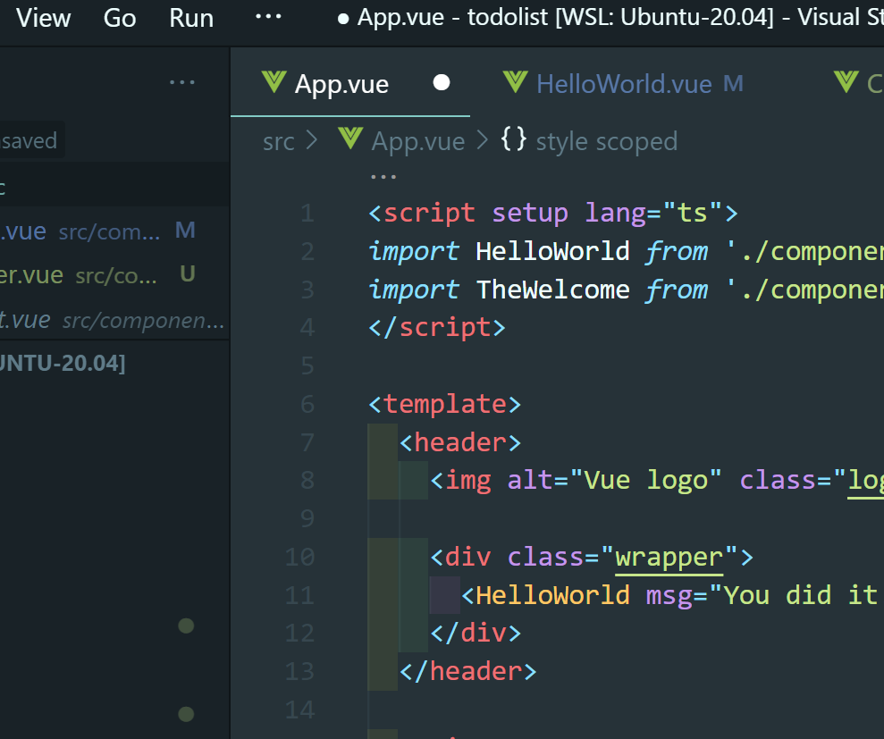
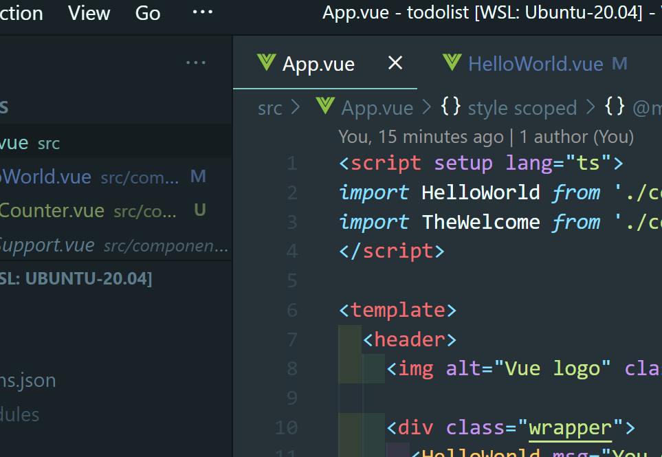

# React 入門

:::warning
コマンドやコードを示すときに`{ユーザー名}`のような表記をすることがありますが、これは実際には自分の情報に合わせて`{}`を取り除いた上で、自分のユーザー名を入力してください。

`git clone`するときの例を挙げてみます。

```bash
$ git clone {リポジトリのURI}
```

上のように書いてあって traQ のリポジトリをクローンする場合、以下のように自分がクローンしたいリポジトリの URI を入力します。

```bash
$ git clone git@github.com:traPtitech/traQ.git
```

このような表記はしばしば出てくるので、`{}`をつけたまま書いてしまわないように気をつけましょう。

:::

## Node.jsの導入
React を使うために、Node.js を入れます。自分の環境に合わせたものを選んで実行してください。

### 簡単
前の章で asdf を使って Go をインストールした人はこちらではなくて、「バージョン管理を考える」の方を見てください。
#### mac
1. brew を用いてインストール

```zsh
$ brew install node
```
2. PATH を通す

1.を実行すると、最後に`If you need to have node first in your PATH, run:`というメッセージが出るので、これに続くコマンドを実行してください。

3. バージョンを確認

```zsh
$ node -v
```

を実行して、バージョン番号が表示されれば OK。

#### Windows(WSL)

```bash
$ curl -fsSL https://deb.nodesource.com/setup_current.x | sudo -E bash -
$ sudo apt-get install -y nodejs
```

バージョンを確認します。

```bash
$ node -v
```

を実行して、バージョン番号が表示されれば OK。

### バージョン管理を考える
Go のインストールにも用いた asdf を用いてインストールすることで、プロジェクトごとに自動で手元の Node.js のバージョンを変えることができます。

```bash
$ asdf plugin add nodejs
$ asdf install nodejs latest
$ asdf global nodejs latest
```

これで、デフォルトで現在出ている最新のバージョンが適用されるようになりました。

```bash
$ node -v
```

を実行して、バージョン番号が表示されれば OK。

## React プロジェクトの作成

`~/develop`ディレクトリの中で以下のコマンドを実行し、設問には同じように答えてください。
```bash
$ npx create-next-app@latest

✔ What is your project named? … todolist
✔ Would you like to use TypeScript with this project? … Yes
✔ Would you like to use ESLint with this project? …  Yes
✔ Would you like to use Tailwind CSS with this project? … No
✔ Would you like to use `src/` directory with this project? … Yes
✔ Use App Router (recommended)? … No
✔ Would you like to customize the default import alias? … Yes
✔ What import alias would you like configured? … @/*

Creating a new Next.js app in /home/mehm8128/develop/todolist.

...
```

GitHub に SSH 鍵を登録していない人は以下を参考にしてこのタイミングで登録してください。

[SSH鍵の登録](../dicts/ssh/0_index.md)

プロジェクトが作成できたら、`cd {プロジェクト名}`でプロジェクトのディレクトリに移動し、VSCodeで開いてください。

開いたプロジェクトの中に入っている`package.json`というファイルには npm に関する様々な設定が書かれています。
この中には依存するパッケージ一覧も含まれており、以下のコマンドでそれらをインストールできます。

`$ npm i`  
もしくは  
`$ npm install`

```bash
mehm8128@DESKTOP-6F4C0KI ~/develop/todolist $ npm i

added 292 packages, and audited 293 packages in 10s

116 packages are looking for funding
  run `npm fund` for details

found 0 vulnerabilities
```

テンプレートは初期状態でビルド&配信できるようになっているので、以下のコマンドを実行してブラウザで確認してみましょう。

`$ npm run dev`

```bash
mehm8128@DESKTOP-6F4C0KI ~/develop/todolist $ npm run dev

> todolist@0.1.0 dev
> next dev

- ready started server on 0.0.0.0:3000, url: http://localhost:3000
- event compiled client and server successfully in 714 ms (18 modules)
- wait compiling...
- event compiled client and server successfully in 245 ms (18 modules)

```

この状態で、ブラウザから <a href='http://localhost:3000/' target="_blank" rel="noopener noreferrer">localhost:3000</a> にアクセスすると、以下のような画面が表示されるはずです。


止めるときは`Ctrl + C`で止めてください。

## React 入門

### React とは

以下のリンクから公式ドキュメントに飛ぶことができます。  
[React](https://react.dev/)

日本ではよく使われているフレームワークなのですが、traP ではあんまり使われておらず、使われているのはtraPCollectionくらいです。

また、今回はReactに追加で色々な機能が加わった、Next.jsというフレームワークを使っていきます。  
以下のリンクから公式ドキュメントに飛ぶことができます。  
[Next.js](https://nextjs.org/)

### `.tsx`ファイルについて

React では`.tsx`という拡張子で単一ファイルコンポーネント(SFC, Single File Component)を作ることができます。

なろう講習会の言葉で言うと、React では、**1 つの同じファイルに構造(HTML)・ロジック(JavaScript)(・場合によってはスタイル(CSS))** を記述できます。それぞれを別の巨大なファイルに書くのではなく、**見た目に対応した要素を各ファイルに分割して書く**ことで、それぞれの責任範囲をより直感的な形式で分けることができるわけです。このように分けられた要素をコンポーネントといいます。

### Vue の書き方

基本的にはTypeScriptを書いて、`return()`内にHTML(tsx, jsx)を書きます。


#### Sample.tsx

<<< @/chapter1/dicts/react/src/0/Sample.tsx

### プロジェクト構造

```
.
├── node_modules/           // 依存ライブラリの保存先
├── package-lock.json       // 依存ライブラリ(詳細)
├── package.json            // 依存ライブラリ・タスク・各種設定
├── public
│   └── favicon.ico         // 静的ファイル(ビルドされない)
├── src
|   |── pages
│   │　　|── App.tsx
│   │　　|── _document.tsx
│   │　　└── index.tsx
│   └── styles
│        |── global.css
│        └── Home.module.css
│   
└── next.config.js
```

#### `index.tsx`
このファイルが基本的には一番上の階層になります。
サイトのメタ情報を定義する`head`タグや、メインの要素を記述する`main`タグなどが書かれています。

#### `node_modules`

`npm install` でインストールされる依存ライブラリが保存されるディレクトリです。
中を見ることは殆ど無いです。
`.gitignore`に指定されています。(`package.json`, `package-lock.json` があれば `npm install` で再現できるためです)

#### `package.json` `package-lock.json`

プロジェクトに関するメタ情報や、`npm run ~~`で実行できるタスク、依存ライブラリの情報が記述されています。


#### `src/App.vue`

Vue としてのエントリーポイントです。
HelloWorld コンポーネントを読み込み → 登録 → 描画しています。

## React を書く準備

まず、以下の拡張機能をインストールしてください。

#### React Developer Tools

Chrome Devtool に React 向けのデバッグ機能を追加してくれます。  
[React Developer Tools - Chrome ウェブストア](https://chrome.google.com/webstore/detail/react-developer-tools/fmkadmapgofadopljbjfkapdkoienihi?hl=ja)

#### ESLint

座学編で紹介した、VSCode の拡張機能。  
コードの書き方をチェックしてくれます。  
[ESLint - Visual Studio Marketplace](https://marketplace.visualstudio.com/items?itemName=dbaeumer.vscode-eslint)

#### Prettier

座学編で紹介した、VSCode の拡張機能。  
コードのフォーマットを整えてくれます。  
保存時に自動で実行されるような設定をしておくと便利です。  
[Prettier - Code formatter - Visual Studio Marketplace](https://marketplace.visualstudio.com/items?itemName=esbenp.prettier-vscode)


### ソースコードの書き進め方

`npm run dev`で起動していれば、ファイルの変更を自動で検知して表示が更新されます。

:::tip
ちゃんと保存しましょう。


画面上部のタブのファイル名の横に ● がついているときは保存できていません。



設定で自動保存されるようにしておくと便利です。  
参考： [自動保存するように設定する](https://www.javadrive.jp/vscode/setting/index2.html)
:::

## React を書く

開発基礎講習会で書いたカウンターのソースコードを再掲します。

#### index.html(一部抜粋)

<<< @/chapter1/dicts/react/src/0/index.html{html:line-numbers}

#### counter.js

<<< @/chapter1/dicts/react/src/0/counter.js{js:line-numbers}

:::info
Go や C++などでは`""`と`''`が区別されますが、JavaScript では区別されません。
:::

### React を書く

先にコードを書いてから解説を書いています。  
意味がわからなくてもとりあえずコピー&ペースト or 写経しましょう。

#### ファイルの作成

`components`ディレクトリを作成し、その中に`ClickCounter.tsx`というファイルを作成します。


#### ソースコードの変更

##### src/pages/index.tsx

`ClickCounter.tsx`を読み込み、カウンターを配置します。

<<< @/chapter1/dicts/react/src/0/index.tsx{tsx:line-numbers}

##### src/components/ClickCounter.tsx

<<< @/chapter1/dicts/react/src/0/ClickCounter.tsx{tsx:line-numbers}

以下のように動けば OK です。


### ソースコード解説

#### src/pages/index.tsx

##### 4 行目

```ts
import ClickCounter from "./components/ClickCounter.tsx"
```

`ClickCounter` コンポーネントを読み込む部分です。

##### 9-23行目
テンプレート部分です。  
Reactのコンポーネントは一つのタグの中に収まっている必要があります。  
そのため、多くの場合divタグかでReact.Fragmentで囲まれています。

参考：[Fragment – React](https://react.dev/reference/react/Fragment)


##### 19 行目

```tsx
<ClickCounter />
```

読み込んだコンポーネントを利用しています。

#### src/components/ClickCounter.tsx

##### 4 行目

コンポーネント内で利用する変数を`useState`を用いてこのように書きます。
ここでは`count`という名前の変数を`number`型で定義しています(実はこの程度なら TypeScript の型推論というものが効いて、初期値の`0`から自動で`count`変数は`number`型だと推論してくれます)。
`useState`は返り値の配列の 0 番目に変数、1 番目に変数を更新するための関数が入っています。
今回でいうと`count`が変数、`setCount`が変数を更新するための関数です。
Reactはこの`setCount`が実行されたときに、引数に与えられた値で`count`の値を更新し、表示も更新(再描画)してくれます。

```ts
  const [count, setCount] = useState<number>(0)
```

参考: [useState – React](https://react.dev/reference/react/useState)

:::info
ここで`counter.js`の`countUp`を見てみましょう。

```js
const countUp = () => {
  count++
  const countElement = document.querySelector('#count')
  countElement.innerText = '回数: ' + count
}
```

`count`変数の値を変更した後に、DOM を直接操作して回数の値を更新しています。
React では先ほど述べたように、`useState`を使うことで「値を更新」と「表示を変更」の 2 つをセットでやってくれるようになります。

:::

##### 7 行目

`return()`内では`{}`内にJavaScriptが書けるので、count変数の中身を表示しています。

```tsx
  <div>回数： {count}</div>
```

参考: [JavaScript in JSX with Curly Braces – React](https://react.dev/learn/javascript-in-jsx-with-curly-braces)


##### 8・9 行目

ボタンが押されたイベントに対する処理を書いています。  
`onClick`では、今回のように直接 JavaScript を記述するだけでなく、`return()`外で定義した関数の呼び出しもできます。
`useState`を使ったときに定義した`setCount`関数に引数を渡すことで、`count`変数の中身の更新を行うことが出来ます。


```tsx
<button onClick={() => setCount(count + 1)}>クリック！</button>
<button onClick={() => setCount(0)}>リセット！</button>
```

参考: [イベントへの入門 - ウェブ開発を学ぶ | MDN](https://developer.mozilla.org/ja/docs/Learn/JavaScript/Building_blocks/Events)  
参考: [Responding to Events – React](https://react.dev/learn/responding-to-events)


### React の嬉しさを実感する

いかがでしょうか？  
この規模だと、ソースコードの行数としては生の HTML・JS で書いたほうが少ないですが、書く量を増やしてでも Vue を使う嬉しさがあります。

#### 変数を操作するだけで表示が変わる

生 JS ではボタンのクリックごとに表示を変更する必要があります。  
React ではコンポーネントの定義の時に表示と変数を関連付ける(5 行目・10 行目)ことで、変数を操作するだけで表示が自動で切り替わります。これが React の提供するリアクティビティです(コンポーネントが内部に保持している状態を変更したとき、その変更が Vue によって検知されて自動で HTML に反映されます)。

今回は、変数を操作する箇所が少ないのでまだ追えますが、この変数が様々なところで変更されるものだった場合を考えてみましょう。  
生 HTML・JS ではその全ての場所で書き換えるコードを忘れることなく書かなければなりません。  
複数のプログラマでコードを書いた場合、それを忘れないようにするということはかなりのコストになってしまうので辛いです。  
React ではそれがなくて嬉しいです。

### 一度コンポーネントを登録すれば使い回せる

カウンターを 2 つ作りたくなった場合を考えます。  
生 HTML・JS が書ける人はちょっとチャレンジしてみてください。関数名や変数名をかぶらないようにしたり、セレクタの名前を変更したりと結構めんどくさいです。  
Vue ならば、`index.tsx` の`<ClickCounter />`をコピーして増やすだけで OK です。  
これは traQ のように同じ要素を沢山利用するような Web アプリで大きな利点となります。
