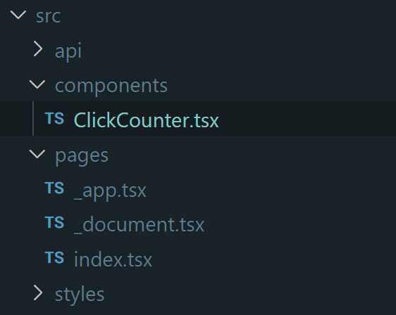

# React 入門

React 編は本編を一通り終えた後に行うことを想定しているため、一部省略しています。本編が終わっていない方は先に本編を進めてください。

## React プロジェクトの作成

`~/develop`ディレクトリの中で以下のコマンドを実行してください。
```bash
$ npm create vite@latest todolist -- --template react-ts -y

Scaffolding project in /home/mehm8128/develop/todolist...

Done. Now run:

  cd todolist
  npm install
  npm run dev

```

プロジェクトが作成できたら、`cd {プロジェクト名}`でプロジェクトのディレクトリに移動し、VSCode で開いてください。

開いたプロジェクトの中に入っている`package.json`というファイルには npm に関する様々な設定が書かれています。
この中には依存するパッケージ一覧も含まれており、以下のコマンドでそれらをインストールできます。

`$ npm i`  
もしくは  
`$ npm install`

```bash
mehm8128@DESKTOP-6F4C0KI ~/develop/todolist-mehm8128 (main)$ npm i

added 218 packages, and audited 219 packages in 12s

41 packages are looking for funding
  run `npm fund` for details

found 0 vulnerabilities
```

テンプレートは初期状態でビルド&配信できるようになっているので、以下のコマンドを実行してブラウザで確認してみましょう。

`$ npm run dev`

```bash
mehm8128@DESKTOP-6F4C0KI ~/develop/todolist-mehm8128 (main)$ npm run dev

> todolist@0.0.0 dev
> vite

Port 5173 is in use, trying another one...

  VITE v5.2.10  ready in 159 ms

  ➜  Local:   http://localhost:5174/
  ➜  Network: use --host to expose
  ➜  press h + enter to show help
```

この状態で、ブラウザから <a href='http://localhost:5173/' target="_blank" rel="noopener noreferrer">localhost:5173</a> にアクセスすると、以下のような画面が表示されるはずです。


止めるときは`Ctrl + C`で止めてください。

また、このタイミングで Git の初期化もしておきましょう。`.git`ディレクトリがプロジェクト内に存在していないので、このままだと Git 管理ができません。
```bash
$ git init
```

## React 入門

### React とは

以下のリンクから公式ドキュメントに飛ぶことができます。  
[React](https://react.dev/)

日本ではよく使われているフレームワークなのですが traP ではあんまり使われておらず、使われているのは traPCollection くらいです。

### `.tsx`ファイルについて

Vue では`.vue`という拡張子でコンポーネントファイルを作成していましたが、React では`.tsx`という拡張子でコンポーネントファイルを作ることができます。

基本的には TypeScript を書いて、`return()`内に HTML(tsx, jsx)を書きます。


#### Sample.tsx

<<< @/chapter1/dicts/react/src/0/Sample.tsx


## React を書く準備

まず、以下の拡張機能をインストールしてください。

#### React Developer Tools

Chrome Devtool に React 向けのデバッグ機能を追加してくれます。  
[React Developer Tools - Chrome ウェブストア](https://chrome.google.com/webstore/detail/react-developer-tools/fmkadmapgofadopljbjfkapdkoienihi?hl=ja)


## React を書く

### React を書く

先にコードを書いてから解説を書いています。  
意味がわからなくてもとりあえずコピー&ペースト or 写経しましょう。

#### ファイルの作成

`components`ディレクトリを作成し、その中に`ClickCounter.tsx`というファイルを作成します。



#### ソースコードの変更

#### src/main.tsx

CSS ファイルの読み込みを削除します。

<<< @/chapter1/dicts/react/src/0/main.tsx{tsx:line-numbers}

##### src/pages/App.tsx

`ClickCounter.tsx`を読み込み、カウンターを配置します。

<<< @/chapter1/dicts/react/src/0/App.tsx{tsx:line-numbers}

##### src/components/ClickCounter.tsx

<<< @/chapter1/dicts/react/src/0/ClickCounter.tsx{tsx:line-numbers}

以下のように動けば OK です。


### ソースコード解説

#### src/pages/App.tsx

##### 4 行目

```ts
import ClickCounter from "./components/ClickCounter.tsx"
```

`ClickCounter` コンポーネントを読み込む部分です。

##### 9-23行目
テンプレート部分です。  
React のコンポーネントは 1 つのタグの中に収まっている必要があります。  
そのため、多くの場合 div タグで囲まれています。

##### 7 行目

```tsx
<ClickCounter />
```

読み込んだコンポーネントを利用しています。

#### src/components/ClickCounter.tsx

##### 4 行目

コンポーネント内で利用する変数を`useState`を用いてこのように書きます。引数には変数の初期値を与えます。
ここでは`count`という名前の変数を`number`型で定義しています(実はこの程度なら TypeScript の型推論というものが効いて、初期値の`0`から自動で`count`変数は`number`型だと推論してくれます)。
`useState`は返り値の配列の 0 番目に変数、1 番目に変数を更新するための関数が入っています。今回でいうと`count`が変数、`setCount`が変数を更新するための関数です。
React はこの`setCount`が実行されたときに、引数に与えられた値で`count`の値を更新し、表示も更新(再描画)してくれます。

```ts
  const [count, setCount] = useState<number>(0)
```

参考  
[useState – React](https://react.dev/reference/react/useState)  
[ジェネリクス (generics) | TypeScript入門『サバイバルTypeScript』](https://typescriptbook.jp/reference/generics)

:::info
ここで`counter.js`の`countUp`を見てみましょう。

```js
const countUp = () => {
  count++
  const countElement = document.querySelector('#count')
  countElement.innerText = '回数: ' + count
}
```

`count`変数の値を変更した後に、DOM を直接操作して回数の値を更新しています。
React では先ほど述べたように、`useState`を使うことで「値を更新」と「表示を変更」の 2 つをセットでやってくれるようになります。

:::

##### 7 行目

`return()`内では`{}`内に JavaScript が書けるので、count 変数の中身を表示しています。

```tsx
  <div>回数： {count}</div>
```

参考: [JavaScript in JSX with Curly Braces – React](https://react.dev/learn/javascript-in-jsx-with-curly-braces)


##### 8・9 行目

ボタンが押されたイベントに対する処理を書いています。  
`useState`で定義した`setCount`関数に引数を渡すことで、`count`変数の中身を更新できます。
また、`onClick`では今回のように直接 JavaScript を記述するだけでなく、`return()`外で定義した関数の呼び出しもできます。


```tsx
<button onClick={() => setCount(count + 1)}>クリック！</button>
<button onClick={() => setCount(0)}>リセット！</button>
```

参考  
[イベントへの入門 - ウェブ開発を学ぶ | MDN](https://developer.mozilla.org/ja/docs/Learn/JavaScript/Building_blocks/Events)  
[Responding to Events – React](https://react.dev/learn/responding-to-events)

