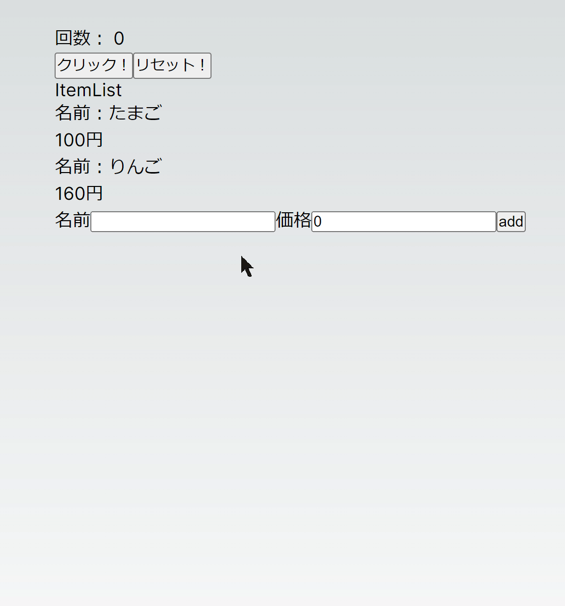
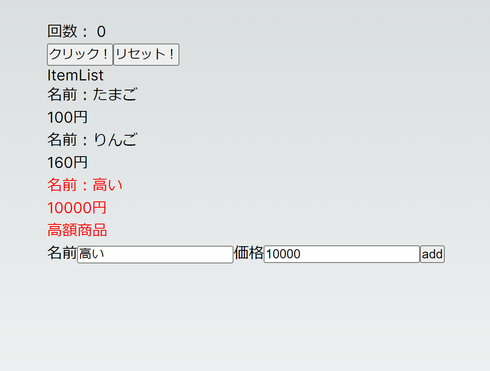

# アプリを作ってみよう

## 商品リストを作ってみる

みなさんにはこの節の最後に Todo リストを作ってもらうのですが、商品リストをテーマに、Todo リストに必要な React の機能をピックアップしていきます。

こんな感じのを作っていきます。

### 必要な要素を考える

上の gif のようなアプリを実現するためには何が必要か考えてみましょう。

- 商品リストのコンポーネントを作る
- 商品のリストデータを保存する
- 商品のリストデータを表示する
- 商品を追加できる
- 商品の値段が 500 円以上だったら赤くする
- 商品の値段が 1000 円以上だったら「高額商品」と表示する

こんな感じでしょうか。  
それでは上から順番に実装していきましょう。

### 商品リストのコンポーネントを作る

`components`ディレクトリに`ItemList.tsx`というファイルを作成します。

#### src/components/ItemList.tsx

中身はコンポーネントに最低限必要な部分だけ書きます。

<<< @/chapter1/dicts/react/src/1/ItemListInit.tsx

#### index.tsx

<<< @/chapter1/dicts/react/src/1/index.tsx{tsx:line-numbers}

表示されました。
こうすることで、後は`ItemList.tsx`の中身を書き変えればよくなります。

### 商品のリストデータを保存する

商品リストのデータを保存するのに適当な変数の型は何でしょうか？  
商品「リスト」なので配列がよさそうです。  
というわけで、配列を使ってデータを保持することにします。  
今は商品の追加ができないので、とりあえずダミーデータを入れておきます。

参考: [Array | MDN](https://developer.mozilla.org/ja/docs/Web/JavaScript/Reference/Global_Objects/Array)  
参考：[JavaScript オブジェクトの基本 - ウェブ開発を学ぶ | MDN](https://developer.mozilla.org/ja/docs/Learn/JavaScript/Objects/Basics)

<<< @/chapter1/dicts/react/src/1/ItemListItems.tsx{tsx:line-numbers}

4~7 行目は TypeScript の記法で、`Item`という型を`interface`を用いて定義しています。  
そして `useState` のジェネリクスに`Item[]`を渡すことで、`items`変数を`Item`型の配列として扱えるようにしています。

参考：[ジェネリクス (generics) | TypeScript 入門『サバイバル TypeScript』](https://typescriptbook.jp/reference/generics)  
参考：[インターフェース (interface) | TypeScript 入門『サバイバル TypeScript』](https://typescriptbook.jp/reference/object-oriented/interface)

### 商品のリストデータを表示する

先ほど定義したリストの情報を表示していきます。  
React ではリストデータをfor文のようにループさせて表示させるには、`map`を使います。  
`map` を使うときには`key`を設定しなければいけません(理由(やや難): [Rendering Lists – React](https://react.dev/learn/rendering-lists#keeping-list-items-in-order-with-key))。

参考: [Rendering Lists – React](https://react.dev/learn/rendering-lists)

これを使ってデータを表示してみます。

<<< @/chapter1/dicts/react/src/1/ItemListList.tsx

表示できました。

### 商品を追加する

フォームを使って、入力された文字を変数に格納します。
参考： [input – React](https://react.dev/reference/react-dom/components/input#controlling-an-input-with-a-state-variable)

これを使って商品を追加できるようにしてみます。

<<< @/chapter1/dicts/react/src/1/ItemListAdd.tsx{tsx:line-numbers}

参考: [アロー関数式 | MDN](https://developer.mozilla.org/ja/docs/Web/JavaScript/Reference/Functions/Arrow_functions)

できました！

#### 練習問題 1：商品リストに機能を追加

このままだとボタンを連打して商品の追加ができてしまいます。

- ボタンを押したら入力欄を空にする機能
- 入力欄が空だったらボタンを押しても追加されないようにする機能

を追加してみましょう。

### 商品の値段が 500 円以上だったら赤くする

条件が満たされたときだけ CSS を当てるようにしてみます。  
`items`配列を展開するところで。三項演算子を用いて条件を満たしたときにだけ`className`がつくようにします。

参考: [CSS の基本 | MDN](https://developer.mozilla.org/ja/docs/Learn/Getting_started_with_the_web/CSS_basics)  
参考：[条件 (三項) 演算子 - JavaScript | MDN](https://developer.mozilla.org/ja/docs/Web/JavaScript/Reference/Operators/Conditional_operator)  
参考：[css-modules/css-modules: Documentation about css-modules](https://github.com/css-modules/css-modules)  

<<< @/chapter1/dicts/react/src/1/ItemListRed.tsx{2,26}

そして、`src/components/ItemList.module.css`を作成して以下の内容を記入します。

<<< @/chapter1/dicts/react/src/1/ItemList.module.css

### 商品の値段が 10000 円以上だったら「高額商品」と表示する

ある特定の条件を満たした場合のみ、対象コンポーネントを表示するという機能を`&&`を使って実現します。もちろん、三項演算子を使っても実現できます。

参考:[Conditional Rendering – React](https://react.dev/learn/conditional-rendering)

これを使って商品の値段が 10000 円以上だったら「高額商品」と表示するという機能を実現してみましょう。

<<< @/chapter1/dicts/react/src/1/ItemListExpensive.tsx{29}

これで商品リストが完成しました！

## Todo リストを作る

ここまで紹介してきた機能を使うことで Todo リストが作れるはずです。
頑張りましょう！

#### 練習問題 2：Todo リストを作る

Todo リストを作りましょう。

必要な機能は以下の通りです。

- タスクは未完または完了済みの状態を持つ。
- タスクはタスク名を持つ。
- 未完タスクのリストと完了済みタスクのリストが表示される。
- タスクを完了させることができる。
- タスクの追加ができる。

以上の機能が実現されていれば後は自由です。
スタイルが気になる人は CSS なども書きましょう。
