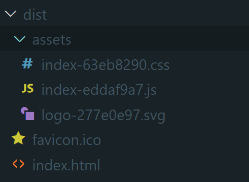
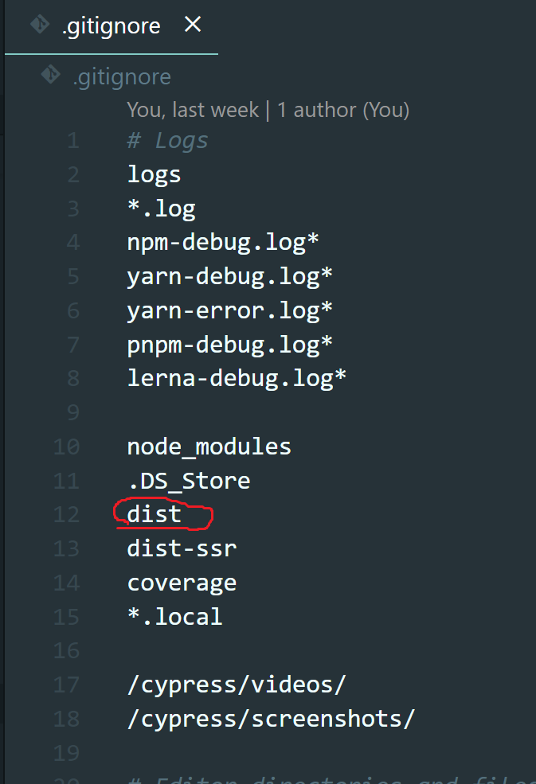

# 制作物を公開してみよう

## ビルドする

`npm run build`でビルドを行うことができます。

React などのフレームワークの記法に従って書かれたコードは、そのままではブラウザ上で動きません。  
Vite や Webpack のようなバンドラーによって、以下のような様々な処理を加えられた後、いい感じにブラウザ上で動作する生の HTML/CSS/JS として出力されます。

- 依存関係の解決
- HTML/CSS/JS への変換
- 圧縮
- etc...

ビルドによる成果物は`dist`ディレクトリの中に生成されています。

## 公開する

それでは公開しましょう！

早速 push して公開したいところですが、`.gitignore`をみてみると`dist`ディレクトリが ignore されていることがわかります。

これは GitHub にはソースコードだけをアップロードし、そのソースコードから再現できるものは極力アップロードしない(Git のパフォーマンスに影響するため)という考えから来ているものです。

`node_modules`も同じような理由で ignore されていることがわかります。

ビルド済みの成果物を直接 GitHub にアップロードして GitHub Pages などで公開してもいいのですが、今回は別の方法で公開します。

### Vercel で公開する
Vercelというサイトを使うと、簡単に公開することができます。
Next.js を作っている会社が運営しているサービスなので、Next.js との相性が良いです。  
[Vercel](https://vercel.com/)

### まとめ
お疲れさまでした！  
これで React に入門して Todo リストを作り、Vercel で公開するところまで一通りの流れを掴むことができました。この流れをしっかり理解し、発展させていくことでフロントエンドは自由に書くことができるようになります。  
今回のコードは以下に公開してあるので、参考にしてみてください。

https://github.com/traPtitech/naro-template-frontend/tree/example/react
