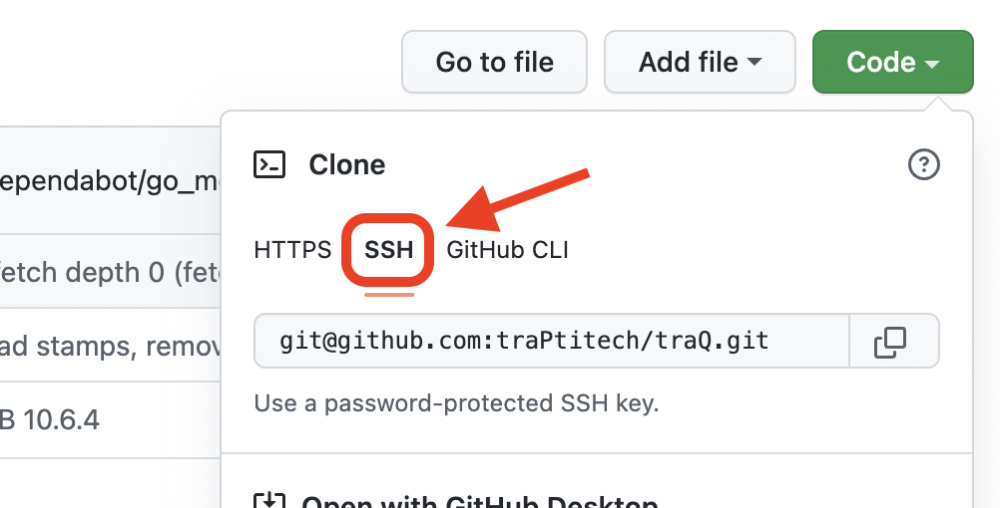

# SSH鍵の登録

GitHub に push/pull などをするには、SSH 鍵を登録する必要があります(Personal Access Token でも可能ですが、SSH の方が便利です)。
常に鍵を登録してあるかどうかは [SSH and GPG keys](https://github.com/settings/keys) で確認できます。

まだ登録していない人は以下の手順で作成・登録してください。
### 鍵の生成

```bash
$ ssh-keygen -t ed25519 -C {GitHubに登録してあるメールアドレス}
```

鍵のファイルを作成する場所を聞かれますが、鍵を登録したことがない人はデフォルトでよいのでそのまま Enter を押します。

::: danger
既に同じ場所に同じファイル名の鍵を作成したことがある場合、上書きされてしまうので注意してください。
:::

以下のようにパスフレーズの設定を求められますが、そのまま Enter を押します。

```bash
Generating public/private ed25519 key pair.
Enter file in which to save the key (~/.ssh/id_ed25519):
```
### 鍵の登録

今生成した鍵の公開鍵を以下のコマンドで表示します。

```bash
$ cat ~/.ssh/id_ed25519.pub
```

出力された文字列をコピーしてください(メールアドレスが含まれていますが、それも含めて 1 行丸ごとコピーしてください)。  
Mac の場合は以下のコマンドを実行すると、結果を出力せずにコピーできます。

```zsh
$ cat ~/.ssh/id_ed25519.pub | pbcopy
```

[SSH and GPG keys](https://github.com/settings/keys) にアクセスし、「New SSH key」をクリックします。

Title: `id_ed25519`
Key type: `Authentication Key`
Key: `{先ほどコピーした文字列}`

を入力し、「Add SSH Key」をクリックします。
これで登録が完了です。

### 接続確認

以下のコマンドを実行してください。

```bash
$ ssh -T git@github.com
```

以下のように表示されたら成功です。

```bash
Hi {ユーザー名}! You've successfully authenticated, but GitHub does not provide shell access.
```

`yes/no/[fingerprint]`は yes を選択してください。

これで SSH 接続できるようになりました。
リポジトリをクローンするときは以下の画像のように、SSH の方を選択して URI をコピーするようにしてください。


また、既に https の方でクローンしてしまった場合は以下のコマンドで URI を変更できます。

```bash
$ git remote set-url origin {SSHのURI}
```