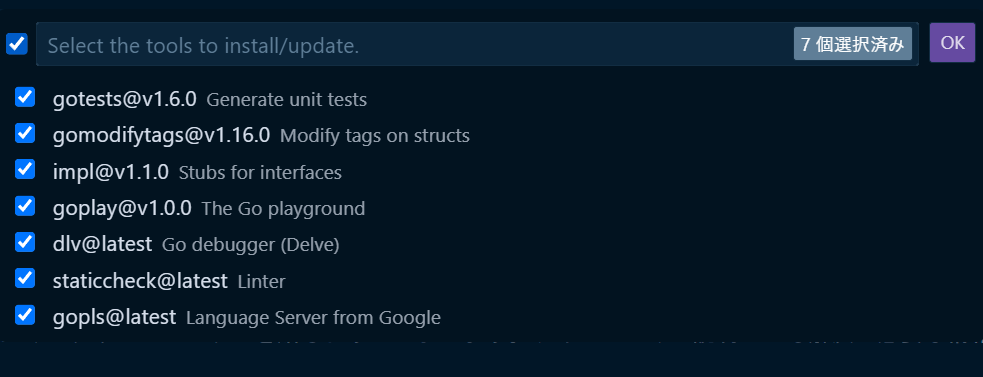
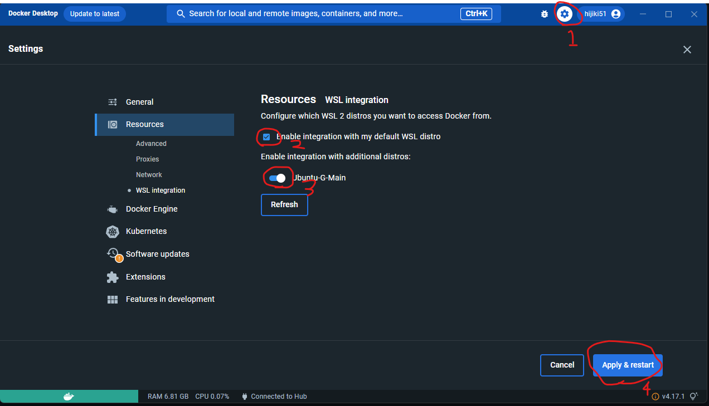

# 環境構築 (Windows)

[[toc]]

:::warning
コマンドは手入力ではなく、コピー & ペースト で入力してください。
手入力だと写し間違いの可能性があります。
この際、1 行ずつコピーするようにしてください。
:::

## 事前準備

::: tip
質問をするときにはできるだけスクリーンショットを貼るようにしましょう。テキストだけで説明しても解決に必要な情報を全て伝えるのは難しいです。

`Windowsキー+Shift+s`を押すと、矩形選択でスクリーンショットが撮れます。 traQ のメッセージ入力欄に`Ctrl + V`で貼り付けられます。
:::

### WSL の導入

すでに WSL をインストールしている方はこの手順を飛ばして大丈夫です。

WSL は Windows 上で Linux を動かすための仕組みで、`Windows Subsystem for Linux`の略です。

以下のページの Step 1 を行ってください。 Step 2 以降は行わなくて大丈夫です。

https://pg-basic.trap.show/text/chapter-0/enviroment/windows.html#step-1-install-wsl

## VSCode の導入

すでに VSCode をインストールしている方はこの手順を飛ばして大丈夫です。

以下のサイトから`windows`の VSCode のインストーラーをダウンロードして、それを実行してインストールしてください。

https://code.visualstudio.com/download

### 拡張機能の導入

VSCode は拡張機能により様々な言語でのプログラミングをラクにすることができます。
次回以降に使うものも最初にまとめて導入しておきましょう。

:::warning
下記に書いてある拡張機能は必ず導入してください！ `Ctrl + Shift + X` で拡張機能のインストール画面を開くことができます。
:::

- [Go](https://marketplace.visualstudio.com/items?itemName=golang.Go)
  - Go 言語で書いたコードをチェックしてくれたり、プログラムを書くときに補完 (予測変換のような機能) を使えるようになったりします。
- [ESLint](https://marketplace.visualstudio.com/items?itemName=dbaeumer.vscode-eslint)
  - コードの書き方をチェックしてくれます。
- [Prettier - Code formatter](https://marketplace.visualstudio.com/items?itemName=esbenp.prettier-vscode)
  - コードのフォーマットを整えてくれます。保存時に自動で実行されるような設定をしておくと便利です。
- [Vue Language Features (Volar)](https://marketplace.visualstudio.com/items?itemName=vue.volar)
  - VSCode の Vue3 向けの統合プラグイン。

インストールが終わったら、反映させるために VSCode を 1 度閉じて開きなおしてください。

## miseのインストール

mise という開発ツールのバージョンを簡単に管理するためのツールをインストールします。

```bash
# mise のインストール
curl https://mise.run | sh

echo 'eval "$(~/.local/bin/mise activate bash)"' >> ~/.bashrc
source ~/.bashrc
```

インストールできているか確認します。
```bash
mise --version
```
`2026.x.x` のように表示されれば成功です。

### セキュリティ対策

最近、公開されたばかりの最新パッケージに悪意のあるコードを混入させる「サプライチェーン攻撃」が増えています。
この対策として、パッケージが公開されてから一定期間(ここでは3日間)経過していないバージョンは、インストールしないように設定しておきましょう。

```bash
mise settings set minimum_release_age "3d"
```

## Go のインストール

ここでは、Go というプログラミング言語の導入をします。
この講習会では Go という言語でサーバーサイドの制作を行います。

``` bash
mise use -g go@latest
```

ここまでで、以下のコマンドを実行して

```bash
go version
```

`go version go1.26.4`と表示されればインストール完了です。

### Go のツールのインストール

VSCode で `Ctrl`+`Shift`+`P` を押して出てくるコマンドパレットに`gotools`と入力して、出てきた「Go: Install/Update Tools」をクリックしてください。



利用可能なツールの一覧が出てくるので、全てにチェックを入れて「OK」をクリックします。

:::warning
ここで `gotools` と入力しても何も出てこない場合は、拡張機能が入っていない可能性があります。
"拡張機能の導入" のセクションを確認してください。
:::

:::tip
一番上の入力欄の左にあるチェックボックスを押すと一括選択ができます。
:::

出力で`All tools successfully installed. You are ready to Go. :)`と出ているのが確認できたら成功です。

## Node.jsの導入

この講習会では、クライアントサイド（フロントエンド）の制作に Vue を使用します。
その開発環境を動かすための土台として、Node.js をインストールしましょう。

```bash
mise use -g node@lts
```

インストールできているか確認しましょう。

```bash
node -v
```

を実行して、`v24.16.0`のようにバージョンが表示されればOK。

### セキュリティ対策

npm も mise と同様にサプライチェーン攻撃の対策をしておきましょう。

ここでは、公開されたばかりのパッケージをインストールしない設定と、インストール時のスクリプトの実行を無効化する設定を行います。

```bash
npm config set min-release-age 3
npm config set ignore-scripts true
```

:::warning
npmのバージョンが低いとこの設定ができない可能性があります。
その場合は、以下のコマンドで npm を最新バージョンにアップデートしてください。
```bash
npm install -g npm
```
:::

設定が反映されているか確認します。

```bash
cat ~/.npmrc
```

これで以下のような内容が表示されれば成功です。

```text
min-release-age=3
ignore-scripts=true
```

## Docker Desktopのインストール

https://www.docker.com/products/docker-desktop/
上のリンクからそれぞれの OS にあったものをダウンロードしてインストールしてください。

### WSL2の追加設定 - WSL Backend の有効化

1. 右上の歯車アイコンから `Resources` => `WSL Integration` に移動する。
2. `Enable integration with my default WSL distro`にチェックを入れる。
3. 下に出てくる Distro をすべて有効化する。
4. 最後に、右下の `Apply & Restart` をクリックして設定は完了です。



## Postmanのインストール

[Postman | API Development Environment](https://www.getpostman.com/) は GUI で HTTP リクエストを行えるアプリケーションです。

[ダウンロードページ](https://www.postman.com/downloads/)
