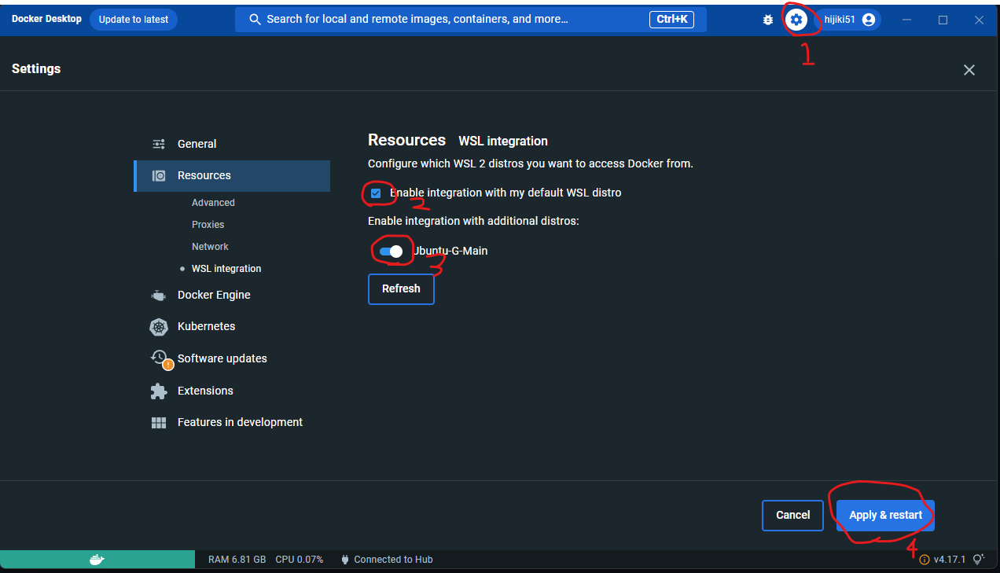

# 環境構築

[[toc]]

:::warning
コマンドは手入力ではなく、コピー & ペースト で入力してください。  
手入力だと写し間違いの可能性があります。  
この際、1 行ずつコピーするようにしてください。
:::

## 事前準備

:::info
以下の作業では、Mac と Windows で手順が違います。
まずは自分の PC の OS を以下から選んでください。

<div style="font-size: 1.2rem; font-weight: bold;">
  <input type="radio" id="windows" value="windows" v-model="userOs" />
  <label for="windows">Windows</label>
  <br>
  <input type="radio" id="unix" value="unix" v-model="userOs" />
  <label for="unix">macOS / Linux</label>
</div>
:::

::: tip
質問をするときにはできるだけスクリーンショットを貼るようにしましょう。テキストだけで説明しても解決に必要な情報を全て伝えるのは難しいです。

<div v-if="userOs==='windows'">

`Control + Shift + Command + 4`を押すと、矩形選択でスクリーンショットが撮れます。 traQ のメッセージ入力欄に`Command + V`で貼り付けられます。

</div>
<div v-if="userOs==='unix'">

`Winキー + Shift + S`を押すと、矩形選択でスクリーンショットが撮れます。 traQ のメッセージ入力欄に`Ctrl + V`で貼り付けられます。

</div>
:::

<div v-if="userOs==='windows'">
<h3>WSL の導入</h3>

すでに WSL をインストールしている方はこの手順を飛ばして大丈夫です。

WSL は Windows 上で Linux を動かすための仕組みで、`Windows Subsystem for Linux`の略です。

以下のページの Step 1 を行ってください。 Step 2 以降は行わなくて大丈夫です。

https://pg-basic.trap.show/text/chapter-0/enviroment/windows.html#step-1-install-wsl
</div>

<div v-if="userOs==='unix'">
<h3>Homebrew の導入</h3>

`ターミナル`アプリを開いて、以下のコマンドを貼り付け、`return`キーを押して実行してください。

Homebrew とは、様々なアプリケーションをインストールしやすくし、アップデートなどもやりやすくするためのソフトです。

```bash
/bin/bash -c "$(curl -fsSL https://raw.githubusercontent.com/Homebrew/install/HEAD/install.sh)"
```

参考: https://brew.sh/index_ja
</div>

<div v-if="userOs">

## VSCode の導入

すでに VSCode をインストールしている方はこの手順を飛ばして大丈夫です。

以下のサイトから使用している OS に合った VSCode のインストーラーをダウンロードして、それを実行してインストールしてください。

https://code.visualstudio.com/download

### 拡張機能の導入

VSCode は拡張機能により様々な言語でのプログラミングをラクにすることができます。  
次回以降に使うものも最初にまとめて導入しておきましょう。

- [Go](https://marketplace.visualstudio.com/items?itemName=golang.Go)
  - Go 言語で書いたコードをチェックしてくれたり、プログラムを書くときに補完 (予測変換のような機能) を使えるようになったりします。
- [ESLint](https://marketplace.visualstudio.com/items?itemName=dbaeumer.vscode-eslint)
  - コードの書き方をチェックしてくれます。
- [Prettier - Code formatter](https://marketplace.visualstudio.com/items?itemName=esbenp.prettier-vscode)
  - コードのフォーマットを整えてくれます。保存時に自動で実行されるような設定をしておくと便利です。
- [Vue Language Features (Volar)](https://marketplace.visualstudio.com/items?itemName=vue.volar)
  - VSCode の Vue3 向けの統合プラグイン。  

インストールが終わったら、反映させるために VSCode を 1 度閉じて開きなおしてください。

## asdf の導入 (任意)

asdf とは、一つのプログラムの複数のバージョンを PC 内で管理できるようにするものです。
それ以外にもあとからバージョンを更新するのが容易にもなるので長期的に見るとオススメです。
しかし、本講習会で必須というわけではないので任意とします。

:::info
以下の作業では、asdf を使うかどうかで手順が違います。
どちらか一方を選んで次の作業に移ってください。

<div style="font-size: 1.2rem; font-weight: bold;">
  <input type="radio" id="true" value="true" v-model="useAsdf" />
  <label for="true">asdf を使う</label>
  <br>
  <input type="radio" id="false" value="false" v-model="useAsdf" />
  <label for="false">asdf を使わない</label>
</div>
:::

<div v-if="useAsdf==='true'">

[公式資料](https://asdf-vm.com/#/core-manage-asdf)

以下のコマンドにより asdf の導入を行います。

<div v-if="userOs==='windows'">

``` bash [Windows(WSL2)]
sudo apt install git
git clone https://github.com/asdf-vm/asdf.git ~/.asdf --branch v0.11.3
echo '. $HOME/.asdf/asdf.sh' >> ~/.bashrc
echo '. $HOME/.asdf/completions/asdf.bash' >> ~/.bashrc
source ~/.bashrc
```

</div>
<div v-if="userOs==='unix'">

``` zsh [Mac]
brew install asdf
echo -e '\n. $(brew --prefix asdf)/libexec/asdf.sh' >> ${ZDOTDIR:-~}/.zshrc
source ~/.zshrc
```

</div>

</div>

<div v-if="useAsdf">

## Go と Task のインストール

ここでは、Go というプログラミング言語の導入をします。
この講習会では Go という言語でサーバーサイドの制作を行います。

<div v-if="useAsdf==='false'">
<div v-if="userOs==='unix'">

先ほど導入した Homebrew を用いてインストールします。

```bash
brew install go@1.22
```

</div>

<div v-if="userOs==='windows'">

``` bash
sudo apt install tar git
wget https://go.dev/dl/go1.22.3.linux-amd64.tar.gz
sudo rm -rf /usr/local/go && sudo tar -C /usr/local -xzf go1.22.3.linux-amd64.tar.gz
echo 'export PATH=$PATH:/usr/local/go/bin' >> ~/.bash_profile
source ~/.bash_profile
```

</div>

ここまでで、以下のコマンドを実行して

```bash
go version
```

`go version go.1.22.3`と表示されればインストール完了です。
ここまでできれば、次は以下のコマンドも実行して Task のインストールをしてください。

```sh
go run github.com/go-task/task/v3/cmd/task@latest init
```

</div>

<div v-if="useAsdf==='true'">

``` bash
asdf plugin add golang
asdf install golang 1.22.3
asdf global golang 1.22.3
go run github.com/go-task/task/v3/cmd/task@latest init
asdf reshim golang
```

ここまでで、以下のコマンドを実行して

```bash
go version
```

`go version go1.22.3`と表示されれば Go の導入は完了。

```bash
task --version
```

と入力して`Task version: 3.37.2`と表示されれば Task の導入も完了です。

</div>

:::info 詳しく知りたい人向け。

**`Task`って何だ。**

Task は、Go で動いているタスクランナーです。これによって長いコマンドを短くできたり、複数のコマンドを 1 回で実行できたりと、開発においてとても便利なツールです。テンプレートリポジトリに`Taskfile.yaml`というファイルがありますが、このファイルによってコマンドの設定をしています。公式ドキュメントは英語しかありませんが、興味のある人は目を通してみてください。

Task 公式ドキュメント [https://taskfile.dev/](https://taskfile.dev/)

Task GitHub [https://github.com/go-task/task](https://github.com/go-task/task)

:::

### Go のツールのインストール

VSCode で<span v-if="userOs==='windows'">`Ctrl`+`Shift`+`P`</span><span v-if="userOs==='unix'">`Command`+`Shift`+`P`</span>を押して出てくるコマンドパレットに`gotools`と入力して、出てきた「Go: Install/Update Tools」をクリックしてください。


利用可能なツールの一覧が出てくるので、全てにチェックを入れて「OK」をクリックします。

:::tip
一番上の入力欄の左にあるチェックボックスを押すと一括選択ができます。
:::

出力で`All tools successfully installed. You are ready to Go. :)`と出ているのが確認できたら成功です。

## Node.jsの導入

Vue を使うために、Node.js を入れます。
この講習会では、クライアントサイドを Vue を用いて制作します。

<div v-if="useAsdf==='false'">

<div v-if="userOs==='unix'">

以下のコマンドで、Homebrew を用いてインストールします。

```zsh
brew install node
```

このコマンドを実行すると、最後に`If you need to have node first in your PATH, run:`というメッセージが出るので、これに続くコマンドを実行してください。

</div>
<div v-if="userOs==='windows'">

```bash
curl -fsSL https://deb.nodesource.com/setup_current.x | sudo -E bash -
sudo apt-get install -y nodejs
```

</div>
</div>

<div v-if="useAsdf==='true'">

asdf を用いてインストールすると、プロジェクトごとに自動で手元の Node.js のバージョンを変えることができます。

```bash
asdf plugin add nodejs
asdf install nodejs latest
asdf global nodejs latest
```

これで、デフォルトで現在出ている最新のバージョンが適用されるようになりました。

</div>

<div v-if="useAsdf">
ここで、インストールが正常にできているかを確認します。

```bash
node -v
```

を実行して、バージョン番号が表示されれば OK。
</div>

## Docker Desktopのインストール

https://www.docker.com/products/docker-desktop/  
上のリンクからそれぞれの OS にあったものをダウンロードしてインストールしてください。

<div v-if="userOs==='unix'">

:::info
Mac は M1/M2 の場合、 Apple Chip を、Intel の場合、Intel Chip を選択してください。
:::

</div>

<div v-if="userOs==='windows'">

<h3>WSL2の追加設定 - WSL Backend の有効化</h3>

1. 右上の歯車アイコンから `Resources` => `WSL Integration` に移動する。
2. `Enable integration with my default WSL distro`にチェックを入れる。
3. 下に出てくる Distro をすべて有効化する。
4. 最後に、右下の `Apply & Restart` をクリックして設定は完了です。


</div>

## Postmanのインストール

[Postman | API Development Environment](https://www.getpostman.com/) は GUI で HTTP リクエストを行えるアプリケーションです。

[ダウンロードページ](https://www.postman.com/downloads/)

</div>
</div>

<script setup lang="ts">
import { ref } from 'vue'
const userOs = ref<"windows" | "unix" | undefined>()
const useAsdf = ref<"true" | "false" | undefined>()
</script>
