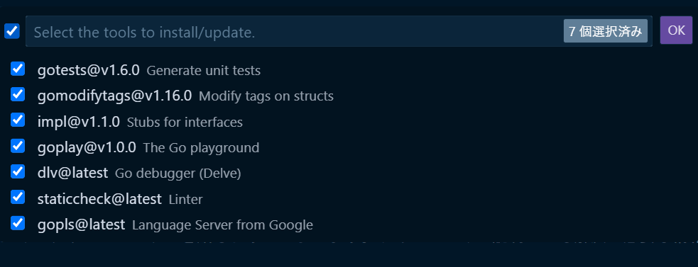

# 環境構築

[[toc]]

::: tip

質問をするときにはできるだけスクリーンショットを貼るようにしましょう。テキストだけで説明しても解決に必要な情報を全て伝えるのは難しいです。

Mac: `Control + Shift + Command + 4`を押すと、矩形選択でスクリーンショットが撮れます。 traQ のメッセージ入力欄に`Command + V`で貼り付けられます。  
Windows: `Winキー + Shift + S`を押すと、矩形選択でスクリーンショットが撮れます。 traQ のメッセージ入力欄に`Ctrl + V`で貼り付けられます。
:::

## WSL の導入(Windows を使っている人のみ)

すでに WSL をインストールしている方はこの手順を飛ばして大丈夫です。

WSL は Windows 上で Linux を動かすための仕組みで、`Windows Subsystem for Linux`の略です。

以下のページの Step 1 を行ってください。 Step 2 以降は行わなくて大丈夫です。 

https://pg-basic.trap.show/text/chapter-0/enviroment/windows.html#step-1-install-wsl

## Homebrew の導入(Mac を使っている人のみ)

`ターミナル`アプリを開いて、以下のコマンドを貼り付け、`return`キーを押して実行してください。

Homebrew とは、様々なアプリケーションをインストールしやすくし、アップデートなどもやりやすくするためのソフトです。

```bash
/bin/bash -c "$(curl -fsSL https://raw.githubusercontent.com/Homebrew/install/HEAD/install.sh)"
```

参考: https://brew.sh/index_ja

## VSCode の導入

すでに VSCode をインストールしている方はこの手順を飛ばして大丈夫です。

以下のサイトから使用している OS に合った VSCode のインストーラーをダウンロードして、それを実行してインストールしてください。

https://code.visualstudio.com/download

## VSCode 拡張機能の導入

- [Go](https://marketplace.visualstudio.com/items?itemName=golang.Go)

::: info
コマンドは手打ちではなくてコピー&ペーストで打ってください。
手打ちだと写し間違いをする可能性があります。
:::

## Go のインストール

直接インストールする方法と asdf を使ったインストールの 2 種類がありますが、asdf を使った方が後からバージョンを上げるのが簡単になるので、長期的にオススメです。
どちらか好みのほうを選択しましょう。

::: info
コマンドは一行ずつ実行してください。
:::

### 直接インストールする方法

https://golang.org/doc/install  
インストールが終わった後に`go version`してみて`go version go1.22.2`と出れば成功です。
#### Mac

Mac のタブを選択し、ダウンロードページに飛んで自分のアーキテクチャの pkg をダウンロード=>インストーラ起動で設定完了です。

もしくは Homebrew がすでにインストールされている人は、`brew install go@1.20`を実行することでも導入できます。

::: info
M1/M2 Mac の人は Apple macOS (ARM64) を、Intel Mac の人は Apple macOS (x86-64) を選択してください。

::: details 確認方法
1. 左上の :apple: のアイコンから、「この Mac について」
2. 画像の青枠の場所で確認できます。


:::


#### Windows (WSL2)
``` bash
sudo apt install tar git
wget https://go.dev/dl/go1.22.2.linux-amd64.tar.gz
sudo rm -rf /usr/local/go && sudo tar -C /usr/local -xzf go1.22.2.linux-amd64.tar.gz
echo 'export PATH=$PATH:/usr/local/go/bin' >> ~/.bash_profile
source ~/.bash_profile
```

### with asdf(バージョン管理ツール)

asdf を導入したのち、 asdf 経由で go を導入します。

#### asdf導入

[公式資料](https://asdf-vm.com/#/core-manage-asdf)
::: code-group
``` bash [Windows(WSL2)]
sudo apt install git
git clone https://github.com/asdf-vm/asdf.git ~/.asdf --branch v0.11.3
echo '. $HOME/.asdf/asdf.sh' >> ~/.bashrc
echo '. $HOME/.asdf/completions/asdf.bash' >> ~/.bashrc
source ~/.bashrc
```
``` zsh [Mac]
brew install asdf
echo -e '\n. $(brew --prefix asdf)/libexec/asdf.sh' >> ${ZDOTDIR:-~}/.zshrc
source ~/.zshrc
```
:::
##### Go の導入

``` bash
asdf plugin add golang
asdf install golang 1.22.2
asdf global golang 1.22.2
```

### Go のツールのインストール(全員)

VSCode で Windows ならば`Ctrl`+`Shift`+`P`、Mac ならば`Command`+`Shift`+`P`を押して出てくるコマンドパレットに`gotools`と入力して、出てきた「Go: Install/Update Tools」をクリックしてください。



利用可能なツールの一覧が出てくるので、全てにチェックを入れて「OK」をクリックします。

出力で`All tools successfully installed. You are ready to Go. :)`と出ているのが確認できたら成功です。

## Docker Desktopのインストール

https://www.docker.com/products/docker-desktop/  
上のリンクからそれぞれの OS にあったものをダウンロードしてインストールしてください。

:::info
Mac は M1/M2 の場合、 Apple Chip を、Intel の場合、Intel Chip を選択してください。
:::

### WSL2の追加設定
#### WSL Backendの有効化

1. 右上の歯車アイコンから `Resources` => `WSL Integration` に移動する。
2.  `Enable integration with my default WSL distro`にチェックを入れる。
3. 下に出てくる Distro をすべて有効化する。
4. 最後に、右下の `Apply & Restart` をクリックして設定は完了です。


