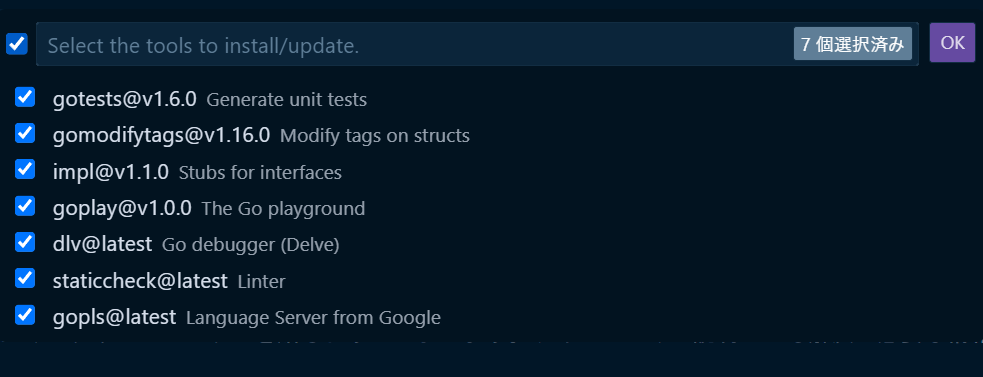

# 環境構築 (macOS)

[[toc]]

:::warning
コマンドは手入力ではなく、コピー & ペースト で入力してください。  
手入力だと写し間違いの可能性があります。  
この際、1 行ずつコピーするようにしてください。
:::

## 事前準備

::: tip
質問をするときにはできるだけスクリーンショットを貼るようにしましょう。テキストだけで説明しても解決に必要な情報を全て伝えるのは難しいです。

`Control + Shift + Command + 4`を押すと、矩形選択でスクリーンショットが撮れます。 traQ のメッセージ入力欄に` Command + V`で貼り付けられます。
:::

### Homebrew の導入

`ターミナル`アプリを開いて、以下のコマンドを貼り付け、`return`キーを押して実行してください。

Homebrew とは、様々なアプリケーションをインストールしやすくし、アップデートなどもやりやすくするためのソフトです。

```bash
/bin/bash -c "$(curl -fsSL https://raw.githubusercontent.com/Homebrew/install/HEAD/install.sh)"
```

参考: https://brew.sh/index_ja

## VSCode の導入

すでに VSCode をインストールしている方はこの手順を飛ばして大丈夫です。

以下のサイトから`macOS`の VSCodeインストーラーをダウンロードして、それを実行してインストールしてください。

https://code.visualstudio.com/download

### 拡張機能の導入

VSCode は拡張機能により様々な言語でのプログラミングをラクにすることができます。  
次回以降に使うものも最初にまとめて導入しておきましょう。

- [Go](https://marketplace.visualstudio.com/items?itemName=golang.Go)
  - Go 言語で書いたコードをチェックしてくれたり、プログラムを書くときに補完 (予測変換のような機能) を使えるようになったりします。
- [ESLint](https://marketplace.visualstudio.com/items?itemName=dbaeumer.vscode-eslint)
  - コードの書き方をチェックしてくれます。
- [Prettier - Code formatter](https://marketplace.visualstudio.com/items?itemName=esbenp.prettier-vscode)
  - コードのフォーマットを整えてくれます。保存時に自動で実行されるような設定をしておくと便利です。
- [Vue Language Features (Volar)](https://marketplace.visualstudio.com/items?itemName=vue.volar)
  - VSCode の Vue3 向けの統合プラグイン。  

インストールが終わったら、反映させるために VSCode を 1 度閉じて開きなおしてください。

## Go と Task のインストール

ここでは、Go というプログラミング言語の導入をします。
この講習会では Go という言語でサーバーサイドの制作を行います。

先ほど導入した Homebrew を用いてインストールします。

```bash
brew install go@1.22
```

ここまでで、以下のコマンドを実行して

```bash
go version
```

`go version go.1.22.3`と表示されればインストール完了です。
ここまでできれば、次は以下のコマンドも実行して Task のインストールをしてください。

```sh
go install github.com/go-task/task/v3/cmd/task@latest
```

:::info 詳しく知りたい人向け。

**`Task`って何だ。**

Task は、Go で動いているタスクランナーです。これによって長いコマンドを短くできたり、複数のコマンドを 1 回で実行できたりと、開発においてとても便利なツールです。テンプレートリポジトリに`Taskfile.yaml`というファイルがありますが、このファイルによってコマンドの設定をしています。公式ドキュメントは英語しかありませんが、興味のある人は目を通してみてください。

Task 公式ドキュメント [https://taskfile.dev/](https://taskfile.dev/)

Task GitHub [https://github.com/go-task/task](https://github.com/go-task/task)

:::

### Go のツールのインストール

VSCode で `Command`+`Shift`+`P` を押して出てくるコマンドパレットに`gotools`と入力して、出てきた「Go: Install/Update Tools」をクリックしてください。



利用可能なツールの一覧が出てくるので、全てにチェックを入れて「OK」をクリックします。

:::tip
一番上の入力欄の左にあるチェックボックスを押すと一括選択ができます。
:::

出力で`All tools successfully installed. You are ready to Go. :)`と出ているのが確認できたら成功です。

## asdf の導入

asdf とは、一つのプログラムの複数のバージョンを PC 内で管理できるようにするものです。
それ以外にもあとからバージョンを更新するのが容易にもなるので長期的に見るとオススメです。
しかし、本講習会で必須というわけではないので任意とします。

:::info
以下の作業では、asdf を使うかどうかで手順が違います。
どちらか一方を選んで次の作業に移ってください。
:::

[公式資料](https://asdf-vm.com/#/core-manage-asdf)

以下のコマンドにより asdf の導入を行います。

``` zsh [Mac]
brew install asdf
echo -e '\n. $(brew --prefix asdf)/libexec/asdf.sh' >> ${ZDOTDIR:-~}/.zshrc
source ~/.zshrc
```

## Node.jsの導入

Vue を使うために、Node.js を入れます。
この講習会では、クライアントサイドを Vue を用いて制作します。

```bash
asdf plugin add nodejs
asdf install nodejs latest
asdf global nodejs latest
```

これで、デフォルトで現在出ている最新のバージョンが適用されるようになりました。

ここで、インストールが正常にできているかを確認します。

```bash
node -v
```

を実行して、バージョン番号が表示されれば OK。

## Docker Desktopのインストール

https://www.docker.com/products/docker-desktop/  
上のリンクからそれぞれの OS にあったものをダウンロードしてインストールしてください。

:::info
Mac は M1/M2 の場合、 Apple Chip を、Intel の場合、Intel Chip を選択してください。
:::

## Postmanのインストール

[Postman | API Development Environment](https://www.getpostman.com/) は GUI で HTTP リクエストを行えるアプリケーションです。

[ダウンロードページ](https://www.postman.com/downloads/)
