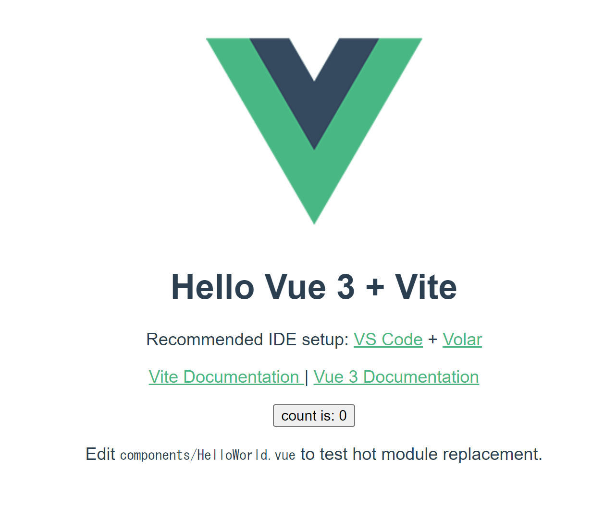
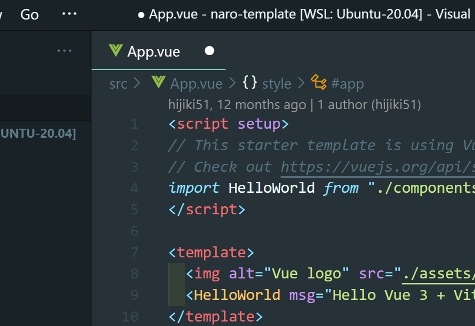
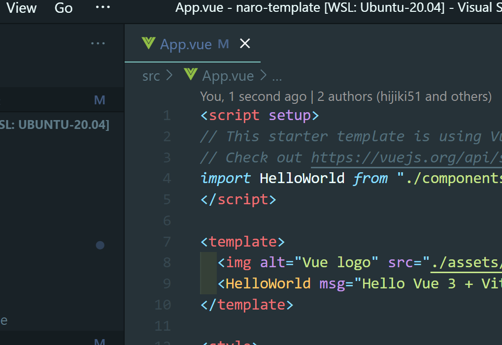
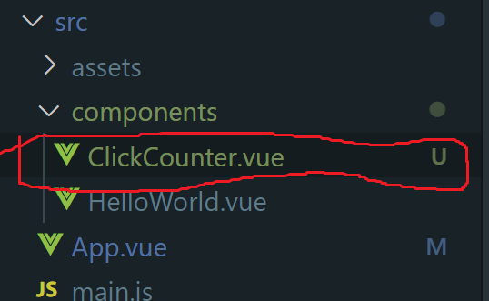
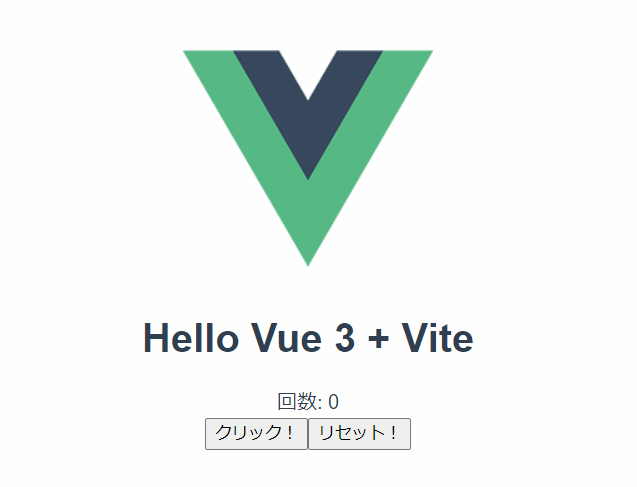

# Vue.js で TodoList

`~/vue`ディレクトリの中にテンプレートリポジトリをクローンしてプログラムを書きます。

## Vue テンプレートのクローン

// todo: ts 対応したのを traPtitech に別で作る

予め設定等が準備されたテンプレートリポジトリを用いて TodoList を作っていきます。

https://github.com/hijiki51/naro-template にアクセスし、「Use this template」→「Create a new repository」をクリックしてください。


「Repository name」にリポジトリ名を入力、公開状態は TA が見れるように「Public」 にしてください。


「Create repository from template」でリポジトリを作成したら手元にクローンしてください。  
`cd <リポジトリ名>`でプロジェクトのディレクトリに移動し、`code .`で VSCode を開きます。

:::warning
`command not found`と出る場合にはパスが通っていないので、TA に聞いてください。

// todo: リンクかなんか貼ってもよさそう
:::

開いたプロジェクトの中に入っている`package.json`というファイルには npm に関する様々な設定が書かれています。
この中には依存するパッケージ一覧も含まれており、以下のコマンドでそれらをインストールすることができます。

`$ npm i`  
もしくは  
`$ npm install`

```bash
mehm8128@DESKTOP-6F4C0KI ~/naro-lecture/naro-template (main)$ npm i

added 130 packages, and audited 131 packages in 2s

20 packages are looking for funding
  run `npm fund` for details

1 moderate severity vulnerability

To address all issues, run:
  npm audit fix

Run `npm audit` for details.
```

//todo: 色やばい

テンプレートは初期状態でビルド&配信できるようになっているので、以下のコマンドを実行してブラウザで確認してみましょう。

`$ npm run dev`

```bash
mehm8128@DESKTOP-6F4C0KI ~/naro-lecture/todolist (main)$ npm run dev

> todolist@0.0.0 dev
> vite


  VITE v4.3.8  ready in 611 ms

  ➜  Local:   http://localhost:5173/
  ➜  Network: use --host to expose
  ➜  press h to show help

```

この状態で、ブラウザから http://localhost:5173/ にアクセスすると、以下のような画面が表示されるはずです。

:::warning
WSL2 を使う人は、最初に書いた WSL2 の設定についてを実行しないとアクセスできません。

//todo リンク
:::



止めるときは`Ctrl + C`(Mac の人は`⌘+C`)で止めてください。

## Vue.js 入門

### Vue.js とは

以下のリンクから公式ドキュメントに飛ぶことができます。
[Vue.js](https://v3.ja.vuejs.org/)

traP では、Web フロントフレームワークとして最も多く使われているフレームワークで、traQ、traPortal、Showcase、anke-to、knoQ などで使われています。

### `.vue`ファイルについて

Vue.js では`.vue`という拡張子で単一ファイルコンポーネント(SFC, Single File Component)を作ることができます。

なろう講習会の言葉で言うと、Vue では、**一つの同じファイルに構造(HTML)・ロジック(JavaScript)・スタイル(CSS)**を記述することができます。それぞれを別の巨大なファイルに書くのではなく、**見た目に対応した要素ごとに分割して書く**ことで、それぞれの責任範囲をより直感的な形式で分けることができるわけです。このように分けられた要素をコンポーネントといいます。

//todo: .html でも全部書けるのでは？

### Vue.js の書き方

`<script>`タグ内にロジック
`<template>`タグ内に構造
`<style>`タグ内にスタイル
を記述します。

#### Sample.vue

<<< @/chapter1/section2/src/Sample.vue

#### 使用例

traQ で一つ例を挙げると、メッセージの表示部分はコンポーネントとして定義されています。
メッセージも複数のコンポーネントから構成されています。

https://github.com/traPtitech/traQ_S-UI/blob/master/src/components/Main/MainView/MessageElement/MessageElement.vue

- メッセージ情報の表示(ユーザー名、画像、ファイル等)の構造(HTML)
- メッセージにスタンプをつける等のロジック(TypeScript)
- それらのスタイルを記述するスタイル(Scss)

が一つのファイルに纏められていることがわかります(このファイルはたった 130 行程度ですが、traQ にはコンポーネントが 300 個以上あります。 これがそれぞれの HTML、 CSS、 JavaScript のファイルに書かれていると想像してみると…)。

### プロジェクト構造

```
.
├── index.html              // 最初にブラウザに読まれるHTMLファイル
├── node_modules/           // 依存ライブラリの保存先
├── package-lock.json       // 依存ライブラリ(詳細)
├── package.json            // 依存ライブラリ・タスク・各種設定
├── public
│   └── favicon.ico         // 静的ファイル(ビルドされない)
├── src
│   ├── App.vue             // main.jsから読まれる.vueファイル(Vueの処理開始点)
│   ├── assets              // Vueで使用したい画像など
│   │　　└── logo.svg
│   ├── components          // 各種コンポーネント
│   │　　└── HelloWorld.vue
│   └── main.ts　　　　　　　　// index.htmlから読まれるscript(TSの処理開始点)
└── vite.config.ts
```

#### `index.html`

Vite はここから参照されているファイルをたどってビルドを進めていきます。
ここに必要なものを書き加えることもありますが、基本的には書き換えません
マウント用の<div id="app"></div>と main.js の読み込みが書かれています。

#### `node_modules`

`npm install` でインストールされる依存ライブラリが保存されるディレクトリです。
中を見ることは殆ど無いです。
.gitignore に指定されています。(`package.json`, `package-lock.json` があれば `npm install` で再現できるためです)

#### `package.json` `package-lock.json`

プロジェクトに関するメタ情報や、`npm run ~~`で実行できるタスク、依存ライブラリの情報が記述されています。

#### `src/main.ts`

`index.html` で読み込まれている ts ファイルです。
ここでは Vue インスタンスを生成し、`index.html` の`<div id="app"></div>`部分にマウントしています。

#### `src/App.vue`

Vue.js としてのエントリーポイントです。
HelloWorld コンポーネントを読み込み → 登録 → 描画しています。

#### `src/components/HelloWorld.vue`

ここと似たようなものをどんどん書いていきます。
App.vue で呼び出されています。  
※`components`内に他にも色々なコンポーネントがありますが、重要ではないので無視します。

## Vue.js を書く準備

まず、以下の拡張機能をインストールしてください。

#### Vue Dev tool

Chrome Devtool に Vue.js 向けのデバッグ機能を追加してくれます。  
[Vue.js devtools - Chrome ウェブストア](https://chrome.google.com/webstore/detail/vuejs-devtools/nhdogjmejiglipccpnnnanhbledajbpd?hl=ja)

//todo: ほとんど使ったことないけどどう使うんだっけ

#### ESLint

前回の「きれいなソースコードを保つために」で紹介した VSCode の拡張機能。  
保存時にフォーマットする設定にしておくと精神衛生が保たれます。  
[ESLint - Visual Studio Marketplace](https://marketplace.visualstudio.com/items?itemName=dbaeumer.vscode-eslint)

#### Prettier

同じく前回の「きれいなソースコードを保つために」で紹介した VSCode の拡張機能。  
保存時にフォーマットする設定にしておくと精神衛生が保たれます。  
[Prettier - Code formatter - Visual Studio Marketplace](https://marketplace.visualstudio.com/items?itemName=esbenp.prettier-vscode)

#### Volar

VSCode の Vue3 向けの統合プラグイン。  
[Vue Language Features (Volar) - Visual Studio Marketplace](https://marketplace.visualstudio.com/items?itemName=vue.volar)

インストールが終わったら、反映させるために VSCode を一度閉じて開きなおしてください。

### ソースコードの書き進め方

`npm run dev`で起動していれば、ファイルの変更を自動で検知して表示が更新されます。

:::tip
ちゃんと保存しましょう。


画面上部のタブのファイル名の横に ● がついているときは保存できていません。



設定で自動保存されるようにしておくと便利です。
参考： [自動保存するように設定する](https://www.javadrive.jp/vscode/setting/index2.html)
:::

## Vue.js を書く

開発基礎講習会で書いたカウンターのソースコードを再掲します。

#### index.html(一部抜粋)

<<< @/chapter1/section2/src/index.html

#### counter.js

<<< @/chapter1/section2/src/counter.js

### Vue.js を書く

:::info
先にコードを書いてから解説を書いています。
意味がわからなくてもとりあえずコピペ or 写経しましょう。
:::

#### ファイルの作成

`components`ディレクトリ内に`ClickCounter.vue`というファイルを作成します。



#### ソースコードの変更

##### src/components/HelloWorld.vue

`script`タグ内で`ClickCounter.vue`を読み込み、`template`タグ内にカウンターを配置します。

<<< @/chapter1/section2/src/HelloWorld.vue

##### src/components/ClickCounter.vue

<<< @/chapter1/section2/src/ClickCounter.vue

以下のように動けば OK です。



### ソースコード解説

#### src/components/HelloWorld.vue

##### 9~14 行目

テンプレート部分です。
Vue のコンポーネントは一つのタグの中に収まっている必要があります。
そのため、多くの場合 div タグで囲まれています。(`ClickCounter.vue`も)

##### 2 行目

```js
import ClickCounter from "./ClickCounter.vue"
```

`ClickCounter` コンポーネントを読み込む部分です。

##### n 行目

```js
defineProps<{
	msg: string
}>()
```

`msg`props を`string`型で定義してる部分です。
今回だと`App.vue`で `<HelloWorld msg="Hello Vue 3 + Vite" />`のような形で`msg`に値を指定することで、コンポーネントを使う側から値を渡しています。JavaScript でいう関数の引数のようなものです。

参考: [プロパティ | Vue.js](https://ja.vuejs.org/guide/components/props.html)

##### 12 行目

```html
<ClickCounter />
```

読み込んだコンポーネントを利用しています。

#### src/components/ClickCounter.vue

##### 4 行目

コンポーネント内で利用する変数をこのように書きます。  
ここでは`count`という名前の変数を`number`型で定義しています。

//todo: フォーマットバグってる

```js
const count = ref < number > 0
```

参考: [ref によるリアクティブな変数 | Vue.js](https://v3.ja.vuejs.org/guide/composition-api-introduction.html#ref-%E3%81%AB%E3%82%88%E3%82%8B%E3%83%AA%E3%82%A2%E3%82%AF%E3%83%86%E3%82%A3%E3%83%95%E3%82%99%E3%81%AA%E5%A4%89%E6%95%B0)

##### 11・12 行目

ボタンが押されたイベントに対する処理を書いています。
`@click`の中には直接 JavaScript を書くこと(今回)も`<script setup>`内で定義した関数を指定することもできます。

```html
<button @click="count++">クリック！</button>
<button @click="count = 0">リセット！</button>
```

参考: [イベントへの入門 - ウェブ開発を学ぶ | MDN](https://developer.mozilla.org/ja/docs/Learn/JavaScript/Building_blocks/Events)  
参考: [イベントハンドリング | Vue.js](https://v3.ja.vuejs.org/guide/events.html)

:::tip
v-on:click のショートハンドとして@click という書き方ができます(推奨)
:::

##### 5 行目・10 行目

`computed`という機能を使って、表示するメッセージを生成します。

参考: [テンプレート構文 | Vue.js](https://v3.ja.vuejs.org/guide/template-syntax.html#%E3%83%86%E3%83%B3%E3%83%95%E3%82%9A%E3%83%AC%E3%83%BC%E3%83%88%E6%A7%8B%E6%96%87)  
参考: [算出プロパティ | Vue.js](https://v3.ja.vuejs.org/guide/reactivity-computed-watchers.html#%E7%AE%97%E5%87%BA%E3%83%95%E3%82%9A%E3%83%AD%E3%83%8F%E3%82%9A%E3%83%86%E3%82%A3)

### Vue.js の嬉しさを実感する

いかがでしょうか？
この規模だと、ソースコードの行数としては生の HTML・JS で書いたほうが少ないですが、書く量を増やしてでも Vue を使う嬉しさがあります。

#### 変数を操作するだけで表示が変わる

生 JS ではボタンのクリックごとに表示を変更する必要があります。
Vue ではコンポーネントの定義の時に表示と変数を関連付ける(5 行目・10 行目)ことで、変数を操作するだけで表示が自動で切り替わります。これが Vue.js の提供するリアクティビティです(コンポーネントが内部に保持している状態を変更したとき、その変更が Vue によって検知されて自動で HTML に反映されます)。

今回は、変数を操作する箇所が少ないのでまだ追えますが、この変数が様々なところで変更されるものだった場合を考えてみましょう。
生 HTML・JS ではその全ての場所で書き換えるコードを忘れることなく書かなければなりません。
複数のプログラマでコードを書いた場合、それを忘れないようにするということはかなりのコストになってしまうので辛いです。
Vue.js ではそれがなくて嬉しいです。

### 一度コンポーネントを登録すれば使い回せる

カウンターを 2 つ作りたくなった場合を考えます。
生 HTML・JS が書ける人はちょっとチャレンジしてみてください。関数名や変数名をかぶらないようにしたり、セレクタの名前を変更したりと結構めんどくさいです。
Vue.js ならば、`HelloWorld.vue` の`<click-counter />`をコピーして増やすだけで OK です。
これは traQ のように同じ要素を沢山利用するような Web アプリで大きな利点となります。
