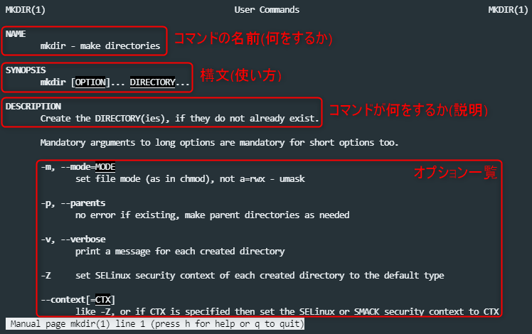
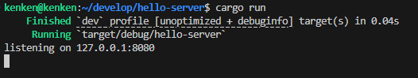
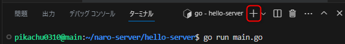
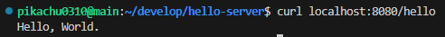
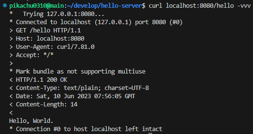
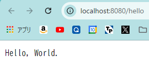
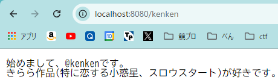

# サーバーアプリケーションを作ってみよう

## ファイルの作成

今回は、Rust と、Rust の有名な web フレームワークである [axum](https://github.com/tokio-rs/axum) を使ってサーバーアプリケーションを作っていきます。

`~/develop/hello-server`というディレクトリを作成し、そのディレクトリを開きます。
```bash
# ディレクトリ ~/develop/hello-server を作成し、そのディレクトリを開く。

$ mkdir -p ~/develop/hello-server
$ cd ~/develop/hello-server
$ code .
```
:::info
先ほどのコマンドの`mkdir`は、`make directories`の略で`-p`というオプションを付けると、階層の深いディレクトリを 1 回で作ることができます。このような説明は、man コマンド(マニュアルの man )を使うことで調べることができます。ググる前に使うと良いです。(q キーを押すことで抜けられます。)
```bash
$ man mkdir
```

:::

:::warning
作ったディレクトリやファイルの名前が資料と違うと、上手く実行できない場合があります。
変えた場合には適宜読み替えてください。
:::

作成したディレクトリを、Rust プロジェクトとして初期化します。
以下のコマンドを実行してみましょう。
```bash
# Rust プロジェクトの初期化をする。
$ cargo init
```

すると、`src/main.rs`を含むいくつかのファイルが生成されます。

`src/main.rs`に以下のプログラムを書き込みましょう。

<<<@/chapter1/section3/src/1-1_hello-server.rs

axum は、[Rust の標準ライブラリ](https://doc.rust-lang.org/std/)に入っていない外部ライブラリなので、外部からダウンロードしなければなりません。しかし、`cargo` という Rust のパッケージマネージャを使えば、簡単にダウンロードできます。

以下を VSCode 内のターミナルで実行してください。(他のターミナルでも可)

:::tip
**ターミナルの開き方**

ツールバー > Terminal > New Terminal でその時開いているディレクトリでターミナルが開きます。
もしくは`Ctrl` + `@`でも。
:::

```bash
# Rust プロジェクトに axum と tokio の依存を追加する。
$ cargo add axum
$ cargo add tokio --features rt-multi-thread,macros
```

続けて、`main.rs` を実行してサーバーを立てましょう。
```bash
# 先ほど書いたファイルを実行して、サーバーを立てる

$ cargo run
```

以下のような画面が出れば起動できています。


止めるときはターミナル上にて`Ctrl+C`で終了できます。
:::warning
**止めないと次に起動するときにポート番号を変えないとエラーが出てしまうので、使い終わったら`Ctrl+C`で止めるようにしましょう。**
:::

## アクセスしてみる

まずはコマンドライン(ローカル)でサーバーにアクセスしてみましょう。  
コマンドラインでサーバーにアクセスするには、[curl](https://curl.se/)というコマンドを使います。  
ターミナルパネルの上にあるツールバーのプラスボタンを押すと、新たにターミナルを開くことができます。



新しくターミナルを開いて、以下のコマンドを実行してみましょう。
```bash
$ curl localhost:8080/hello
```

すると、レスポンスとして Hello, World が返ってきていることがわかります。


## 更に詳しくリクエストを見る

curl コマンドのオプションとして、リクエストなどの情報を詳しく見る`-vvv`があります。

```bash
$ curl localhost:8080/hello -vvv
```

とすると


先程座学でやったような、リクエスト・レスポンスが送られていることがわかります。

## ブラウザからアクセスする

localhost は自分自身を表すドメインなので、自分のブラウザからのみアクセスが可能です。  
ブラウザで、<a href='http://localhost:8080/hello' target="_blank" rel="noopener noreferrer">localhost:8080/hello</a> にアクセスしてみましょう。


## 基本問題
エンドポイントとして自分の traQ ID のものを生やして自己紹介を返すようにしてみましょう。  
`main.rs`に`/{自分の traQ ID}`処理を追加して作ってください。

:::tip
この章では、この`main.rs`に処理を追加していきます。

以降のコードではすでに作ったエンドポイントを省略していますが、作ったエンドポイントは消さずに、新しいエンドポイントを追加していくようにしてください。
:::

作り終わったら、変更を反映させるために、`cargo run`を実行したターミナル上で`Ctrl+C`を押してサーバーを止めた後、また`cargo run`してサーバーを立て直しましょう。  
今後`main.rs`を書き換えたらこの工程を行うようにして下さい。

サーバーの立て直しができたら、ブラウザで`http://localhost:8080/{自分の traQ ID}` にアクセスするか、以下のコマンドを実行して、上手く出来ていることを確認しましょう。
```bash
$ curl http://localhost:8080/{自分の traQ ID}
```

例:


**ここまで完成したら、講習会の実況用チャンネルに↑のようなスクリーンショットを投稿しましょう。**
