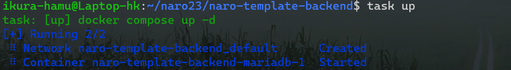
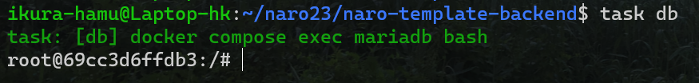
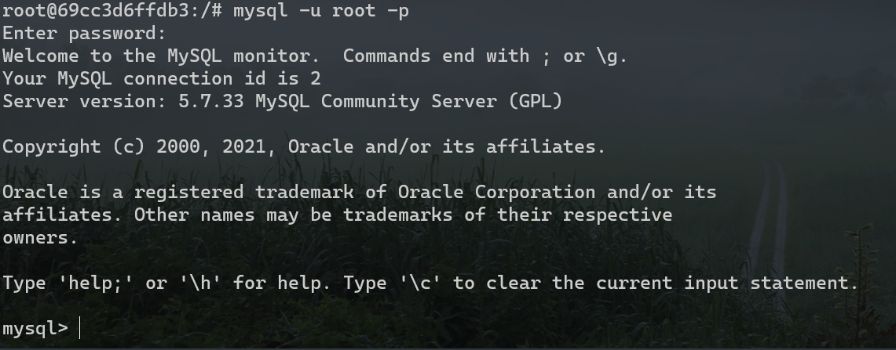

# データベースを扱う準備

## リポジトリの準備

なろう講習会のバックエンド用のテンプレートリポジトリ、[https://github.com/traPtitech/naro-template-backend](https://github.com/traPtitech/naro-template-backend) を使います。リンクから GitHub のリポジトリにアクセスしてください。右上の「Use this template」と書かれたボタンをクリックし、「Create a new repository」から自分のアカウントにリポジトリを作ります。リポジトリ名は`naro-backend`など適当なものにしましょう。


これができたら自分の手元にリポジトリをクローンし、`cd`コマンドでクローンしたリポジトリを開きましょう。

## Taskのインストール

`go run github.com/go-task/task/v3/cmd/task@latest init`をコマンドラインで実行してください。

:::info 詳しく知りたい人向け。

**`task`って何だ。**

Task は、Go で動いているタスクランナーです。これによって長いコマンドを短くできたり、複数のコマンドを 1 回で実行できたりと、開発においてとても便利なツールです。テンプレートリポジトリに`Taskfile.yaml`というファイルがありますが、このファイルによってコマンドの設定をしています。公式ドキュメントは英語しかありませんが、興味のある人は目を通してみてください。

Task 公式ドキュメント [https://taskfile.dev/](https://taskfile.dev/)

Task GitHub [https://github.com/go-task/task](https://github.com/go-task/task)

:::

## データベースを立ち上げる

この講習会では、「Docker」と呼ばれるコンテナ型仮想環境に MariaDB を載せて使います。Docker は開発でよく使う便利なものですが、今は理解できなくても大丈夫です。インストールした「Docker Desktop」を立ち上げてください。これ以降もデータベースを使う作業をする際は必ず「Docker Desktop」を立ち上げてください。

「Docker Desktop」を立ち上げたあと、ターミナルで `task up` を実行してください。これによってデータベースが起動します。



次に `task db` を実行しましょう。MariaDB が動いている Docker コンテナの中に入ることができます。



この状態で `mysql -u root -p` と入力するとパスワードを求められます。「`password`」と入力してください。このとき、入力した文字は表示されないので注意してください。下の画像のように `mysql>` と表示されたら成功です。
`mysql -u root -p`は、「MySQL を`root`というユーザーで使うためにパスワードを使ってログインする」という意味のコマンドです。パスワードをつなげて`mysql -u root -ppassword`ともできます。



MySQL にログイン出来たら、スクリーンショットを講習会チャンネルに投稿しましょう。

:::warning

これからはさまざまな場所でコマンドを入力することになります。どこで入力すべきか混乱しないようにしましょう。この資料では以下のような表記をします。

- 普通のターミナル（PC から起動して最初に出てくるやつ）

```bash
$ ~~~
```

- Docker のターミナル（`task db`を実行すると出てくるやつ）

```bash
/# ~~~
```

- MySQL でのコマンド（Docker のターミナルで`mysql -u root`をするとでてくるやつ）

```sql
mysql> ~~~
```

打ち間違いを防ぐためにコマンドのコピーをお勧めしますが、右のコピーボタンからコピーする際は、最初の記号も含めてコピーされるので注意してください。

:::
