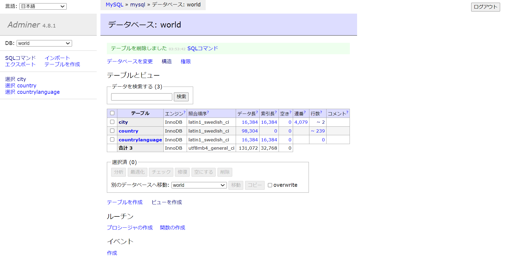

# SQLで遊ぶ

:::tip
SQL 文は小文字でも動きます。大文字を打つのが面倒な場合は、小文字にしましょう
:::

データベースに入った状態で、さまざまな SQL を試していきます。ターミナルに `mysql>`が表示されていることを確認してください。

初めにデータベースを確認します。

```sql
mysql> SHOW DATABASES;
```

以下のように出力されるはずです。

```txt
+--------------------+
| Database           |
+--------------------+
| information_schema |
| mysql              |
| performance_schema |
| sys                |
| world              |
+--------------------+
5 rows in set (0.00 sec)
```

これは MySQL サーバーに存在するデータベースの一覧です。今回は`world`というデータベースを使います。下のコマンドを入力してください。

```sql
mysql> USE world;
```

他のデータベースは MySQL の設定などが含まれているデータベースです。
`world`は、 MySQL 公式が用意している学習用のデータベースで、さまざまな国や地域の情報が集まっています。

https://dev.mysql.com/doc/world-setup/en/

次に`world`に含まれるテーブル一覧を確認します。

```sql
mysql> SHOW TABLES;
```

```txt
+-----------------+
| Tables_in_world |
+-----------------+
| city            |
| country         |
| countrylanguage |
+-----------------+
3 rows in set (0.00 sec)
```

`city`、`country`、`countrylanguage`の 3 つのテーブルの存在がわかります。

## テーブルの構造を見る

```sql
mysql> DESC city;
-- または
mysql> DESCRIBE city;
-- または
mysql> SHOW COLUMNS FROM city;
```

```txt
+-------------+----------+------+-----+---------+----------------+
| Field       | Type     | Null | Key | Default | Extra          |
+-------------+----------+------+-----+---------+----------------+
| ID          | int(11)  | NO   | PRI | NULL    | auto_increment |
| Name        | char(35) | NO   |     |         |                |
| CountryCode | char(3)  | NO   | MUL |         |                |
| District    | char(20) | NO   |     |         |                |
| Population  | int(11)  | NO   |     | 0       |                |
+-------------+----------+------+-----+---------+----------------+
5 rows in set (0.00 sec)
```

`city`テーブルには`ID`、`Name`、`CountryCode`、`District`、`Population`の 5 つのカラムの存在がわかります。

## データベースから情報を取得する

### SELECT 文

`SELECT {対象カラム名} FROM {対象テーブル名};` で、テーブルから情報を取得できます。複数のカラムを取得したいときは`,`で区切ります。

```sql
mysql> SELECT Name, Population FROM city;
```

```txt
+-----------------------------------+------------+
| Name                              | Population |
+-----------------------------------+------------+
| Kabul                             |    1780000 |
| Qandahar                          |     237500 |
| Herat                             |     186800 |
| Mazar-e-Sharif                    |     127800 |
| Amsterdam                         |     731200 |
| Rotterdam                         |     593321 |
| Haag                              |     440900 |
| Utrecht                           |     234323 |
| Eindhoven                         |     201843 |
| Tilburg                           |     193238 |
...省略
```

#### 全取得

全てのカラムを取得したい場合は、`*`を使えます。

```sql
mysql> SELECT * FROM city;
```

```txt
+------+-----------------------------------+-------------+----------------------+------------+
| ID   | Name                              | CountryCode | District             | Population |
+------+-----------------------------------+-------------+----------------------+------------+
|    1 | Kabul                             | AFG         | Kabol                |    1780000 |
|    2 | Qandahar                          | AFG         | Qandahar             |     237500 |
|    3 | Herat                             | AFG         | Herat                |     186800 |
|    4 | Mazar-e-Sharif                    | AFG         | Balkh                |     127800 |
|    5 | Amsterdam                         | NLD         | Noord-Holland        |     731200 |
|    6 | Rotterdam                         | NLD         | Zuid-Holland         |     593321 |
|    7 | Haag                              | NLD         | Zuid-Holland         |     440900 |
|    8 | Utrecht                           | NLD         | Utrecht              |     234323 |
|    9 | Eindhoven                         | NLD         | Noord-Brabant        |     201843 |
|   10 | Tilburg                           | NLD         | Noord-Brabant        |     193238 |
...省略
```

#### LIMIT句

`SELECT` 文の後ろに`LIMIT {件数}`を追加することで取得件数の上限を指定できます。

```sql
mysql> SELECT * FROM city LIMIT 5;
```

```txt
+----+----------------+-------------+---------------+------------+
| ID | Name           | CountryCode | District      | Population |
+----+----------------+-------------+---------------+------------+
|  1 | Kabul          | AFG         | Kabol         |    1780000 |
|  2 | Qandahar       | AFG         | Qandahar      |     237500 |
|  3 | Herat          | AFG         | Herat         |     186800 |
|  4 | Mazar-e-Sharif | AFG         | Balkh         |     127800 |
|  5 | Amsterdam      | NLD         | Noord-Holland |     731200 |
+----+----------------+-------------+---------------+------------+
5 rows in set (0.00 sec)
```

#### OFFSET句

`OFFSET {ずらす数}`を LIMIT 句の後ろにつなげると、データを取得し始める位置をずらして指定できます。ただし、`LIMIT`を指定せずに`OFFSET`は指定できません。

```sql
mysql> SELECT * FROM city LIMIT 5 OFFSET 10;
```

```txt
+----+-----------+-------------+---------------+------------+
| ID | Name      | CountryCode | District      | Population |
+----+-----------+-------------+---------------+------------+
| 11 | Groningen | NLD         | Groningen     |     172701 |
| 12 | Breda     | NLD         | Noord-Brabant |     160398 |
| 13 | Apeldoorn | NLD         | Gelderland    |     153491 |
| 14 | Nijmegen  | NLD         | Gelderland    |     152463 |
| 15 | Enschede  | NLD         | Overijssel    |     149544 |
+----+-----------+-------------+---------------+------------+
5 rows in set (0.00 sec)
```

#### WHERE句

`SELECT {カラム名} FROM {テーブル名} WHERE {条件式};`で取得するレコードの条件を付けることができます。`AND`や`OR`を使うことで、条件を複数つけることができます。

```sql
mysql> SELECT * FROM city WHERE Population >= 8000000;
```

```txt
+------+-------------------+-------------+------------------+------------+
| ID   | Name              | CountryCode | District         | Population |
+------+-------------------+-------------+------------------+------------+
|  206 | São Paulo         | BRA         | São Paulo        |    9968485 |
|  939 | Jakarta           | IDN         | Jakarta Raya     |    9604900 |
| 1024 | Mumbai (Bombay)   | IND         | Maharashtra      |   10500000 |
| 1890 | Shanghai          | CHN         | Shanghai         |    9696300 |
| 2331 | Seoul             | KOR         | Seoul            |    9981619 |
| 2515 | Ciudad de México  | MEX         | Distrito Federal |    8591309 |
| 2822 | Karachi           | PAK         | Sindh            |    9269265 |
| 3357 | Istanbul          | TUR         | Istanbul         |    8787958 |
| 3580 | Moscow            | RUS         | Moscow (City)    |    8389200 |
| 3793 | New York          | USA         | New York         |    8008278 |
+------+-------------------+-------------+------------------+------------+
10 rows in set (0.01 sec)
```

```sql
mysql> SELECT * FROM city WHERE CountryCode = "JPN" AND Population > 5000000;
```

```txt
+------+-------+-------------+----------+------------+
| ID   | Name  | CountryCode | District | Population |
+------+-------+-------------+----------+------------+
| 1532 | Tokyo | JPN         | Tokyo-to |    7980230 |
+------+-------+-------------+----------+------------+
1 row in set (0.00 sec)
```

#### ORDER BY 句

`SELECT {カラム名} FROM {テーブル名} ORDER BY {対象カラム名} {並び順};`で結果を昇順・降順に並び替えて取得できます。`ASC`で昇順、`DESC`で降順です。`ORDER BY`を指定しない場合、取得するレコードの順番は保証されません。

```sql
SELECT * FROM city WHERE Population >= 8000000 ORDER BY Population DESC;
```

```txt
+------+------------------+-------------+------------------+------------+
| ID   | Name             | CountryCode | District         | Population |
+------+------------------+-------------+------------------+------------+
| 1024 | Mumbai (Bombay)  | IND         | Maharashtra      |   10500000 |
| 2331 | Seoul            | KOR         | Seoul            |    9981619 |
|  206 | S�o Paulo        | BRA         | S�o Paulo        |    9968485 |
| 1890 | Shanghai         | CHN         | Shanghai         |    9696300 |
|  939 | Jakarta          | IDN         | Jakarta Raya     |    9604900 |
| 2822 | Karachi          | PAK         | Sindh            |    9269265 |
| 3357 | Istanbul         | TUR         | Istanbul         |    8787958 |
| 2515 | Ciudad de M�xico | MEX         | Distrito Federal |    8591309 |
| 3580 | Moscow           | RUS         | Moscow (City)    |    8389200 |
| 3793 | New York         | USA         | New York         |    8008278 |
+------+------------------+-------------+------------------+------------+
10 rows in set (0.01 sec)
```

#### IN演算子

`SELECT {カラム名} FROM {テーブル名} WHERE {カラム名} IN ({値1}, {値2}, ...)`のように書くことで、カラムの値が複数の値のうちどれかに当てはまるものを選ぶことができます。
例えば、都市のうち都道府県(`District`)が四国(香川、徳島、愛媛、高知)に当てはまるものを選ぶ文は下のようになります。

```sql
mysql> SELECT * FROM city WHERE District IN ("Kagawa", "Tokushima", "Ehime", "Kochi");
```

```txt
+------+-----------+-------------+-----------+------------+
| ID   | Name      | CountryCode | District  | Population |
+------+-----------+-------------+-----------+------------+
| 1559 | Matsuyama | JPN         | Ehime     |     466133 |
| 1586 | Takamatsu | JPN         | Kagawa    |     332471 |
| 1592 | Kochi     | JPN         | Kochi     |     324710 |
| 1610 | Tokushima | JPN         | Tokushima |     269649 |
| 1700 | Niihama   | JPN         | Ehime     |     127207 |
| 1716 | Imabari   | JPN         | Ehime     |     119357 |
+------+-----------+-------------+-----------+------------+
6 rows in set (0.01 sec)
```

#### JOIN句

`SELECT {カラム名} FROM {テーブル名1} JOIN {テーブル名2} ON {条件式};`で複数のテーブルを結合して、1 つのテーブルとして取得できます。
条件式は、結合したいテーブルの特定のカラムの関係について書きます。

中国語を使っている国の国名を知りたいときを考えましょう。
`countrylanguage`テーブルには下のように国コード(`CountryCode`)のカラムはありますが国名はありません。そのため、`country`テーブルから国名を知る必要があります。

```sql
mysql> DESCRIBE countrylanguage;
```

```txt
+-------------+---------------+------+-----+---------+-------+
| Field       | Type          | Null | Key | Default | Extra |
+-------------+---------------+------+-----+---------+-------+
| CountryCode | char(3)       | NO   | PRI |         |       |
| Language    | char(30)      | NO   | PRI |         |       |
| IsOfficial  | enum('T','F') | NO   |     | F       |       |
| Percentage  | float(4,1)    | NO   |     | 0.0     |       |
+-------------+---------------+------+-----+---------+-------+
4 rows in set (0.00 sec)
```

そこで`JOIN`句を下のように使います。

```sql
mysql> SELECT country.Name, countrylanguage.Language FROM country JOIN countrylanguage ON country.Code = countrylanguage.CountryCode WHERE countrylanguage.Language = "Chinese";
```

```
+--------------------------+----------+
| Name                     | Language |
+--------------------------+----------+
| Brunei                   | Chinese  |
| Canada                   | Chinese  |
| China                    | Chinese  |
| Costa Rica               | Chinese  |
| Christmas Island         | Chinese  |
| Japan                    | Chinese  |
| Cambodia                 | Chinese  |
| South Korea              | Chinese  |
| Northern Mariana Islands | Chinese  |
| Malaysia                 | Chinese  |
| Nauru                    | Chinese  |
| Palau                    | Chinese  |
| North Korea              | Chinese  |
| French Polynesia         | Chinese  |
| Réunion                  | Chinese  |
| Singapore                | Chinese  |
| Thailand                 | Chinese  |
| United States            | Chinese  |
| Vietnam                  | Chinese  |
+--------------------------+----------+
19 rows in set (0.00 sec)
```

`country`テーブルの`Code`カラムの値と`countrylanguage`テーブルの`CountryCode`カラムが一致するように 2 つのテーブルをつなげています。`WHERE`句は`JOIN`句の後に書く必要があることに注意しましょう。

JOIN 句にはいくつか種類があり、適切なものを使う必要があります。今回使ったものは`INNER JOIN`と呼ばれます。

https://www.w3schools.com/sql/sql_join.asp

#### AS句

`SELECT {カラム名} AS {別名} FROM {テーブル名}`で、カラムに別名を付けて扱うことができます。
例えば日本の都市の名前(`Name`)と都道府県(`District`)を取得したいとき、`District`を`Prefecture`と表示したい場合は次のように書くことができます。

```sql
mysql> SELECT Name, District AS "Prefecture" FROM city WHERE CountryCode = "JPN";
```

```txt
+---------------------+------------+
| Name                | Prefecture |
+---------------------+------------+
| Tokyo               | Tokyo-to   |
| Jokohama [Yokohama] | Kanagawa   |
| Osaka               | Osaka      |
| Nagoya              | Aichi      |
| Sapporo             | Hokkaido   |
| Kioto               | Kyoto      |
| Kobe                | Hyogo      |
| Fukuoka             | Fukuoka    |
| Kawasaki            | Kanagawa   |
| Hiroshima           | Hiroshima  |
...省略
```

また、`AS`は省略でき、上の SQL は次のようにも書くことができます。

```sql
mysql> SELECT Name, District "Prefecture" FROM city WHERE CountryCode = "JPN";
```

`AS`はカラム名だけでなくテーブル名にも使うことができ、先ほどの`JOIN`の SQL は`AS`を使うとこのように書けます。

```sql
mysql> SELECT c.Name, cl.Language FROM country AS "c" JOIN countrylanguage AS "cl" ON c.Code = cl.CountryCode WHERE cl.Language = "Chinese";
```

#### COUNT関数

`SELECT COUNT({カラム名}) FROM {テーブル名};`でレコードの数を数えることができます。
都市のうち国コード(`CountryCode`)が`JPN`のレコード数は下のようにして取得できます。

```sql
mysql> SELECT COUNT(*) FROM city WHERE CountyCode = "JPN";
```

```txt
+----------+
| count(*) |
+----------+
|      248 |
+----------+
1 row in set (0.00 sec)
```

#### GROUP BY 句

`GROUP BY {カラム名}`を付けることで、`COUNT`などの結果を共通の値でまとめることができます。
各国コードの都市数を数える SQL 文は下のようになります。

```sql
SELECT CountryCode, COUNT(*) FROM city GROUP BY CountryCode;
```

```txt
+-------------+----------+
| CountryCode | COUNT(*) |
+-------------+----------+
| ABW         |        1 |
| AFG         |        4 |
| AGO         |        5 |
| AIA         |        2 |
| ALB         |        1 |
| AND         |        1 |
| ANT         |        1 |
| ARE         |        5 |
| ARG         |       57 |
...省略
```

## データベースの値を変える

### INSERT文

`INSERT INTO {テーブル名} ({カラム名1}, {カラム名2}, ...) VALUES ({値1}, {値2}, ...);`でテーブルにレコードを挿入できます。

1. 挿入

```sql
mysql> INSERT INTO city (Name, CountryCode, District, Population) VALUES ("oookayama", "JPN", "Tokyo-to", 5000);
```

2. 確認

```sql
mysql> SELECT * FROM city ORDER BY ID DESC LIMIT 1;
```

```txt
+------+-----------+-------------+----------+------------+
| ID   | Name      | CountryCode | District | Population |
+------+-----------+-------------+----------+------------+
| 4080 | oookayama | JPN         | Tokyo-to |       5000 |
+------+-----------+-------------+----------+------------+
1 row in set (0.00 sec)
```

### UPDATE文

`UPDATE {テーブル名} SET {カラム名} = {値} WHERE {条件式};`で条件に当てはまる **全ての** レコードの値を変えることができます。
さっき追加した大岡山の情報を変えてみましょう。

```sql
mysql> UPDATE city SET Population = 9999 WHERE ID = 4080;
mysql> SELECT * FROM city WHERE ID = 4080;
```

```txt
+------+-----------+-------------+----------+------------+
| ID   | Name      | CountryCode | District | Population |
+------+-----------+-------------+----------+------------+
| 4080 | oookayama | JPN         | Tokyo-to |       9999 |
+------+-----------+-------------+----------+------------+
1 row in set (0.00 sec)
```

### DELETE文

`DELETE FROM {テーブル名} WHERE 条件式;`の構文で条件に合致するレコードを **全て** 削除できます。
大岡山を消してみましょう。

```sql
mysql> DELETE FROM city WHERE ID = 4080;
```

確認してみます。

```sql
mysql> SELECT * FROM city WHERE ID = 4080;
```

```txt
Empty set (0.00 sec)
```

大岡山が消えていることが確認できました。

## Adminerを使う

Adminer(https://www.adminer.org/) はデータベースを GUI（マウスなど）を使って操作するためのソフトウェアです。traP 内では traQ の開発などで使われています。同じようなソフトウェアとして PHPMyAdmin などがあります。これらを使うことで SQL を使わなくてもデータベースを操作できます。

今回は`task up`を実行したときに Adminer が立ち上がるようになっています。ブラウザで http://localhost:8080 にアクセスすると使えます。
ログイン画面が出てくるはずなので、MySQL にログインするときと同様に、下の画像のように入力してログインしてください。パスワードは`password`です。




ログインした画面からテーブルを選び、「データ」を選択するとレコード一覧を見ることができ、検索や並び替えなどができます。また、データの編集もできます。Adminer 上で SQL の実行もでき、文がいい感じに強調表示されるので書きやすいです。


