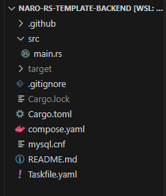

# Goでデータベースを扱う

ここからは Go でプログラムを書いてデータベースを扱っていきます。`task up`を実行してデータベースが立ち上がっていることを確認してください。
まずは VSCode で先ほどクローンしてきたリポジトリを開きましょう。画像のようなファイルが入っているはずです。 main.go を開いてください。


## データベースに接続する

### Goのプログラムを書く

サンプルのプログラムが書いてありますが、データベースと接続できるように書き換えます。
Go でデータベースに接続するためのライブラリは様々ありますが、今回は SQL 文を書く sqlx を使います。

- 参考
  - [jmoiron/sqlx: a set of extensions on go's standard `database/sql` library.](https://pkg.go.dev/github.com/jmoiron/sqlx)
  - [Illustrated guide to SQLX](https://jmoiron.github.io/sqlx/)

<<< @/chapter1/section4/src/connect_db.go{go:line-numbers}

`// #region`などのコメントは無視してください。

書き換えた後、 import の周りで赤字のエラーが出た場合は、ターミナルで`go mod tidy`を実行してください。
26 から 40 行目でデータベースに接続するための設定をして、42 行目の`db, err := sqlx.Open("mysql", conf.FormatDSN())`でデータベースに接続しています。32 行目などで`os.Getenv()`という関数が出てきていますが、これは環境変数と呼ばれる、コンピューター側で設定してプログラムで使えるようにしている変数です。今は必要なデータベースのパスワードなどの環境変数を何も設定していないので、設定します。

:::info 詳しく知りたい人向け
**dsn とは**

42 行目に`FormatDSN`という関数がありますが、`DSN`は「**D**ata **S**ource **N**ame」の頭文字をとったものです。プログラムがデータベースを指定するために使われます。今回の`FormatDSN`という関数は、データベースのユーザー名、パスワード、使うデータベース、どこにデータベースのサーバーがあるのか、用いる標準時、文字種などの設定を`conf`という変数から読み取って DSN を組み立てています。

[Wikipedia DSN(英語)](https://en.wikipedia.org/wiki/Data_source_name)
:::

### 環境変数を設定する

`.env`というファイルを作り、以下の内容を書いてください。

```sh
export DB_USERNAME="root"
export DB_PASSWORD="password"
export DB_HOSTNAME="localhost"
export DB_PORT="3306"
export DB_DATABASE="world"
```

今回は手元で動いているデータベースを使うのでパスワードなどが知られても問題ありませんが、実際には環境変数など外部の人に知られたくない、GitHub などに上げたくないファイルもあります。そのような場合は、`.gitignore`というファイルを使うことで特定のファイルやフォルダを Git 管理の対象外にできます。`.gitignore`ファイルの最後に`.env`を追記しましょう。

```txt
...
# Go workspace file
go.work

.tool-versions
.env // [!code ++]
```

`.gitignore`ファイルは便利ですが、既に Git の追跡対象になっているファイルを書いても追跡対象から外れないので注意しましょう。

https://docs.github.com/ja/get-started/getting-started-with-git/ignoring-files

最後に環境変数ファイル`.env`を環境変数として読み込むために、ターミナルで`source .env`を実行してください。

:::warning

```sh
$ source .env
```

このコマンドによって読み込んだ環境変数は、コマンドを入力したターミナルを終了すると消えてしまいます。また、コマンドを入力したターミナル以外では環境変数として読み込まれません。新しくターミナルを開きなおした場合などは、もう一度実行してください。
:::

### 実行する

```sh
$ go run main.go
```

出力はこのようになります。

```txt
connected
Tokyoの人口は7980230人です
```

`main.go`を解説してきます。

<<< @/chapter1/section4/src/connect_db.go#city

この`City`構造体の横にあるバッククオートで囲まれたタグに`db`でデータベースのカラム名を指定します。これによってライブラリがデータベースから取得したレコードを構造体に上手くあてはめてくれます。

参考: [Struct タグについて | text.Baldanders.info](https://text.baldanders.info/golang/struct-tag/)

<<< @/chapter1/section4/src/connect_db.go#get

`City`型の`city`という変数のポインタを sqlx ライブラリの`Get`関数の第 1 引数に指定します。第 2 引数には SQL 文を書きます。`Name = ?`としていますが、第 3 引数以降の値が順番に`?`へと当てはめられて SQL 文が実行され、取得したレコードが`city`変数に代入されます。

### 基本問題

```sh
$ go run main.go {都市の名前}
```

と入力して、同様に人口を表示するようにしましょう。

ヒント：[Go言語 - os.Argsでコマンドラインパラメータを受け取る - 覚えたら書く](https://blog.y-yuki.net/entry/2017/04/30/000000)

:::details 答え
<<< @/chapter1/section4/src/practice_basic1.go
:::

### 応用問題

基本問題 1 と同様に都市を入力したとき、その都市の人口がその国の人口の何％かを表示してみましょう。

ヒント： 1 回のクエリでも取得できますが、2 回に分けた方が楽に考えられます。

:::details 答え
<<< @/chapter1/section4/src/practice_advanced.go
:::

## 複数レコードを取得する

`Get`関数の代わりに`Select`関数を使い、第 1 引数を配列のポインタに変えると、複数レコードを取得できます。`main.go`の`main`関数を以下のように書き換えて実行してみましょう。

<<< @/chapter1/section4/src/select.go#main{27 go:line-numbers}
以下のように日本の都市一覧を取得できます。

```txt
connected
日本の都市一覧
都市名: Tokyo, 人口: 7980230
都市名: Jokohama [Yokohama], 人口: 3339594
都市名: Osaka, 人口: 2595674
都市名: Nagoya, 人口: 2154376
都市名: Sapporo, 人口: 1790886
都市名: Kioto, 人口: 1461974
...省略
```

日本の都市一覧を取得出来たら、スクリーンショットを講習会用チャンネルに投稿しましょう。

## レコードを書き換える

`INSERT`や`UPDATE`、`DELETE`を実行したい場合は、`Exec`関数を使うことができます。第 1 引数に SQL 文を渡し、第 2 引数以降は`?`に当てはめたい値を入れます。

```go
result, err := db.Exec("INSERT INTO city (Name, CountryCode, District, Population) VALUES (?,?,?,?)", name, countryCode, district, population)
```

例えば`INSERT`ならば、このように使うことができます。`result`には操作によって変更があったレコード数などの情報が入っています。

:::info 詳しく知りたい人向け
**なぜ「`?`」を使うのか**

sqlx で変数を含む SQL を使いたいときは「`?`」を使わなくてはいけません。これはセキュリティ上の問題です。例として、国のコードからその国の都市の情報一覧を取得することを考えましょう。`fmt`ライブラリの`Sprintf`関数を使うとこのように処理を書くことができます。

```go
err = db.Select(&city, fmt.Sprintf("SELECT * FROM city WHERE CountryCode = '%s'", code))
```

`code`に入っている値がただの国名コードなら問題はないのですが、`JPN' OR 'A' = 'A`という値が入っていたらどうなるでしょうか。データベースで実行されるとき、SQL 文は下のようになります。

```sql
SELECT * FROM city WHERE CountryCode = 'JPN' OR 'A' = 'A'
```

`OR`でつなげた条件文のうち、「`'A' = 'A'`」は常に成り立つので、`WHERE`句の条件は常に真です。よって、この SQL を実行すると、作成者が意図しない方法で全ての都市が取得できてしまいます。このような攻撃は「SQL インジェクション」と呼ばれます。

sqlx ではこれを防ぐために`?`を使うことができ、SQL 文が意図しない動きをしないようになっています。
:::
