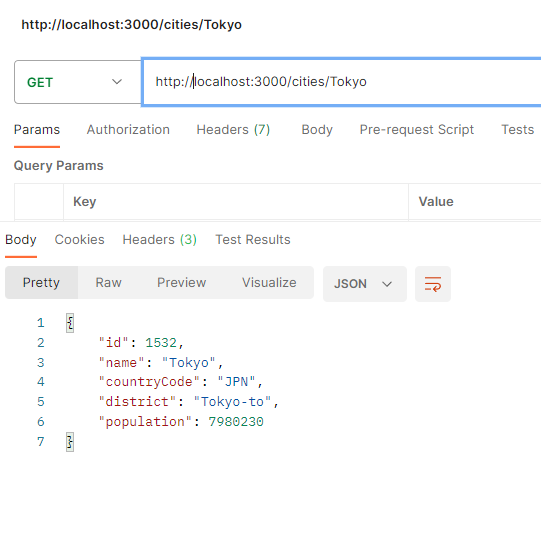

# サーバーからデータベースを扱う

Echo を使い、データベースからデータを取得するサーバーアプリケーションを作りましょう。

<<< @/chapter1/section4/src/server.rs{rs:line-numbers}

都市が見つかったら`200`を、見つからなかったら`404`を返しています。
Postman からリクエストを送ってみましょう。

画像のように返ってきたら成功です。

自分が好きな都市の情報を取得する API を叩いて、そのレスポンスのスクリーンショットを講習会チャンネルに投稿しましょう。

## 基本問題

都市を追加する API を追加してみましょう。

:::details ヒント 1
都市を追加するということはクライアントから情報を受け取る必要があります。このようなときは、どのメソッドを使えばいいでしょうか。
:::
:::details ヒント 2
メソッドは`POST`を使いましょう。リクエストボディには JSON を使いましょう。どのようにすれば JSON を扱えたでしょうか。
:::

:::details 答え

<<< @/chapter1/section4/src/practice_server.rs{rs:line-numbers}

:::

架空の都市や実在する都市を Postman から追加して、レスポンスのスクリーンショットを講習会チャンネルに投稿しましょう。

## 応用問題

さまざまな API を作ってみましょう。

- 例
  - 国の情報を取得する
  - 都市をすべて取得する
  - 既にある都市や国の情報を変更する
