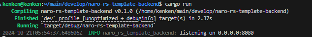

# プロジェクトのセットアップ

## 環境準備

今回の演習は、[(第一部)サーバーからデータベースを扱う](../../chapter1/section4/4_server_and_db) の状態から開始します。

**第一部から繰り返し受講している方も、** 以下の手順でセットアップを行ってください。

1. [データベースを扱う準備](../../chapter1/section4/0_prepare) からプロジェクトをセットアップしましょう。

2. `.env` ファイルを作成し、以下のように編集しましょう。

```sh
DB_USERNAME="root"
DB_PASSWORD="password"
DB_HOSTNAME="localhost"
DB_PORT="3306"
DB_DATABASE="world"
```

3. `source .env` を実行しましょう。

4. 以下のコマンドを実行し、クレートの依存関係を追加しましょう。

```sh
$ cargo add axum anyhow serde serde_json tokio --features tokio/full,serde/derive,axum/macros
$ cargo add async-session tracing tracing-subscriber --features tracing-subscriber/env-filter,tracing-subscriber/fmt
$ cargo add tower-http --features add-extension,trace,fs
```

また、 cargo.toml に以下の記述を足しましょう。

```toml
[dependencies.sqlx]
version = "0.7"
features = ["mysql", "migrate", "chrono", "runtime-tokio", "macros"] 

[dependencies.async-sqlx-session]
git = "https://github.com/maxcountryman/async-sqlx-session.git"
default-features = false
branch = "sqlx-0.7"
features = ["mysql"]
```

``[dependencies]`` に既に `sqlx` がある場合は、その行を削除してください。

以上でセットアップはできているはずです。

## ファイルの分割

このまま演習を始めてしまうとファイルが長くなりすぎてしまうので、ファイルを別のモジュールとして分割します。
:::tip
パッケージとは、関連する複数のファイルをまとめる単位のことです。  
詳しくは以下を参照してください。
[The Rust Programming Language 日本語版 - パッケージとクレート](https://doc.rust-jp.rs/book-ja/ch07-01-packages-and-crates.html)
:::

まずは、`src` ディレクトリにファイルを追加していきます。


この画像のようなディレクトリ構造を作成しましょう。
次に、それぞれのファイルにコードを追加していきます。

### ファイルの内容

#### handler.rs

<<<@/chapter2/section1/src/first/handler.rs{rs:line-numbers}

#### main.rs

<<<@/chapter2/section1/src/first/main.rs{rs:line-numbers}

#### repository.rs

<<<@/chapter2/section1/src/first/repository.rs{rs:line-numbers}

#### handler/country.rs

<<<@/chapter2/section1/src/first/handler/country.rs{rs:line-numbers}

#### repository/country.rs

<<<@/chapter2/section1/src/first/repository/country.rs{rs:line-numbers}

## 変更点の説明
今までは`main.rs`に全てのコードを記述しており、データベースやハンドラーの処理が混ざっていましたが、ここではそれらの処理をファイルに分割しました。

ルーティングの処理を`handler.rs`に、データベースの初期化や接続を`repository.rs`に分割しました。
`handler`のサブモジュールとして`country.rs`を作成し、都市に関する API の処理を記述しました。
同様に`repository`のサブモジュールとして`country.rs`を作成し、都市に関するデータベースの処理を記述しました。
## 準備完了

それでは、`task up` でデータベースを立ち上げてから `cargo run` で実行してみましょう。



<a href="http://localhost:8080/cities/Tokyo">localhost:8080/cities/Tokyo</a>にアクセスして実際に動いていることを確認しましょう。


上手く動いていることを確認できたら、 `Ctrl+C` で一旦止めましょう。
