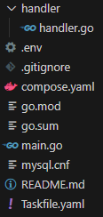

# プロジェクトのセットアップ

## 環境準備

今回の演習は、[(第一部)サーバーからデータベースを扱う](../../chapter1/section4/4_server_and_db) の状態から開始します。

もしファイルを削除してしまった場合は、以下の手順でセットアップしましょう。

1. [データベースを扱う準備](../../chapter1/section4/0_prepare) からプロジェクトをセットアップしましょう。

2. `.env` ファイルを作成し、以下のように編集しましょう。

```sh
DB_USERNAME="root"
DB_PASSWORD="password"
DB_HOSTNAME="localhost"
DB_PORT="3306"
DB_DATABASE="world"
```

3. `go mod tidy` を実行しましょう。

以上でセットアップはできているはずです。

## ファイルの分割

このまま演習を始めてしまうとファイルが長くなりすぎてしまうので、ファイルを別のパッケージとして分割します。
各エンドポイントでの処理はハンドラーと呼ばれますが、それを `handler/handler.go` に移動してみましょう。手順は以下の通りです。

### handler.go の作成

1. `handler` というディレクトリを新しく作成し、その中に `handler.go` というファイルを作成する。
2. `handler.go` を以下のように記述する。

<<<@/chapter2/section1/src/first/handler.go{go:line-numbers}

ファイルを編集したら、`go mod tidy` を実行しましょう。

### main.go の編集

`main.go`を以下のように編集しましょう。

<<<@/chapter2/section1/src/first/main.go{go:line-numbers}

ファイルを編集したら、`go mod tidy` を実行しましょう。  

ここまで出来たら、画像のようになっているはずです。

## 準備完了

ファイルの分割で変更したのは、以下の 3 点です。

1. `handler`パッケージを作成し、コードを分割した。
2. `handler`という`db`をフィールドに持つ構造体を作成し、その構造体のメソッドとして`GetCityInfoHandler`や`PostCityHandler`を定義した。
3. `.env`ファイルの環境変数を、プログラムで読むようにした。

それでは、`go run main.go` で実行してみましょう。


無事起動が出来たら、ターミナルで`task up`を実行してデーターベースを起動し、<a href="http://localhost:8080/cities/Tokyo">localhost:8080/cities/Tokyo</a>にアクセスして実際に動いていることを確認しましょう。


上手く動いていることを確認できたら、 `Ctrl+C` で一旦止めましょう。
