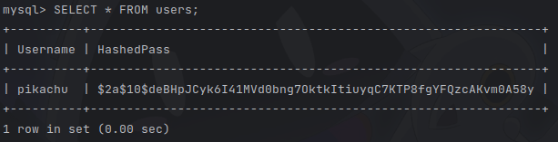

# アカウント機能の実装

## 本日の目的

`main.rs` と `handler.rs` の handler の設定部分を見てみましょう。

### main.rs
```rs
...(省略)
#[tokio::main]
async fn main() -> anyhow::Result<()> {
    tracing_subscriber::fmt()
        .with_env_filter(EnvFilter::try_from_default_env().unwrap_or("info".into()))
        .init();

    let app_state = repository::Repository::connect().await?; // [!code hl]
    let app = handler::make_router(app_state).layer(TraceLayer::new_for_http()); // [!code hl]
    let listener = tokio::net::TcpListener::bind("0.0.0.0:8080").await?; // [!code hl]

    tracing::info!("listening on {}", listener.local_addr()?);
    axum::serve(listener, app).await.unwrap(); // [!code hl]
    Ok(())
}
```

### handler.rs
```rs
...(省略)
pub fn make_router(app_state: Repository) -> Router {
    let city_router = Router::new() // [!code hl]
        .route("/city/:city_name", get(country::get_city_handler)) // [!code hl]
        .route("/cities", post(country::post_city_handler)); // [!code hl]

    Router::new().nest("/", city_router).with_state(app_state) // [!code hl]
}
```

今回の目標は、 `/cities/` で始まる api 2 つ (`get_city_handler`, `post_city_handler`) に対して、
ログインしているかどうかを判定して、ログインしていなければリクエストを拒否するように実装することです。

用語を使わずに言えば、`City` を新たに追加したり、`City` の情報を得るのにログインを必須にする、ということです。

実装は以下のように進めます。

1. アカウントを作成できるようにする
2. ログインを実装する
3. ログインしないと利用できないようにする

では、アカウントの作成を実装していきましょう。

アカウントの作成は、以下の手順で進んでいきます。

1. クライアントから`username`と`password`をリクエストとして受け取る
2. `username`と`password`のバリデーション(値が正当かのチェック)を行う
3. 既に同じ`username`のユーザーが登録されていないかチェックする
4. `password`をハッシュ化する
5. ユーザーをデーターベースに登録する

## 下準備

### テーブルの作成

アカウントを管理するテーブル `users` を作成しましょう。そのために、マイグレーションファイルを作成します。

マイグレーションとは、データベースのスキーマの変更内容をファイルに記述しておき、それを実行して更新していく手法です。

`naro-rs-template-backend` のルートディレクトリに移動し、以下のコマンドを実行してください。
```sh
$ mkdir migrations && touch migrations/0_create-table.sql
```

`0_create_table.sql` に以下の内容を記述してください。

<<<@/chapter2/section1/src/0_create-table.sql


:::tip
パスワードをデーターベースに保存する際はハッシュ化するのが当たり前なので、ハッシュ化されたパスワードのためのデータベーステーブルのカラム名には`password`を使うのが一般的です。  
今回は混乱しないように`hashed_pass`という名前でカラムを作成しています。
:::

次に、マイグレーションを実行するために、`main.rs` と `repository.rs` を編集していきます。

### main.rs
```rs
#[tokio::main]
async fn main() -> anyhow::Result<()> {
    tracing_subscriber::fmt()
        .with_env_filter(EnvFilter::try_from_default_env().unwrap_or("info".into()))
        .init();

    let app_state = repository::Repository::connect().await?;
    app_state.migrate().await?; // [!code ++]
    let app = handler::make_router(app_state).layer(TraceLayer::new_for_http());
    let listener = tokio::net::TcpListener::bind("127.0.0.1:8080").await?;

    tracing::info!("listening on {}", listener.local_addr()?);
    axum::serve(listener, app).await.unwrap();
    Ok(())
}
```

### repository.rs
```rs
...(省略)
impl Repository {
    pub async fn connect() -> anyhow::Result<Self> {
        let options = get_options()?;
        let pool = sqlx::MySqlPool::connect_with(options).await?;
        Ok(Self {
            pool,
            //session_store: MySqlSessionStore::new(pool.clone()),
        })
    }
    pub async fn migrate(&self) -> anyhow::Result<()> { // [!code ++]
        sqlx::migrate!("./migrations").run(&self.pool).await?; // [!code ++]
        Ok(()) // [!code ++]
    } // [!code ++]
}
...(省略)
```

マイグレーションを実行するメソッド `migrate` を追加しました。
これにより、データベースに接続した後 `0_create_table.sql` の内容が実行され、`users` テーブルが作成されます。

## signup の ハンドラ の実装

続いて、アカウントを作成するハンドラーである `sign_up` を `handler/auth.rs` に実装していきましょう。

ファイル `handler/auth.rs` を作成し、以下を記述してください。

```rs
pub async fn sign_up( // [!code ++]
    State(state): State<Repository>, // [!code ++]
    Json(body): Json<SignUp>, // [!code ++]
) -> Result<StatusCode, StatusCode> { // [!code ++]
} // [!code ++]
```

また、`handler.rs` に以下の行を追加してください。

```rs
...(省略)
use crate::repository::Repository;

mod auth; // [!code ++]
mod country;
...(省略)
```

この `sign_up` ハンドラに以下のものを順番に実装していきます。

### 1. リクエストの受け取り

`sign_up` ハンドラの外に以下の構造体を追加します。

```rs
#[derive(Deserialize)] // [!code ++]
pub struct SignUp { // [!code ++]
    pub username: String, // [!code ++]
    pub password: String, // [!code ++]
} // [!code ++]
```

`sign_up` ハンドラの body 変数に requestBody の json 情報が格納されます。
`SignUp` 型を見れば分かる通り、ここには username と password が格納されています。

### 2. リクエストの検証

```rs
pub async fn sign_up(
    State(state): State<Repository>,
    Json(body): Json<SignUp>,
) -> Result<StatusCode, StatusCode> {
    // バリデーションする(PasswordかUsernameが空文字列の場合は400 BadRequestを返す) // [!code ++]
    if body.username.is_empty() || body.password.is_empty() { // [!code ++]
        return Err(StatusCode::BAD_REQUEST); // [!code ++]
    } // [!code ++]
}
```

ここでは、UserName と Password が正しく入っているのかをチェック（バリデーションといいます）します。
入っていない場合は、与えられた入力が正しくない間違った形式なので、 400 (Bad Request) をレスポンスします。

### 3. アカウントの存在チェック

ユーザーに関するデータベースの操作を、`repository/users.rs` に追加していきます。

ファイル `repository/users.rs` を作成し、以下を記述してください。

```rs
use super::Repository; // [!code ++]

impl Repository { // [!code ++]
    pub async fn is_exist_username(&self, username: String) -> sqlx::Result<bool> { // [!code ++]
        let result = sqlx::query("SELECT * FROM users WHERE username = ?") // [!code ++]
            .bind(&username) // [!code ++]
            .fetch_optional(&self.pool) // [!code ++]
            .await?; // [!code ++]
        Ok(result.is_some()) // [!code ++]
    } // [!code ++]
} // [!code ++]
```

また、`repository.rs` に以下の行を追加してください。

```rs
use sqlx::mysql::MySqlConnectOptions;
use sqlx::mysql::MySqlPool;
use std::env;

pub mod country;
pub mod users; // [!code ++]

...(省略)
```

`SELECT * FROM users WHERE username=?` で、指定された UserName を持つユーザーを取得します。
このとき、`fetch_optional` を使うことにより、ユーザーを高々 1 つ取得し、`Option` 型で返されます。

次に、`sign_up` ハンドラに以下のコードを追加してください。

```rs
pub async fn sign_up(
    State(state): State<Repository>,
    Json(body): Json<SignUp>,
) -> Result<StatusCode, StatusCode> {
    // バリデーションする(PasswordかUsernameが空文字列の場合は400 BadRequestを返す)
    if body.username.is_empty() || body.password.is_empty() {
        return Err(StatusCode::BAD_REQUEST);
    }

    // 登録しようとしているユーザーが既にデータベース内に存在したら409 Conflictを返す // [!code ++]
    if let Ok(true) = state.is_exist_username(body.username.clone()).await { // [!code ++]
        return Err(StatusCode::CONFLICT); // [!code ++]
    } // [!code ++]
}
```

もし同じ username を持つユーザーが存在した場合は処理を受け付けず、 409 (Conflict) をレスポンスします。

### 4. ユーザーの作成

ここまでは「リクエストを実行しても本当に問題がないか」を検証していました。
ユーザーはまだ存在していなくて、パスワードとユーザー名がある事まで確認できれば、リクエストを処理できます。なのでここから処理を行っていきます。

まずは、`username` を持つ users レコードをデータベースに追加しましょう。
SQL のインテグレーションにて、`id INT NOT NULL PRIMARY KEY AUTO_INCREMENT` と指定しているため、自動でインクリメントされた `id` も同時に追加されます。

`repository/users.rs` に以下のコードを追加してください。

```rs
use super::Repository;

impl Repository {
    pub async fn is_exist_username(&self, username: String) -> sqlx::Result<bool> {
        let result = sqlx::query("SELECT * FROM users WHERE username = ?")
            .bind(&username)
            .fetch_optional(&self.pool)
            .await?;
        Ok(result.is_some())
    }

     pub async fn create_user(&self, username: String) -> sqlx::Result<u64> { // [!code ++]
        let result = sqlx::query("INSERT INTO users (username) VALUES (?)") // [!code ++]
            .bind(&username) // [!code ++]
            .execute(&self.pool) // [!code ++]
            .await?; // [!code ++]
        Ok(result.last_insert_id()) // [!code ++]
    } // [!code ++]
}
```

`create_user` メソッドの戻り値として、追加されたユーザーの `id` を返しています。

また、`handler/auth.rs` に以下のコードを追加してください。

```rs
pub async fn sign_up(
    State(state): State<Repository>,
    Json(body): Json<SignUp>,
) -> Result<StatusCode, StatusCode> {
    // バリデーションする(PasswordかUsernameが空文字列の場合は400 BadRequestを返す)
    if body.username.is_empty() || body.password.is_empty() {
        return Err(StatusCode::BAD_REQUEST);
    }

    // 登録しようとしているユーザーが既にデータベース内に存在したら409 Conflictを返す
    if let Ok(true) = state.is_exist_username(body.username.clone()).await {
        return Err(StatusCode::CONFLICT);
    }

    // ユーザーを作成する // [!code ++]
    let id = state // [!code ++]
        .create_user(body.username.clone()) // [!code ++]
        .await // [!code ++]
        .map_err(|_| StatusCode::INTERNAL_SERVER_ERROR)?; // [!code ++]
}
```

何かしらのエラーによってユーザーを生成できなかった場合は Error が返されます。
ユーザーのリクエストは問題なく、ここでエラーが発生した場合はサーバー側で何かが発生したということなので、
500 (InternalServer Error) をレスポンスします。

ここで、どんなエラーが発生したかをユーザーに直接伝えるのはセキュリティの観点から △ です。
ログで出力するだけにして、ユーザー側には 500 という情報だけ渡しましょう。

### 5. パスワードのハッシュ化と保存

次にパスワードのハッシュ化です。 **パスワードは平文で保存してはいけません！** パスワードを DB に保管するときは、必ずハッシュ化をしましょう。

`repository/users.rs` に以下のコードを追加してください。

```rs
use super::Repository;

impl Repository {
    ...(省略)

    pub async fn save_user_password(&self, id: i32, password: String) -> anyhow::Result<()> { // [!code ++]
        let hash = bcrypt::hash(password, bcrypt::DEFAULT_COST)?; // [!code ++]

        sqlx::query("INSERT INTO user_passwords (id, hashed_pass) VALUES (?, ?)") // [!code ++]
            .bind(id) // [!code ++]
            .bind(hash) // [!code ++]
            .execute(&self.pool) // [!code ++]
            .await?; // [!code ++]

        Ok(()) // [!code ++]
    } // [!code ++]
}
```

また、`handler/auth.rs` に以下のコードを追加してください。

```rs
pub async fn sign_up(
    State(state): State<Repository>,
    Json(body): Json<SignUp>,
) -> Result<StatusCode, StatusCode> {
    ...(省略)

    // ユーザーを作成する
    let id = state
        .create_user(body.username.clone())
        .await
        .map_err(|_| StatusCode::INTERNAL_SERVER_ERROR)?;

    // パスワードを保存する // [!code ++]
    state // [!code ++]
        .save_user_password(id as i32, body.password.clone()) // [!code ++]
        .await // [!code ++]
        .map_err(|_| StatusCode::INTERNAL_SERVER_ERROR)?; // [!code ++]

    Ok(StatusCode::CREATED) // [!code ++]
}
```

:::info 参考: ソルトについて  
ソルトという手法を用いることで、事前計算されたテーブルを使用する攻撃から守ることができます。

今回は、`bcrypt`というライブラリがハッシュ化を行っています。

参考: <https://ja.wikipedia.org/wiki/%E3%82%BD%E3%83%AB%E3%83%88_(%E6%9A%97%E5%8F%B7)>
:::

`bcrypt`というのはいい感じにハッシュ化してくれるライブラリです。セキュリティに関わるものは自分で実装すると穴だらけになりやすいので、積極的にライブラリに頼りましょう。

全ての操作でエラーが無かったら、最後に 201 (Created) をレスポンスしましょう！

## 完成！
これで実装は終わりです。すべてを実装したら、以下のようになります。

::: code-group
<<<@/chapter2/section1/src/1_account/auth.rs{rs:line-numbers}[auth.rs]
<<<@/chapter2/section1/src/1_account/users.rs{rs:line-numbers}[users.rs]
<<<@/chapter2/section1/src/1_account/main.rs{rs:line-numbers}[main.rs]
<<<@/chapter2/section1/src/1_account/repository.rs{rs:line-numbers}[repository.rs]
:::

最後に、`handler.rs` に、先ほど書いたハンドラーを追加しましょう。

```rs
pub fn make_router(app_state: Repository) -> Router {
    let city_router = Router::new()
        .route("/cities/:city_name", get(country::get_city_handler))
        .route("/cities", post(country::post_city_handler));

    let auth_router = Router::new().route("/signup", post(auth::sign_up)); // [!code ++]

    Router::new()
        .nest("/", city_router)
        .nest("/", auth_router) // [!code ++]
        .with_state(app_state)
}
```

:::warning
このコードは後々の回で使用するので、エンドポイントのパス (`/signup` など) は変更しないでください！

エンドポイントの追加は問題ないので、試したい場合は新しくハンドラーを実装しましょう。
:::

ここまでできたら、実行して、Postman 等を用いて正しく実装できているかデバッグしてみましょう。  
正しく実装できていれば、例えば以下のようにデバッグできます。

上手く作成できれば Status 201 が返ってくるはずです。

正しく API を叩いたあとに、テーブルに意図したユーザー名と、ハッシュ化されたパスワードが入っている事も確認しましょう。

```sh
$ task db
/# mysql -u root -ppassword
```
```sql
mysql> USE world;
mysql> SELECT * FROM users;
mysql> SELECT * FROM user_passwords;
```


画像の様に、先ほど登録したアカウントのユーザー名とハッシュ化されたパスワードが入っていたら成功です。
