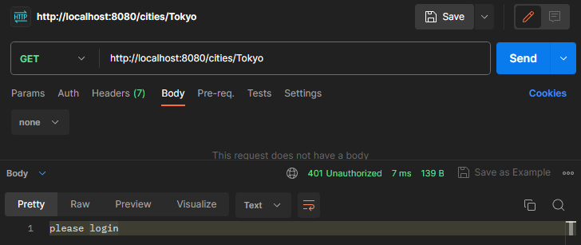

# 検証

## 完成形

まずは完成形です。

:::details 完成形

main.go

<<<@/chapter2/section1/src/0/final/main.go{go:line-numbers}

handler.go

<<<@/chapter2/section1/src/0/final/handler.go{go:line-numbers}

:::

## 検証

自分の実装が正しく動くか検証しましょう。

:::warning
全て Postman での検証です。  
`go run main.go`でサーバーを起動した状態で行ってください。

また、`GET`と`POST`を間違えないようにして下さい。
:::

初めに<a href="http://localhost:8080/cities/Tokyo">localhost:8080/cities/Tokyo</a>にアクセスすると、ログインしていないため`401 Unauthorized`が返ってきます。そのため、情報を入手することができません。

ユーザーを作成します。
上手く作成できれば Status 201 が返ってくるはずです。  
(注意:`POST`です)

そのままパスを変えてログインリクエストを送ります。

ログインに成功したら、レスポンスの方の Cookies を開いて value の中身をコピーします

リクエストの方の Headers で Cookie をセットします。

Key に`Cookie`を
Value に`sessions={コピーした値};`をセットします(既に自動で入っている場合もあります、その場合は追加しなくて大丈夫です)。

もう一度 <a href="http://localhost:8080/cities/Tokyo">localhost:8080/cities/Tokyo</a> にアクセスすると正常に API が取れるようになりました。  
(注意:`GET`です)

ここで、作成されたユーザーがデータベースに保存されていることを確認してみましょう。
`mysql > SELECT * FROM users;`

ユーザー名とハッシュ化されたパスワードが確認できますね。

ちょっと分かりにくい表示ですが、セッションもしっかり確認できます。
