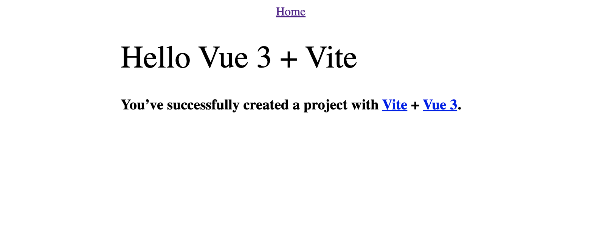

# vue-routerの設定

## 実習編目標
- API を利用するクライアントを書く
- 複数ページが存在するクライアントを書く

:::warning
前回に作成したサーバーを利用します。先に前回の内容を終わらせるようにしてください。
:::

今回は「エンドポイントにアクセスする」に書いてある[最重要課題](2_fetch.html#%E6%9C%80%E9%87%8D%E8%A6%81%E8%AA%B2%E9%A1%8C)を一番やってほしいです。
途中のコードなどはバシバシコピー&ペーストしてもらっても構いません。

最重要課題はこれまでのコードを上手く組み合わせることで実現できるはずです。
どのような API が必要か、それをどうやって表示すればいいかを自分で考えて作ってみましょう。

## Vueのプロジェクトを作成する

[第一部のVue入門](../../chapter1/section2/0_vue-intro.html#vue-テンプレートのクローン)の時と同じように https://github.com/traPtitech/naro-template-frontend のテンプレートリポジトリからリポジトリを作成します。
クローンしてきたディレクトリを VSCode で開いておきましょう。
`npm i`するのを忘れずに。

## Vue Routerの導入

SPA を作る際には、`path`に応じたページを描画する Router のような補助ライブラリが使用すると便利です。
今回は、公式 Router である[Vue Router v4.x](https://next.router.vuejs.org/)を使用します。

参考: [Routing | Vue.js](https://v3.vuejs.org/guide/routing.html)

### 1. ライブラリのインストール

`npm install vue-router@4` を実行してください。

### 2. Routerの設定

`path`と描画対象の関係である Route を定義します。
`src`以下に、`router.ts`を以下の内容で作成してください。

<<<@/chapter2/section2/src/1/router.ts{typescript:line-numbers}

Vue Router を定義しているファイルです。

ページを追加したい場合は、`routes`の中にオブジェクトを追加していけば OK です。
参考: [Routes' Matching Syntax | Vue Router](https://next.router.vuejs.org/guide/essentials/route-matching-syntax.html)

`App.vue` に書かれている、`<router-view/>`コンポーネントが、このファイルで指定されたコンポーネントに置き換えられ描画されます。
参考: [`router-link` | Vue Router](https://next.router.vuejs.org/guide/#router-link)
参考: [`router-view` | Vue Router](https://next.router.vuejs.org/guide/#router-view)

参考: [Vue Router](https://next.router.vuejs.org/)

### 3. Vue Routerの使用

Vue Router を読み込むように`src/main.ts`を以下のように変更します。

<<<@/chapter2/section2/src/1/main.ts{typescript:line-numbers}

次に、`src/App.vue`を以下のように変更します。

<<<@/chapter2/section2/src/1/App.vue{vue:line-numbers}

:::info
`<router-view>`というコンポーネントは自身の`path`に応じて描画するコンポーネントを変えるものです。その設定を`router.ts`で行っています。

また、`<router-link>`は`<a>`タグのようにリンクとして働きますが、ページのリロードを引き起こしません。これによってページの移動の速度を向上させることができます。

参考: [Getting Started | Vue Router](https://router.vuejs.org/guide/)
:::
### 4. Homeページの作成

`src`直下に`pages`ディレクトリを作成し、`src/pages/HomePage.vue`を以下の内容で作成してください。

<<<@/chapter2/section2/src/1/HomePage.vue{vue:line-numbers}

### 5. NotFoundページの作成

`router.ts`に定義した Route の配列は先頭からマッチします。

<<<@/chapter2/section2/src/1/routes.ts{typescript:line-numbers}

この後、皆さんにはいくつかのページとその`path`の対応を追加してもらうわけですが、どの`path`にもマッチしなかった場合、任意の`path`にマッチする`/:path(.*)`がマッチし、NotFound ページが表示されます。

`src/pages/NotFound.vue`を以下の内容で作成してください。

<<<@/chapter2/section2/src/1/NotFound.vue{vue:line-numbers}

## 初期状態の確認

:::warning
PC にインストールされているセキュリティソフトによっては開発ページにアクセスできないことがあるようです。
その場合は、セキュリティソフトのファイアウォールを一時的に停止するか、ターミナルから`npm run dev`で起動した後、表示される IP アドレスでの URL にアクセスしてみてください(できない場合は TA に聞いてください)
:::

これまでと同様に`npm run dev`で起動して、以下のような画面が表示されていれば OK です。

