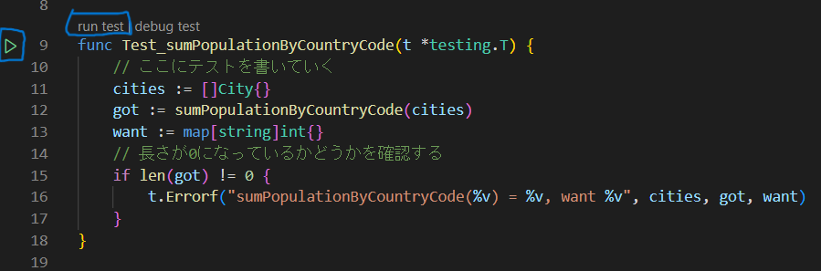

# テストを書いてみよう

テストを書く前に、テスト対象になる処理が必要です。今回は、「与えられた City のリストから国ごとの人口の和」を計算する処理を書いてみます。

::: details ヒント
- 国ごとにデータを分けて持つには`map`を使えばいいでしょう
- 国単位で集計するので map の key は `CountryCode` を使うといいでしょう
- データが入っていない場合もあるので、条件分岐には気を付けてください
:::

::: details 参考実装

<<<@/chapter2/section3/src/calculate_population.go#calculate

:::

そうしたら、このコードが期待した値を返すかテストを書いてみましょう。

まず、`calculate_test.go`を作成します。

::: tips
Go では、`_test`がファイル名の後ろについているファイルはテストファイルとして認識されます。
:::

続いて、`calculate_test.go`にテスト関数を実装していきます。

```go
import "testing"
// Testで始まる関数はテスト関数として認識されます
// testingはGoのテストのための標準ライブラリです
func Test_calculatePopulation(t *testing.T) {
    // ここにテストを書いていく
}
```

まずは、空のリストを渡したときに、空のマップが返ってくることをテストしてみましょう。

```go
import "testing"

func Test_calculatePopulation(t *testing.T) {
	// ここにテストを書いていく
	cities := []City{}
	got := calculatePopulation(cities)
	want := map[string]int{}
	// 長さが0になっているかどうかを確認する
	if len(got) != 0 {
		t.Errorf("calculatePopulation(%v) = %v, want %v", cities, got, want)
	}
}

```

書き終わったら、関数の左上にある`run test`か、そのさらに左にある再生ボタンを押して、テストを実行してみましょう。



すると、VSCode の Output にテストの結果が表示されます。
```
=== RUN   Test_calculatePopulation
--- PASS: Test_calculatePopulation (0.00s)
PASS
ok  	test	0.001s
```

テストが正常に終了したことがわかりますね。

## 様々なケースをテストしてみよう

次に、`calculatePopulation`のテストをもう少し充実させてみましょう。

これから複数のテストを書くため、先ほどのテストの関数名を変更します。

```go
func Test_calculatePopulation_empty(t *testing.T) {
  // ここにテストを書いていく
  cities := []City{}
  got := calculatePopulation(cities)
  want := map[string]int{}
  // 長さが0になっているかどうかを確認する
  if len(got) != 0 {
    t.Errorf("calculatePopulation(%v) = %v, want %v", cities, got, want)
  }
}
```
### 課題
次のテストを実装してください。

- 1 つの国のみのデータが入っている場合
- 複数の国のデータが入っている場合
- 空のデータ(`city.CountryCode.Valid = false`)のデータが入っている場合

::: details 答え

#### 1 つの国のみのデータが入っている場合
<<<@/chapter2/section3/src/calculate_population_test.go#single

#### 複数の国のデータが入っている場合
<<<@/chapter2/section3/src/calculate_population_test.go#multiple

#### 空のデータ(`city.CountryCode.Valid = false`)のデータが入っている場合
<<<@/chapter2/section3/src/calculate_population_test.go#null
::: 
