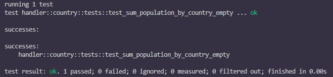
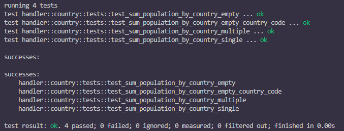

# テストを書いてみよう

テストを書く前に、テスト対象になる処理が必要です。今回は、「与えられた City のリストから国ごとの人口の和」を計算する処理を書いてみます。

::: details ヒント
- 国ごとにデータを分けて持つには `std::collections::HashMap` を使えばいいでしょう
- 国単位で集計するので map の key は `country_code` を使うといいでしょう
- `country_code` が空文字列である City は、和を計算せず無視してください
:::

::: details 参考実装

<<<@/chapter2/section3/src/sum_population_by_country.rs#calculate

:::

このメソッドが期待した値を返すかどうか、テストを書いて確認していきましょう。

メソッド 1 つなど、小さい単位でのテストは、ユニットテストと呼ばれます。
ユニットテストは同じファイル内にテストを書くのが一般的です。

同じファイル内の一番下にテストを書いていきます。

```rs
// #[cfg(test)] 属性を追加したモジュールはテストモジュールとして扱われる // [!code ++]
#[cfg(test)] // [!code ++]
mod tests { // [!code ++]
    use super::{sum_population_by_country, City}; // [!code ++]
    use std::collections::HashMap; // [!code ++]

    fn test_sum_population_by_country() { // [!code ++]
        // ここにテストを追加する // [!code ++]
    } // [!code ++]
} // [!code ++]
```

まずは、空のリストを渡したときに、空のマップが返ってくることをテストしてみましょう。

```rs
// #[cfg(test)] 属性を追加したモジュールはテストモジュールとして扱われる
#[cfg(test)]
mod tests {
    use super::{sum_population_by_country, City};
    use std::collections::HashMap;

    #[test]
    fn test_sum_population_by_country() {
        // ここにテストを追加する
        let cities = vec![]; // [!code ++]
        let result = sum_population_by_country(cities); // [!code ++]
        assert!(result.is_empty()); // [!code ++]
    }
}
```

書き終わったら、関数の左上またはモジュールの左上にある `run test` を押して、テストを実行してみましょう。


すると、VSCode の Output にテストの結果が表示されます。



テストが正常に終了したことがわかります。

## 様々なケースをテストしてみよう

次に、 `sum_population_by_country` のテストをもう少し充実させてみましょう。

これから複数のテストを書くため、先ほどのテストの関数名を変更します。

```rs
// #[cfg(test)] 属性を追加したモジュールはテストモジュールとして扱われる
#[cfg(test)]
mod tests {
    use super::{sum_population_by_country, City};
    use std::collections::HashMap;

    #[test]
    fn test_sum_population_by_country_empty() { // [!code warning]
        // ここにテストを追加する
        let cities = vec![];
        let result = sum_population_by_country(cities);
        assert!(result.is_empty());
    }
}
```

### 課題
次のテストを実装してください。

- 1 つの国のみのデータが入っている場合
- 複数の国のデータが入っている場合
- 空文字列の `country_code` が入っている場合

::: details 答え

#### 1 つの国のみのデータが入っている場合
<<<@/chapter2/section3/src/sum_population_by_country.rs#single

#### 複数の国のデータが入っている場合
<<<@/chapter2/section3/src/sum_population_by_country.rs#multiple

#### 空文字列の `country_code` が入っている場合
<<<@/chapter2/section3/src/sum_population_by_country.rs#empty_country_code
:::

実装が終わったら、モジュールの左上にある `run test` を押して、テストを実行してみましょう。



モジュール内の全てのテストが成功したことを確認できます。
