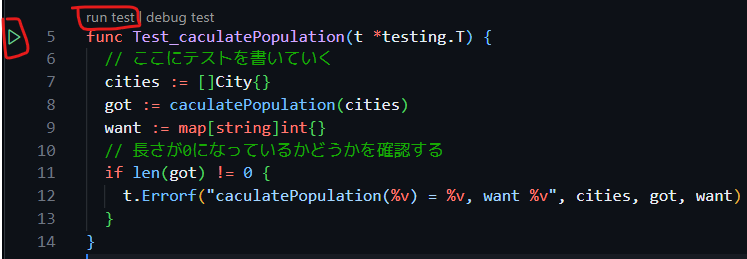

# テストを書いてみよう

テストを書く前に、テスト対象になる処理が必要です。今回は、「与えられた City のリストから国ごとの人口の和」を計算する処理を書いてみます。

::: details ヒント
- 国ごとにデータを分けて持つには`map`を使えばいいでしょう
- 国単位で集計するので map の key は `CountryCode` を使うといいでしょう
- データが入っていない場合もあるので、条件分岐には気を付けてください
:::

::: details 参考実装

<<<@/chapter2/section3/src/calculate_population.go#calculate

:::

そうしたら、このコードが期待した値を返すかテストを書いてみましょう。

まず、`calculate_test.go`を作成します。

::: tip
Go では、`_test`がファイル名の後ろについているファイルはテストファイルとして認識されます。
:::

続いて、`calculate_test.go`にテスト関数を実装していきます。

```go
package main

import "testing"
// Testで始まる関数はテスト関数として認識されます
// testingはGoのテストのための標準ライブラリです
func Test_sumPopulationByCountryCode(t *testing.T) {
    // ここにテストを書いていく
}
```

まずは、空のリストを渡したときに、空のマップが返ってくることをテストしてみましょう。

```go
package main

import "testing"

func Test_sumPopulationByCountryCode(t *testing.T) {
	// ここにテストを書いていく
	cities := []City{}
	got := sumPopulationByCountry(cities)
	want := map[string]int{}
	// 長さが0になっているかどうかを確認する
	if len(got) != 0 {
		t.Errorf("sumPopulationByCountryCode(%v) = %v, want %v", cities, got, want)
	}
}

```

書き終わったら、関数の左上にある`run test`か、そのさらに左にある再生ボタンを押して、テストを実行してみましょう。



すると、VSCode の Output にテストの結果が表示されます。
```
=== RUN   Test_calculatePopulation
--- PASS: Test_calculatePopulation (0.00s)
PASS
ok  	test	0.001s
```

テストが正常に終了したことがわかりますね。

## 様々なケースをテストしてみよう

様々なケースをテストするために使われるテストの方法として、テーブル駆動テスト (Table Driven Tests) というものがあります。
これは、入力と求める出力を一緒に書いたテストケースをテーブルとして用意しておく方法です。

具体的にコードを見てみましょう。

```go
package main

import (
	"maps"
	"testing"
)

func Test_sumPopulationByCountryCode(t *testing.T) {
	// ここにテストケースを書いていく
	cases := []struct {
		name   string           // テストケースの名前
		cities []City           // テストケースの入力
		want   map[string]int64 // 期待される結果
	}{
		{
			name:   "empty input",
			cities: []City{},
			want:   map[string]int64{},
		},
	}
	for _, tt := range cases {
		// サブテストの実行
		t.Run(tt.name, func(t *testing.T) {
			got := sumPopulationByCountryCode(tt.cities)
			if !maps.Equal(got, tt.want) {
				t.Errorf("sumPopulationByCountryCode(%v) = %v, want %v", tt.cities, got, tt.want)
			}
		})
	}
}
```

テーブル駆動テストのメリットは、テストケースの追加が簡単なことです。
新しくテストケースを追加するには、`cases`に追加するだけです。

### 課題
次のテストを実装してください。

- 1 つの国のみのデータが入っている場合
- 複数の国のデータが入っている場合
- 空のデータ(`city.CountryCode.Valid = false`)が入っている場合

::: details 答え

`cases`に追加するものだけ示しています。

#### 1 つの国のみのデータが入っている場合
<<<@/chapter2/section3/src/calculate_population_test.go#single

#### 複数の国のデータが入っている場合
<<<@/chapter2/section3/src/calculate_population_test.go#multiple

#### 空のデータ(`city.CountryCode.Valid = false`)が入っている場合
<<<@/chapter2/section3/src/calculate_population_test.go#null

#### 最終的なテストケース
<<<@/chapter2/section3/src/calculate_population_test.go#test_cases
::: 
