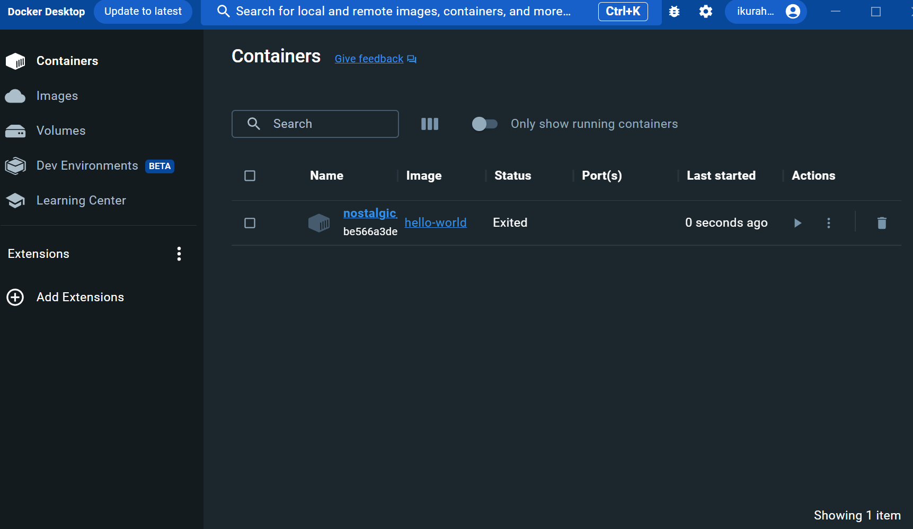
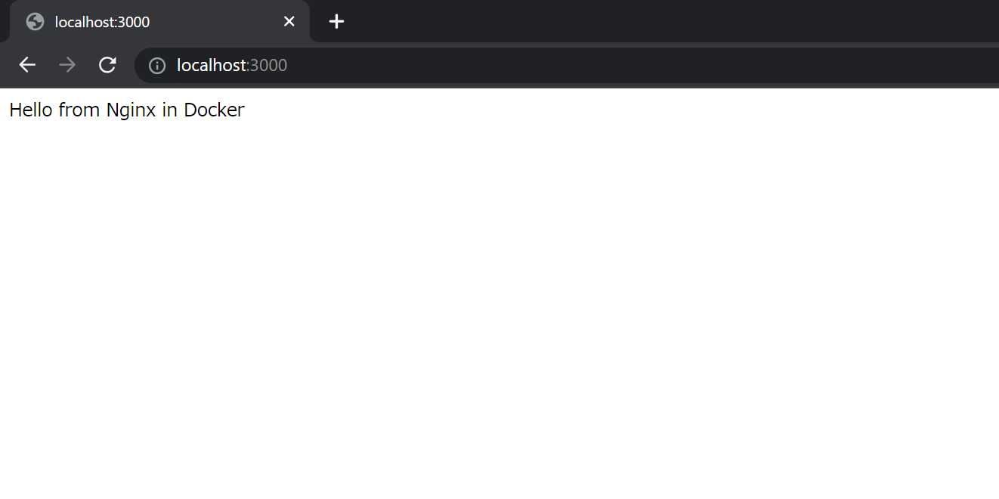

# Docker に触れる

## Hello, Docker

ここからはコンテナ型仮想環境の Docker を扱っていきます。今までも MySQL や Adminer を使うために Docker を使って来ましたが、これからは自分でコンテナを立てて動かします。

まずは Docker Desktop が起動している状態で、このコマンドを実行してください。

```sh
docker run hello-world
```

下のように表示されたら成功です。

```txt
Unable to find image 'hello-world:latest' locally
latest: Pulling from library/hello-world
719385e32844: Pull complete
Digest: sha256:a13ec89cdf897b3e551bd9f89d499db6ff3a7f44c5b9eb8bca40da20eb4ea1fa
Status: Downloaded newer image for hello-world:latest

Hello from Docker!
This message shows that your installation appears to be working correctly.

To generate this message, Docker took the following steps:
 1. The Docker client contacted the Docker daemon.
 2. The Docker daemon pulled the "hello-world" image from the Docker Hub.
    (amd64)
 3. The Docker daemon created a new container from that image which runs the
    executable that produces the output you are currently reading.
 4. The Docker daemon streamed that output to the Docker client, which sent it
    to your terminal.

To try something more ambitious, you can run an Ubuntu container with:
 $ docker run -it ubuntu bash

Share images, automate workflows, and more with a free Docker ID:
 https://hub.docker.com/

For more examples and ideas, visit:
 https://docs.docker.com/get-started/
```

`Hello from Docker!`というメッセージが確認できます。

## Docker コマンド

Docker を扱う上でよく使うコマンドを紹介していきます。基本的には`docker [リソース] {操作} [オプション] {対象}`のような構成になっています。

- Docker コマンド公式ドキュメント(有志による日本語訳) https://docs.docker.jp/engine/reference/commandline/index.html
- Docker 公式リファレンス https://docs.docker.com/reference/

ここでは基本的な使い方しか紹介しませんが、各コマンドにさまざまなオプションが存在します。必要になったら調べてみてください。

### `docker run {イメージ名}`

イメージを指定してコンテナを起動します。先ほど`docker run hello-world`というコマンドを実行しましたが、これは「`hello-world`というイメージでコンテナを起動する」という意味です。ローカルに該当するイメージが無い場合は Docker の公式イメージや [Docker Hub](https://hub.docker.com/)などから探して起動してくれます。

https://docs.docker.jp/engine/reference/commandline/run.html

`hello-world`イメージではテキストを表示するだけなのであまり意味がないですが、コンテナを起動し、そのままコンテナ内に接続する場合は`docker run -it {イメージ名}`のように実行します。

また、コンテナの停止時に自動的に削除するためには、`docker run --rm {イメージ名}`のようにします。

https://docs.docker.jp/engine/reference/commandline/run.html

### `docker stop {コンテナid / コンテナ名}`

docker コンテナを停止します。コンテナ id は下の`docker ps`で確認できます。

https://docs.docker.jp/engine/reference/commandline/stop.html

### `docker ps`

起動しているコンテナの一覧を表示します。
停止中のコンテナも表示する場合は`-a`オプションを付けます。また、起動しているコンテナをすべて止めたい場合は、`docker stop $(docker ps -q)`のように組み合わせると楽です。

```txt
ikura-hamu@Laptop-hk:~$ docker ps -a
CONTAINER ID   IMAGE         COMMAND    CREATED          STATUS                      PORTS     NAMES
2c9ba041ef59   hello-world   "/hello"   10 minutes ago   Exited (0) 10 minutes ago             adoring_chatelet
```

https://docs.docker.jp/engine/reference/commandline/ps.html

### `docker rm {コンテナid / コンテナ名}`

停止しているコンテナを削除します。`docker stop ~~~` -> `docker rm ~~~`のように使います。

```txt
ikura-hamu@Laptop-hk:~$ docker rm adoring_chatelet
adoring_chatelet
ikura-hamu@Laptop-hk:~$ docker ps -a
CONTAINER ID   IMAGE     COMMAND   CREATED   STATUS    PORTS     NAMES
```

https://docs.docker.jp/engine/reference/commandline/rm.html

### `docker images`

ローカルに存在する Docker イメージの一覧を表示します。

https://docs.docker.jp/engine/reference/commandline/images.html

### `docker system prune`

使われていないイメージ、コンテナ、ネットワークをまとめて削除してくれます。

https://docs.docker.jp/config/pruning.html#id5

## Docker Desktop から操作する

Docker Desktop がインストールされている環境では、GUI で Docker を操作できます。



コンテナの起動・停止やログの確認などを簡単に行えます。

## Webサーバーを立てる

`hello-world`イメージのコンテナはメッセージを出力してすぐ終了してしまうので、Docker っぽさをあまり感じられません。そこで、静的な Web ページをホストするサーバーを Docker で立ててみましょう。

ここでは、この後に詳しく登場する nginx を使います。ここでの nginx は Web サーバーの役割として静的な Web サイトを配信します。後で登場するときはリバースプロキシの役割を果たします。

以下のコマンドを実行してください。

```sh
mkdir html && cd html
echo "Hello from Nginx in Docker" > index.html
docker run -d -p 127.0.0.1:3000:80 -v $PWD:/usr/share/nginx/html --name naro_nginx nginx
```

これらのコマンドでは下のようなことを行っています。

1. html ディレクトリを作り移動。
2. index.html ファイルを作り、テキストを書き込み。
3. ポートなどの設定をしてサーバー用の nginx コンテナを起動。

3 での細かい設定は気にせず、<a href='http://localhost:3000' target="_blank" rel="noopener noreferrer">localhost:3000</a> にアクセスするとメッセージが表示されるはずです。



`docker ps`でコンテナが動いていることを確認できます。

```txt
ikura-hamu@Laptop-hk:~/html$ docker ps
CONTAINER ID   IMAGE     COMMAND                  CREATED          STATUS         PORTS                    NAMES
cbe509e0c99f   nginx     "/docker-entrypoint.…"   44 minutes ago   Up 5 minutes   127.0.0.1:3000->80/tcp   naro_nginx
```

確認出来たらコンテナを停止、削除しましょう。

```sh
docker stop naro_nginx
docker rm naro_nginx
```
