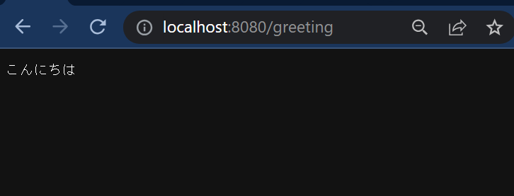

# Docker イメージを作る

## サーバーアプリケーションを作る

### コードを書く

`naro_server`というディレクトリを作り、その中でコードを書いてください。第 1 部でやったように、 Go を使って下の条件を満たすサーバーアプリケーションを作ってください。

- `/greeting`への GET リクエストに、環境変数 `GREETING_MESSAGE`の値を返す。
- 起動するポートを環境変数`PORT`で指定できる。

`go mod`コマンドで外部ライブラリを管理しましょう。

https://go.dev/ref/mod

```sh
go mod init naro_server
go mod tidy
```

:::details 答え
<<< @/chapter2/section4/src/main.go
:::

### ビルドして実行する

今までは`go run`コマンドでプログラムを実行していましたが、Go では`go build`コマンドでコンパイルして実行ファイルを生成し、そのファイルを用いてプログラムを実行できます。

```sh
go build -o server
```

上のコマンドを実行すると`server`というファイルが生成され、`./server`で実行できます。

```sh
GREETING_MESSAGE="こんにちは" PORT="8080" ./server
```

実行前に環境変数を設定しています。

<a href="http://localhost:8080/greeting">localhost:8080/greeting</a>にアクセスすると、メッセージを確認できます。



メッセージとポート番号を「こんにちは」と 8080 から変えてビルド・実行し、ページにアクセスした様子のスクリーンショットを講習会用チャンネルに投稿しましょう。

## Dockerfileを書く

Dockerfile を書くと自分で必要な機能がそろったコンテナを立てることができます。

1. 基本となるベースイメージを探して`FROM`で指定する。
2. 必要なパッケージを入れる。
3. 必要な処理を書く。
4. 起動設定を書く。

の順番で書いていきます。ベースイメージはできるだけ Docker Hub のオフィシャルイメージを使いましょう。2 から 4 を何度か試しながら修正していきます。

ただ、アプリケーションを動かすだけであれば一度書いた Dockerfile を使いまわすことも可能なので、テンプレートを探してきてそれを使っても構いません。

以下が Go のプログラムを動かすための最小の Dockerfile です。

```Dockerfile
# Go のベースイメージを指定
FROM golang:1.20.5-alpine

# コマンドを実行するコンテナ内のディレクトリをworkに指定
WORKDIR /work

# ローカルのカレントディレクトリをコンテナのカレントディレクトリ(work)にコピー
COPY . .

# Go のプログラムをビルド
RUN go build -o app

# ビルドしたものを実行
ENTRYPOINT ./app
```

naro_server ディレクトリ内に`Dockerfile`というファイルを作り、上のコードを書きましょう。

VSCode であれば、[Docker](https://marketplace.visualstudio.com/items?itemName=ms-azuretools.vscode-docker) という拡張機能を入れると Dockerfile を書くのを手助けしてくれます。

詳しい Dockerfile の記法については、このページを読んでください。
https://docs.docker.jp/engine/reference/builder.html

## Dockerイメージをビルドする

書いた Dockerfile を使って、イメージを作ることができます。これをイメージのビルドと言います。

```sh
docker build -t naro_server .
```

`-t`オプションでイメージに名前を付けています。

`docker images`でイメージ一覧を確認しましょう。`naro_server`というイメージが作成されているはずです。

`docker build`について https://docs.docker.jp/engine/reference/commandline/build.html

## コンテナを起動する

最後に先ほど作った `naro_server` イメージから Docker コンテナを起動しましょう。

```sh
docker run -p "127.0.0.1:3000:8080" -e GREETING_MESSAGE=こんにちは -e PORT=8080 naro_server
```

このコマンドを実行した後、<a href="http://localhost:3000/greeting">localhost:3000/greeting</a> にアクセスすると、アプリケーションが動いていることを確認できます。

### `-p`オプション

`{ホスト側ポート}:{コンテナ側ポート}`と書いて、コンテナ内のどのポートをホスト側のポートに公開するか指定します。`127.0.0.1`は`localhost`と同じ意味です。ホストとコンテナで指定したポートがパイプでつながれるイメージです。これによって、ホスト側からコンテナ内のアプリケーションへアクセスできるようになります。指定しない場合はアクセスできません。

### `-e`オプション

`-e {環境変数名}={値}`の形で環境変数を指定できます。今回はアプリケーションの動作に必要な`GREETING_MESSAGE`と`PORT`を指定しています。

他にも様々なオプションがあります。`docker help build`で確認してみましょう。

コンテナ側の側ポートを 8080 以外にして実行し、アクセスした様子をスクリーンショットに撮って講習会用チャンネルに投稿しましょう。

:::details 答え

`-p`と`-e`の両方を変える必要があります。

```sh
docker run -p "127.0.0.1:3000:8081" -e GREETING_MESSAGE=こんにちは -e PORT=8081 naro_server
```

:::

コンテナを止める際には`docker stop {docker ps で調べたコンテナidか名前}`を実行してください。
