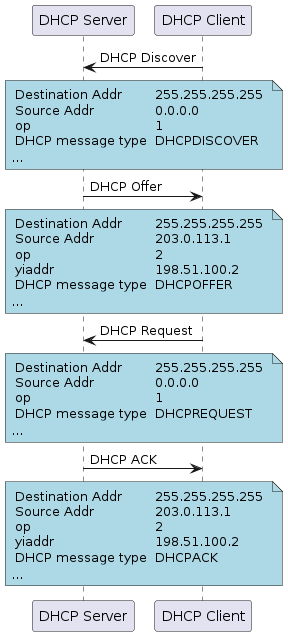

# Chapter5: DHCP

この章では DHCP に関する基礎知識とその設定を学びます。

[[toc]]
## Lesson

### DHCP

DHCP(Dynamic Host Configuration Protocol) は、ネットワーク接続するのに必要な IP アドレスなどの情報を自動的に割り当てるアプリケーション層プロトコルです。

DHCP は情報を割り当てる DHCP サーバーと情報を割り当てられる DHCP クライアントからなります。
最初は、DHCP クライアントは自身の IP アドレスも知らなければ、DHCP サーバの IP アドレスも使うべきではない言葉なので修正してくださいので全ての宛先(ブロードキャスト)に DHCP Discover メッセージを送信して、ネットワーク全体に問い合わせます。

DHCP Discover メッセージを受け取った DHCP サーバは、クライアントに割り当てる IP アドレス設定などをアドレスプールから選択して提案します。
DHCP サーバの仕様により DHCP Offer はブロードキャストで送信するので、その場合は宛先 MAC と IP はブロードキャストアドレスになります。

DHCP Offer を受け取った DHCP クライアントは提案された IP を使用する事を通知するために DHCP Request をブロードキャストします。

最後に、DHCP サーバは DHCP クライアントが使用する IP アドレスなどの設定情報を DHCP Ack で送信します。

これを受け取ることで DHCP クライアントは提案された IP アドレスを自信の IP アドレスとして利用できるようになります。

DHCP サーバには色々な設定項目がありますが、DHCP クライアントに IP アドレスを割り当てる範囲のアドレスプール、サブネットマスク、デフォルトゲートウェイのアドレス、DNS サーバの IP アドレス、リース期間(IP アドレスの貸し出し期間)などが、基本的な設定項目となります。



## Assignment

### 1. DHCPを使ってs1~s3がインターネットに接続できるようにしてみよう

::: info
s1~s3 は`dhclient`導入済み Ubuntu 20.04 LTS です。
:::


::: details ヒント1

ここでは r4 が DHCP サーバー、s1~s3 が DHCP クライアントです。
:::


::: details ヒント2

最初はこれまでと同様に r4 の`eth100`に対して IP アドレスや OSPF の設定する必要があります。
:::


::: details ヒント3

DHCP サーバーには少なくとも割り当てる範囲のアドレスプール・サブネットマスク、デフォルトゲートウェイのアドレスの 3 つが必要です。
:::


::: details 答え

**[r4]**
```sh
root@hijiki51-60000:/# attach r4
minion@r4:/$ config
[edit]
minion@r4# set interfaces ethernet eth100 address 192.168.0.142/28

minion@r4# set protocols ospf area 0 network 192.168.0.128/28

minion@r4# set protocols ospf passive-interface eth100

minion@r4# set service dhcp-server shared-network-name dhcp_scope_01 subnet 192.168.0.128/28 default-router 192.168.0.142 ; 送信先ネットワークに対してデフォルトルート(今回はDHCPホストサーバー)を設定
minion@r4# set service dhcp-server shared-network-name dhcp_scope_01 subnet 192.168.0.128/28 range 0 start 192.168.0.129
minion@r4# set service dhcp-server shared-network-name dhcp_scope_01 subnet 192.168.0.128/28 range 0 stop 192.168.0.139 ; DHCPで使用するネットワークとその中で割り振る範囲を設定

minion@r4# commit
minion@r4# save
[edit]
minion@r4# exit
exit

minion@r4/$ show dhcp server statistics

Pool                      Pool size   # Leased    # Avail
----                      ---------   --------    -------
dhcp_scope_01             10          0           10
```

`show dhcp server statistics`で割り振りが行われているか確認可能です。

**[s1~s3]**
```sh
root@s1:~# dhclient ens4
```
で DHCP の再リースが可能です。

割り振り前後で`ip address`コマンドの結果を比較してみると良いでしょう。
:::

