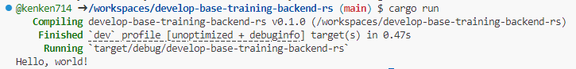
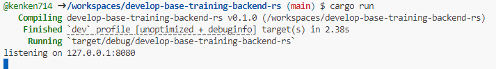
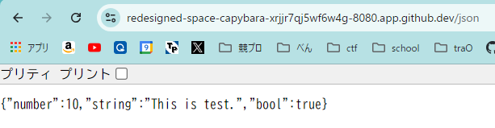

# 第2回 | バックエンド

:::details 座学編まとめ

### URL (URI)
Uniform Resource Locator
プロトコルとサイトを指定する文字列が含まれる。

### IPアドレス(v4)
**インターネット上の住所**(サーバー別でかぶらないように割り当てられる)
IPv4 が枯渇してきているので IPv6 も増えてきている。

### HTTP通信
- Method
    - `GET`: サーバーから取得
    - `POST`: サーバーに渡す
    - 他にも用途に応じて 5 つくらいある
- Version
    - `HTTP/1.1`
    - `HTTP/2`
    - `HTTP/3`
 - Request
    - Header
        - ブラウザの履歴削除で見る`Cookie`とかはここで使われている
        - `Body`で送る形式の指定など
    - Path
        - パスパラメータ
        - クエリパラメータ
    - Body
        - データ本体
        - `POST`などでのみ(get では存在しない)
 - Response
     - StatusCode
         - `200`: OK
         - `300`: Multiple Choice
         - `400`: Bad Request
             - 有名な`404 Not Found`エラーがこの系列
             - ~~418 I'm tea pot~~ <- ジョークコード
         - `500`: Internal Server Error
     - Header
     - Body

### MDNを見ろ🫵🫵🫵🫵🫵
MDN にはこの世の全てが書いてある。

:::

## RustでHello World

前回と同様に GitHub Codespaces を起動してください。(前回とリポジトリが違います!)
https://github.com/traP-jp/develop-base-training-backend-rs

`src/main.rs`ファイルを開きましょう。以下のコードが書かれているはずです。

```rs
fn main() {
    println!("Hello, world!");
}
```

この状態で以下のコマンドを GitHub Codespaces 内のターミナルで実行して、以下のように`Hello, World!`が出れば OK です。
以下のような表記がされている場合は`$`を入力しないで`cargo run`などだけを入力するようにしてください。 (`$`はすでに入力されているはずです!)

```bash
$ cargo run
```



## サーバーアプリケーションを作る

次の内容を`main.rs`に書き込んでください。

```rs
use axum::{routing::get, Router};

#[tokio::main]
async fn main() {
    let app = Router::new().route("/hello", get(String::from("Hello, World.\n")));

    let listener = tokio::net::TcpListener::bind("127.0.0.1:8080")
        .await
        .unwrap();

    println!("listening on {}", listener.local_addr().unwrap());
    axum::serve(listener, app).await.unwrap();
}
```

次のコマンドをターミナルで実行してください。

```sh
$ cargo add axum
$ cargo add tokio --features rt-multi-thread,macros
$ cargo run
```

以下のような画面が出れば起動できています。
コードに変更を加えたら一旦止めてもう 1 回`cargo run`で起動しないと変更が反映されないので注意してください。
止めるときは`Ctrl+C`で終了できます。止めないと次に起動するときにポート番号を変えないとエラーが出てしまうので、使い終わったら止めるようにしましょう。



:::tip ターミナルの開き方
ツールバー > Terminal > New Terminal でその時開いているディレクトリでターミナルが開きます。 
もしくは`Ctrl+@`でも(Windows の場合)。
:::

## アクセスしてみる
今回はコマンドラインから、立ち上げたサーバーにアクセスしてみましょう。

ターミナルパネルの上にあるツールバーのプラスボタンを押すと、新たにターミナルを開くことができます。


新しくターミナルを開いて、次のコマンドを実行してみます。

```
$ curl localhost:8080/hello
```

すると、レスポンスとして Hello, World が返ってきていることがわかります。


### 更に詳しくリクエストを見る
curl コマンドのオプションとして、リクエストなどの情報を詳しく見る`-vvv`があります。

```sh
$ curl localhost:8080/hello -vvv
```


先程座学でやったような、リクエスト・レスポンスが送られていることがわかります。

## ブラウザからアクセスする

Github Codespases には URL が設定されているので、皆さんの PC のブラウザからもアクセスが可能です。

ターミナルの隣にある「ポート」というタブをクリックして、紙袋のようなマークの「ローカルアドレスのコピー」を選択します。


### 練習問題
エンドポイントとして自分の traQ ID のものを生やして自己紹介を返すようにしてみましょう。

例

:::info
完成したら URL を #event/workshop/naro-rs チャンネルに投稿してください
:::

## JSONレスポンスを返す
レスポンスとして JSON を返すようにしましょう
:::info
Rust の構造体についてわからない人は
https://doc.rust-jp.rs/book-ja/ch05-01-defining-structs.html
を見るといいでしょう。
:::

JSON と構造体を相互変換するために、``serde`` というフレームワークを用います。

次のコマンドをターミナルで実行してください。

```sh
$ cargo add serde serde_json --features serde/derive
```

JSON をレスポンスとして返すためには、`Json` に定義した構造体を渡します。

```rs
use axum::{routing::get, Json, Router};

#[tokio::main]
async fn main() {
    let app = Router::new()
        .route("/hello", get(String::from("Hello, World.\n")))
        .route("/json", get(json_handler));

    let listener = tokio::net::TcpListener::bind("127.0.0.1:8080")
        .await
        .unwrap();

    println!("listening on {}", listener.local_addr().unwrap());
    axum::serve(listener, app).await.unwrap();
}

// 構造体を JSON に変換するためにserde::Serializeトレイトを導出する
#[derive(serde::Serialize)]
struct JsonData {
    number: i32,
    string: String,
    bool: bool,
}

async fn json_handler() -> Json<JsonData> {
    let res = JsonData {
        number: 10,
        string: String::from("This is test."),
        bool: true,
    };

    Json(res)
}
```




## 発展課題

### 発展課題1

今までは手動でリクエストを投げていましたが、フロントエンドから JS でリクエストを投げてみましょう。前回作ったフロントエンドを使います。
https://github.com/codespaces から前回作ったフロントエンドの GitHub Codespaces を開いて追記していきましょう。

リクエストを投げるためには[Fetch API](https://developer.mozilla.org/ja/docs/Web/API/fetch)というものを使います。

URL は、以下の画像にて赤で囲ったように、下の`PORTS`->コピーマークの順でクリックするとコピーできます。


```javascript
const httpGetRequest = async () => {
	const res = await fetch("{あなたのURL}/json", { method: "GET" })
	const data = await res.json()
	// 受け取ったdataをHTMLにセットする処理
}
```

ここに受け取った値を HTML にセットする処理を書きます（前回書きましたね）。
`data.string`や`data.bool`、`data.number`のように書くことでそれぞれのデータにアクセスできます。
`async` `await`という見慣れない書き方が出てきましたが、`await` = 処理を待つ、`async` = `await`を使えるようにする、ぐらいの認識で OK です。

:::details 答え

```javascript
// (省略)
const httpGetRequest = async () => {
	const res = await fetch("{あなたのURL}/json", { method: "GET" })
	const data = await res.json()
	const responseElement = document.querySelector('#response')
  responseElement.innerText = data.String
}
```
:::

:::tip
もし詳しいことを聞きたければ #team/SysAd/random/sodan までお気軽にどうぞ！

<!-- TODO: 詳細をちゃんとかく-->
:::

### 発展課題2
フロントで TimeZone を入力すると、その地域の現在時刻が表示されるようにしてみよう。

:::tip タイムゾーン一覧

https://www.iana.org/time-zones

https://en.wikipedia.org/wiki/List_of_tz_database_time_zones

:::

今回の講習会の内容は以上です！　お疲れ様でした。


