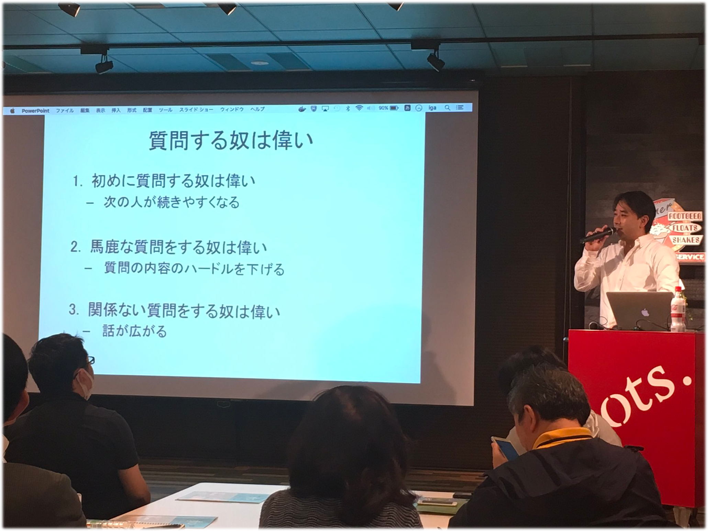
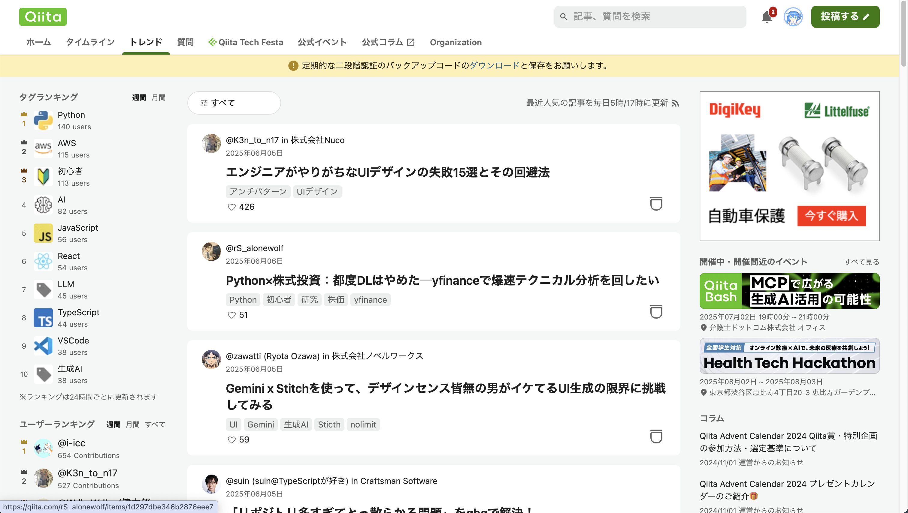
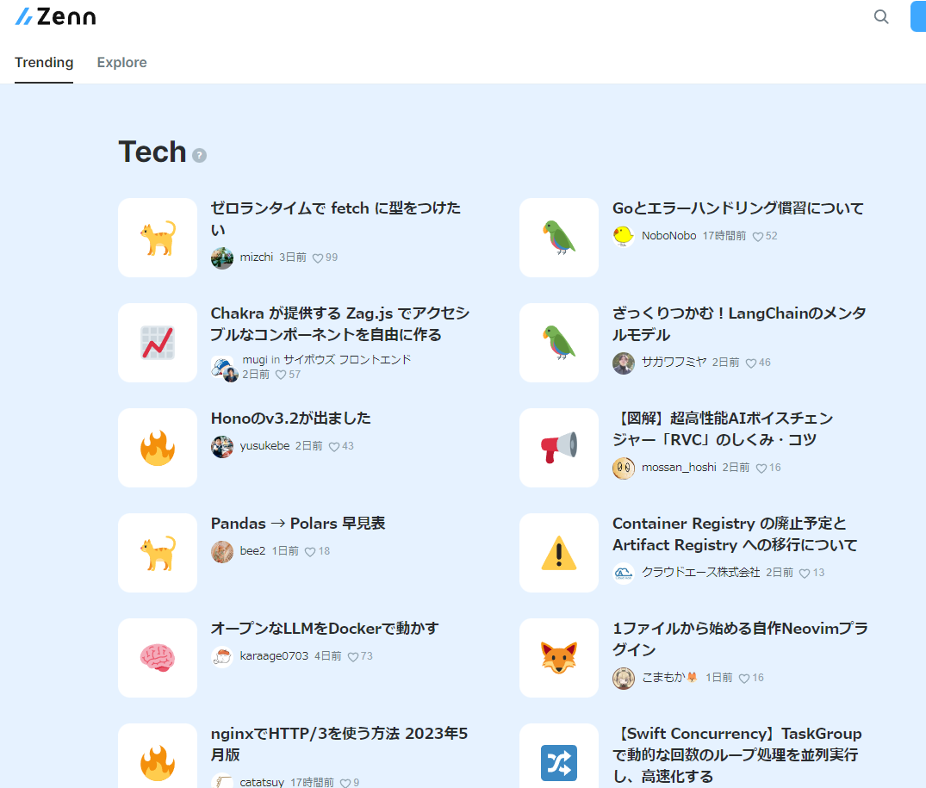
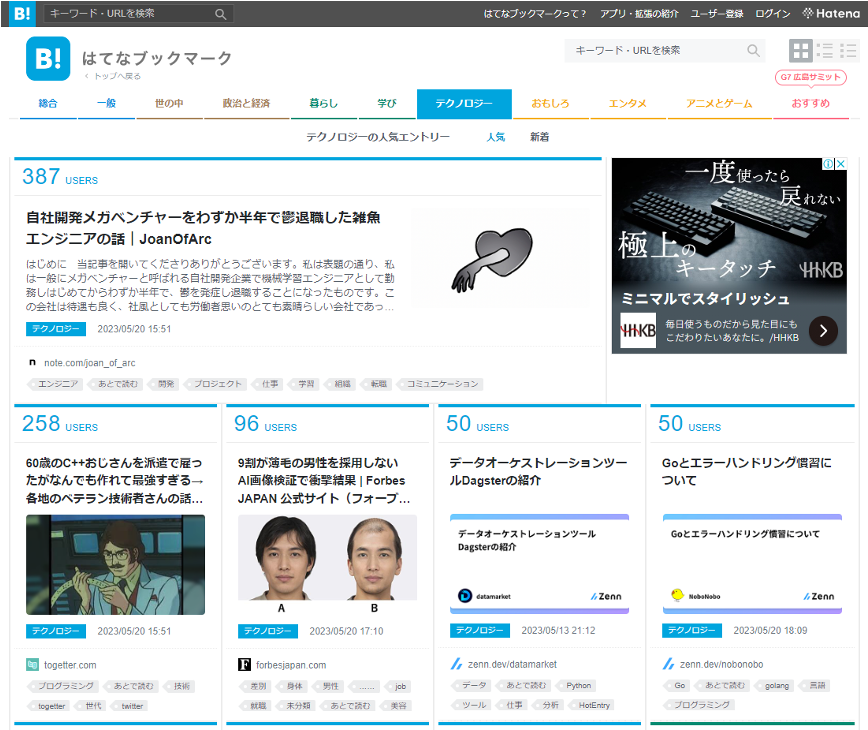
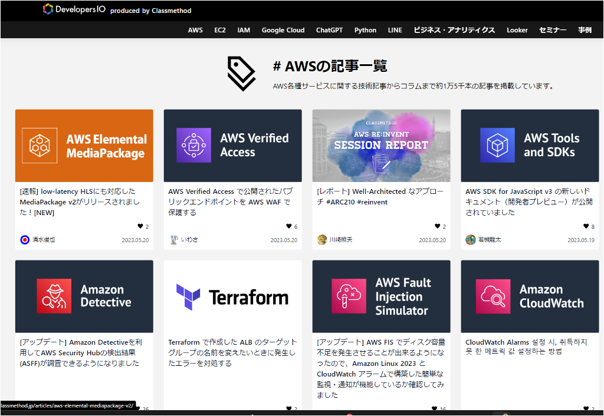
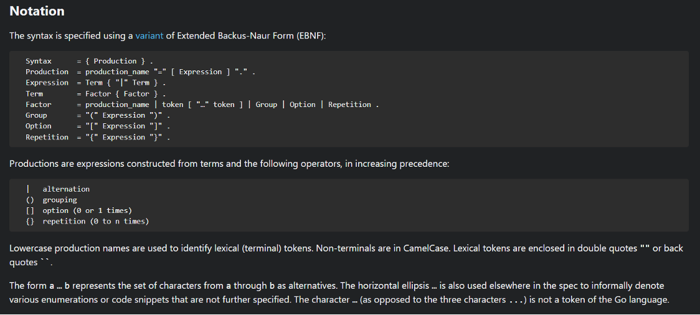
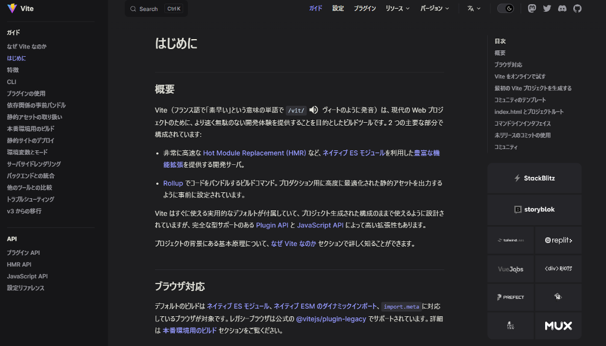
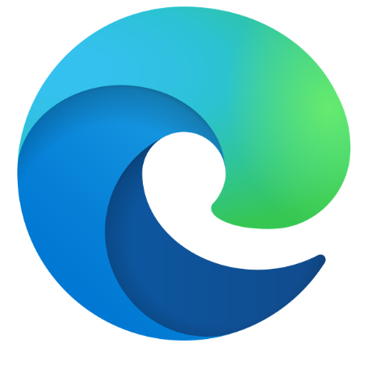
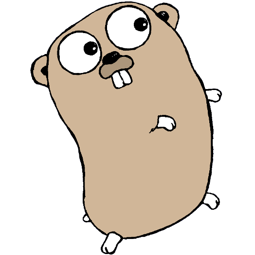

<!--
_class: title
-->

# 導入・Webアプリ概論

Webエンジニアになろう講習会 第1回

---

# 本日のゴール

- 講習会の概要を理解する
- 講習会で使う言語を知る
- 環境構築をする

---

# 目次

- 座学
  - この講習会について
  - 講習会の心構え
  - 講習会で使う言語の紹介
- 実習
  - 環境構築
  - Golang で Hello World!
  - Web サイトを起動してみる

---

# 目次

- 座学
  - **この講習会について ⬅️**
  - 講習会の心構え
  - 講習会で使う言語の紹介
- 実習
  - 環境構築
  - Golang で Hello World!
  - Web サイトを起動してみる

---

<!--
_class: section-head
-->

# この講習会について

---

# この講習会について

## つよつよエンジニアになるための講習会

- お金が取れるクオリティを目指しています！
- 半年以上の時間をかけて、一から Web をすべて教えこみます！
- 複数部で構成されています
  - 0→1 講習会期間では第一部を実施します
  - 夏に第二部、秋に第三部を実施します

---

# 第一部の目標

## ハッカソンで活躍する！

- ハッカソンで楽しむために必要な基礎知識を学ぶ
- ひとつでもいいので、自分で機能を実装できる状態に！

---

# 参考：第二部以降

## 第二部: 一人で開発できるようになる！

- 完成させきるのに必要な、コード以外の知識を学ぶ
- セキュリティ、公開のやり方などなど

## 第三部: 一人前と呼べるレベルの知識を！

- ただ開発できるだけではなく「つよつよエンジニア」に

---

# 目次

- 座学
  - この講習会について
  - **講習会の心構え ⬅️**
  - Web 技術概論
- 実習
  - 環境構築
  - Golang でHello World!

---

<!--
_class: section-head
-->

# 講習会の心構え

---

# この講習会を受けるにあたって

## 質問しよう！
- 詳しい人が近くにいます！
- どんどん質問して知識を奪い取ろう

## どんどん進めよう！
- 進められる人は自分で調べてどんどん進めよう
- 進んだ先で詰まったら質問してね！

---

# この講習会を受けるにあたって

## 調べてみよう！
- 簡単のため、飛ばしていたり曖昧にしていたりもする
- 気になったらガンガンググろう！ (ググりの数は強さ)

## 情報収集しよう！
- いろいろなところから情報を集めよう！

---

# この講習会を受けるにあたって

## 自分のものにしよう！
- ただ作業を模倣するだけにならないようにしよう。
- 「質問しよう！」「どんどん進めよう！」 「調べてみよう！」「情報収集しよう！」ができればOK！

---

# 質問する奴は偉い

https://twitter.com/motcho_tw/status/870589211832795136

---

# 質問する奴は偉い

## 最大でも10分考えてわからなかったら聞く
- 言語化できなくてもとりあえず聞いてほしい
- ひとりでずっと悩まないでほしい

---

# 生成 AI との向き合い方

（正直釈迦に説法かもとは思いつつ…）

「AI に依存しない」 を心がける！

- ぜひ自分の手でコードを書いて学んでください
- 結局生成 AI に任せられない部分が出てくる
  - 細かいコード修正
  - 複雑なロジック

- こうなったときは自分の知識に頼るしかない
- "基本的なロジック・概念・仕組み" を学ぶことに集中すると良い
- 生成 AI の利活用は 2 部で話します

---

# いろいろな情報源

- X (Twitter)

  - どんどんフォローするのがよい
- 技術知見共有サイト(Zenn, Stackoverflow等)
- その他テックブログ
  - RSSを使って購読できる
- はてなブックマーク
  - 見てる人が多い
  - いろんな情報源を横断して見れる

---

# いろいろな情報源

- 公式ドキュメント

  - 慣れてきたらこれをまず見てほしい
  - ここに載っている情報は普通正しい
  - 基本的に英語 (日本語対応のものも)
- 仕様書 (RFCとか)
  - 今は読めなくていい（難解なので）
  - 基本的に英語
- 内部実装
  - (読めたら) 最強

---

# いろいろな情報源

## 誤った情報に気を付ける

- 古い記事は現在の状況に当てはまらないことがある
  - バージョンアップなどで変更されている可能性
  - 記事の投稿日時を確認する
- 生成 AI の出力は信用しない
  - 裏を取ること
- 必ず自分で裏を取る
  - 一次ソースを読む

---

# 強くなる力を身につける

## この講習会だけで強くなれるわけではない

 

- この講習会を通して自分で強くなる力を身につけてほしい
  - エラーの乗り越え方
  - 新しい技術を学ぶ力

---

<!--
_class: section-head
-->

# 心構え - FAQ など

---

# Webエンジニアになるにあたって

- 競プロ力とかって必要？
  - 出来るに越したことはないが、そこまで必要ない
  - 必要になった時に改めて勉強しよう
- 何が必要？
  - 知識と経験
  - あと**やっていく力**
- PCって何がいい？
  - WindowsでもMacでも大丈夫！

---

# Webエンジニアになるにあたって

---

# Webエンジニアになるにあたって

- 最初は大変かもしれないけど、その後は**やりたいことが自分の手**でできるようになるので楽しい！
- 大変なことの大部分は、知識や環境構築に関する部分
  - 先輩たちも通った道なのでどんどん頼ろう

---

# 結局何から始めればいいの？

- 自分の **やりたいこと** から始めると続く
- なければ **SysAd** はどうですか？
- ISUCONなどの大会を目標にするのは？
- **Git** はスムーズに使えるようになろう

---

<!--
_class: section-head
-->

# 座学: ファイルとディレクトリ

---

# ファイルとディレクトリ

- **ディレクトリ** (Directory)

  - フォルダのこと

- **ファイル** (File)

  - データの本体
  - `.pdf` とか `.docx` とか

---

# ファイルのパス

- **パス** (Path)
    - フォルダ・ファイルの住所
    - `/` (Mac or Linux) または `¥` (Windows) で区切られている

    - 例
        - `/home/zoi_dayo/kadai/toukei/mid.pdf`
        - `home`, `zoi_dayo`, `kadai`, `toukei` がディレクトリ
        - `mid.pdf` がファイル

---

# ファイルの種類

## 拡張子

- ファイルを識別するために付ける文字列
- 別に任意に付けられるもので、必須ではない

## テキストファイルとバイナリファイル

- **テキストファイル**

  - 文字だけ含まれるファイル
  - ソースコードとか
- **バイナリファイル**
  - それ以外のファイル（画像とか）

---

<!--
_class: section-head
-->

# 実習編

---

# ブラウザ

  
  
  

- Webアプリを開発する上ではChromeかFirefoxかEdgeを使いましょう
- ただし、**今回の講習では** Chromeを使用してください
- Chrome: https://www.google.com/chrome/

---

# TypeScript

- Microsoft 製
- Javascript のスーパーセット
- フロントエンドは基本これを使う
- 詳細は次回説明します

---

# Go言語

- Google製の言語
- 簡潔な言語仕様・高速な動作・公式ライブラリが充実していることが売り
- traPの大抵のサーバーアプリケーションもGoで書かれている

---

# 宿題

- A tour of GoのBasicsまでを読んでくる
  - https://go-tour-jp.appspot.com/list からできます
  - コードも実行してみてください
- 期限: 第3回まで
- わからないこと、もっと知りたいことがあれば質問！！
  - 講習会時間外でも #event/workshop/webapp/sodan にぜひ聞いて下さい
