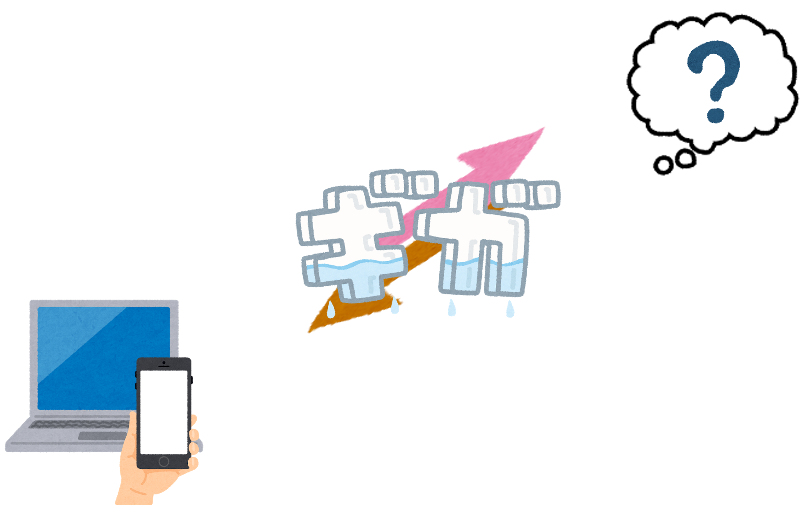

<!--
_class: title
-->

# オリエンテーション＆Webアプリ概論

Webエンジニアになろう講習会 第1回

---

# 目次

- 座学
  - この講習会について
  - 受けるにあたって
  - Web技術概論
- 実習
  - 環境構築
  - GolangでHello World!

---

# 目次

- 座学
  - **この講習会について ⬅️**
  - 受けるにあたって
  - Web技術概論
- 実習
  - 環境構築
  - GolangでHello World!

---

<!--
_class: section-head
-->

# この講習会について

---

# この講習会について

## つよつよエンジニアになるための講習会
- お金が取れるクオリティを目指しています！
- フロントからインフラ、監視まで全部やります！
- 複数部で構成されています
  - 0→1 講習会 (新入部員向け) では1,2部を実施します

---

# 第一部の目標

## ハッカソンで活躍する！
- 一つでもいいので、自分で機能を実装できる状態に！

---

# 目次

- 座学
  - この講習会について
  - **受けるにあたって ⬅️**
  - Web技術概論
- 実習
  - 環境構築
  - GolangでHello World!

---

<!--
_class: section-head
-->

# 受けるにあたって

---

# この講習会を受けるにあたって

## 質問しよう！
- 詳しい人が近くにいます！
- どんどん質問して知識を奪い取ろう

## どんどん進めよう！
- 進められる人は自分で調べてどんどん進めよう
- 進んだ先で詰まったら質問してね！

---

# この講習会を受けるにあたって

## 調べてみよう！
- 簡単のため、飛ばしていたり曖昧にしていたりもする
- 気になったらガンガンググろう！ (ググりの数は強さ)

## 情報収集しよう！
- いろいろなところから情報を集めよう！

---

# この講習会を受けるにあたって

## 自分のものにしよう！
- ただ作業を模倣するだけにならないようにしよう。
- 「質問しよう！」「どんどん進めよう！」 「調べてみよう！」「情報収集しよう！」ができればOK！

---

# 質問する奴は偉い

https://twitter.com/motcho_tw/status/870589211832795136

---

# 質問する奴は偉い

## 最大でも10分考えてわからなかったら聞く
- 言語化できなくてもとりあえず聞いてほしい
- ひとりでずっと悩まないでほしい

---

# いろいろな情報源

- X (Twitter)
  - どんどんフォローするのがよい
- 技術知見共有サイト(Zenn, Stackoverflow等)
- その他テックブログ
  - RSSを使って購読できる
- はてなブックマーク
  - 見てる人が多い
  - いろんな情報源を横断して見れる

---

# いろいろな情報源

- 公式ドキュメント
  - 慣れてきたらこれをまず見てほしい
  - ここに載っている情報は普通正しい
  - 基本的に英語 (日本語対応のものも)
- 仕様書 (RFCとか)
  - 今は読めなくていい（難解なので）
  - 基本的に英語
- 内部実装
  - (読めたら) 最強

---

# いろいろな情報源

## 誤った情報に気を付ける

- 古い記事は現在の状況に当てはまらないことがある
  - バージョンアップなどで変更されている可能性
- 生成AIの出力は信用しない
  - 自分が使わなくても、誰かがAIに出力させた文章が 検索で引っかかることがある
- 記事の投稿日時を確認する
- 一次ソースを読む

---

# 強くなる力を身につける

## この講習会だけで強くなれるわけではない

 

- この講習会を通して自分で強くなる力を身につけてほしい
  - エラーの乗り越え方
  - 新しい技術を学ぶ力

---

# 目次

- 座学
  - この講習会について
  - 受けるにあたって
  - **Web技術概論 ⬅️**
- 実習
  - 環境構築
  - GolangでHello World!

---

<!--
_class: section-head
-->

# Web技術概論

---

# この座学の目標

## Webサービスがどんな技術で 作られているかをなんとなく知ること

全部理解するのは無理 (できるならこの講習会はいらない)

---

# 頭の中に地図を作る

- 個々の要素よりも全体像をイメージできることを重視
  - 全体像をイメージしつつ、自分の言葉や図を使って ほかの人に教えられるようになる
- 細かい名前や用語を覚える必要はない
  - 後で調べればいい
  - 知ってそうな人に聞いてもいい
  - 聞き覚えがあったらこのスライドを見返してみよう

---

# 今日の題材

## traQを通してWebサービスについて知る

  
  

---

# traQ概念図

---

# 登場人物1　フロントエンド

- 別名：クライアント、Web UIなど
- 私達 (= エンドユーザー) が直接見て操作する部分
- 情報の表示や操作の受付を担当

---

# 登場人物2　ネットワーク

- いわゆるインターネット (通信)
- 様々なデータを決められたやり方でやり取りするパイプ
- 今日は詳しく説明しませんが、第3回で取り扱います

---

# traQ概念図（再掲）

---

# 疑問1

## 色んなクライアントから同じデータが見られるのはなぜ？🤔

ログインさえすればPCでもスマホでもクライアントを問わず、同じユーザーとして自分向けの表示を見ることができます。

それが可能なのはなぜでしょうか？

---

# 登場人物3　サーバーアプリケーション

- サーバー（鯖）、バックエンドなどとも
- 接続してきたクライアントや**リクエストの内容に応じて**色々処理する
  - データを受け取ったり・返したりする
  - 許可したり・拒否したり（ログインなど）
  - その他にもいろいろ

---

# 登場人物4　物理サーバー

- サーバー（鯖）、インスタンス、サーバーマシンなどとも
- サーバーアプリケーションのプログラムが実際に動くマシン
- 世界中のどこかにある
  - 「クラウド」上に存在
  - 基本仮想化されている
  - その他にもいろいろ

---

# 注意

  
  

- 物理サーバーとサーバーアプリケーションは紛らわしい！
- どちらもサーバー、バックエンドなどと呼ばれる
- 気を付けますが、混乱したときは聞いてください

---

# traQ概念図

---

# 用語解説: リクエスト

## リクエスト

- こういうデータがほしい・こういう操作をしてほしいという要求
- クライアント **→** サーバー
- 例: 「#randomのメッセージがほしい」「『〇〇』というメッセージを送信したい」

---

# 用語解説: レスポンス

## レスポンス

- リクエストに対する返答
- クライアント **←** サーバー
- 例: 「#randomのメッセージは『〇〇』です」「メッセージが正常に送信されました」

---

# 疑問2

## メッセージをどこに保管する？🤔

traQには多くのメッセージなどの情報が保管されていますが、サーバーアプリケーションは実行が終了すると、メモリに保存されているデータは消えてしまいます。

では、メッセージなどをどのように保存し、取り出しているのでしょうか？

---

# 登場人物5　データベース

- DB（**D**ata**B**ase）と略されることも
- データの保存に特化したアプリケーション
- 様々なデータ管理方式、アプリケーションがある
  - traPではMariaDB(MySQL)を使用しています。
  - MongoDB, PostgreSQL, DynamoDB, Redis, etc...

---

# データの永続化

- 情報は主に**メモリ**か**ストレージ**に保持される
- メモリ → 変数の値やキャッシュなど
  - プログラムの実行中のみ保持するデータが置かれる
- ストレージ (HDD, SSD) → ファイルなど
  - プログラムが終了したり、PCの電源を切っても永続的にデータを保持し続けられる
- プレイ中のゲームの状態とセーブデータのような関係
  - ゲームをやめるとゲームの状態は消えるけど、 セーブデータは参照できる

---

# traQ概念図

---

# traQ概念図

基本的な**構成**はこんな感じ
Webサービスを考えるにあたっての**主役**になる5要素

---

<!--
_class: section-head
-->

# おまけ

---

# Webエンジニアになるにあたって

- 競プロ力とかって必要？
  - 出来るに越したことはないが、そこまで必要ない
  - 必要になった時に改めて勉強しよう
- 何が必要？
  - 知識と経験
  - あと**やっていく力**
- PCって何がいい？
  - WindowsでもMacでも大丈夫！

---

# Webエンジニアになるにあたって

---

# Webエンジニアになるにあたって

- 最初は大変かもしれないけど、その後は**やりたいことが自分の手**でできるようになるので楽しい！
- 大変なことの大部分は、知識や環境構築に関する部分
  - 先輩たちも通った道なのでどんどん頼ろう

---

# 言語とか

## クライアント

- 基本的に HTML / CSS / JavaScript からは逃げられない
  - Wasmというものもあるが、普通のWebアプリでは わざわざ使うメリットがあまりない
- React (近年のプロダクトに多い), Vue (traP内最大手) など
- JavaScriptの代わりにTypeScriptを使っての開発が多い

---

# 言語とか

## サーバーサイド

- Go, Rust, Java, JavaScript, TypeScript, Python, Ruby(Ruby on Rails), PHPなどなど
- モダンな言語だとGo（採用企業も多い）, Rust（最近増えてる）
- traQのサーバーもGo

---

# 今熱いこと

- AI関連
  - エディタ (Cursorなど) / エージェント
  - Model Context Protocol (MCP)
- React Server Components (RSC)
- TypeScriptコンパイラのGo移植
- GraphQL Federation
- WebGPU
- DuckDB

---

# 結局何から始めればいいの？

- 自分の**やりたいこと**から始めると続く
- なければ**SysAd**はどうですか？
- ISUCONなどの大会を目標にするのは？
- **Git**はスムーズに使えるようになろう

---

# 今日話したこと

---

# マスタリングTCP/IP

- 今日話さなかったデータのやり取りについてよくまとまった本
- これを覚えておけば困らない
- 事前知識を要求しない
- JK/JCのネットワーク科目の教科書

---

<!--
_class: section-head
-->

# 実習編

---

# ブラウザ

  
  
  

- Webアプリを開発する上ではChromeかFirefoxかEdgeを使いましょう
- ただし、**今回の講習では** Chromeを使用してください
- Chrome: https://www.google.com/chrome/

---

# Go言語

- Google製の言語
- 簡潔な言語仕様・高速な動作・公式ライブラリが充実していることが売り
- traPの大抵のサーバーアプリケーションもGoで書かれている

---

# 宿題

- A tour of GoのBasicsまでを読んでくる
  - https://go-tour-jp.appspot.com/list からできます
  - コードも実行してみてください
- 期限: 第3回まで
- わからないこと、もっと知りたいことがあれば質問！！
  - 講習会時間外でも #event/workshop/webapp/sodan にぜひ聞いて下さい
