

<!--
_class: title
-->

# プログラミング心得＆ フロントエンド基礎

Webエンジニアになろう講習会 第2回

---

# 目次

- おさらい・フロントエンド
  - HTML / CSS / JS
- Web サービスの仕組み
  - traQ を題材にして知る
  - バックエンド・フロント・DB を知ってもらう
- Vue について　（座学編）
  - なぜ HTML JS じゃないのか
- Vite npm node
- Alt 〇〇
- Vue について（実習編）
- フロントエンドのデバッグ　（実習編）

---

# 目次

- 座学
  - **きれいなコードを書こう ⬅️**
  - きれいなコードを保つために
  - JavaScriptの歴史
  - フロントエンド開発
- 実習
  - Chrome Devtools 入門
  - Vue入門

---

<!--
_class: section-head
-->

# Web技術概論

---

# この座学の目標

## Webサービスがどんな技術で 作られているかをなんとなく知ること

全部理解するのは無理

---

# 頭の中に地図を作る

- 個々の要素よりも全体像をイメージできることを重視
  - 全体像をイメージしつつ、自分の言葉や図を使って ほかの人に教えられるようになる
- 細かい名前や用語を覚える必要はない
  - 後で調べればいい
  - 知ってそうな人に聞いてもいい
  - 聞き覚えがあったらこのスライドを見返してみよう

---

# 今日の題材

## traQを通してWebサービスについて知る

  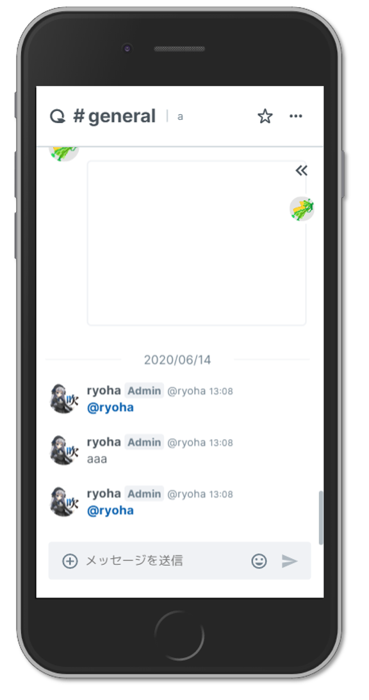
  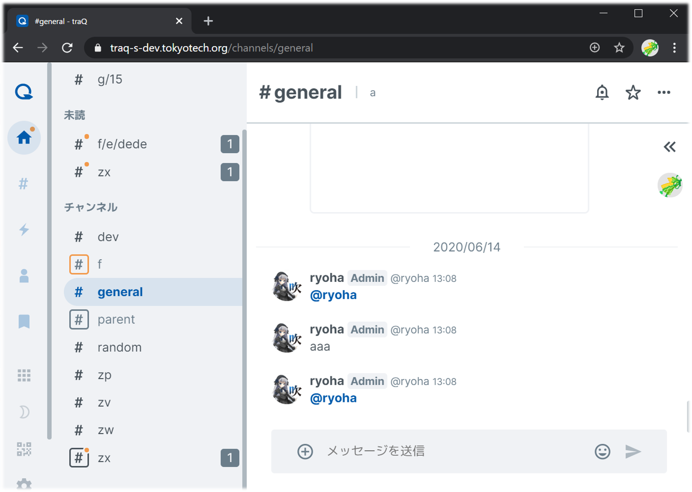

---

# traQ概念図

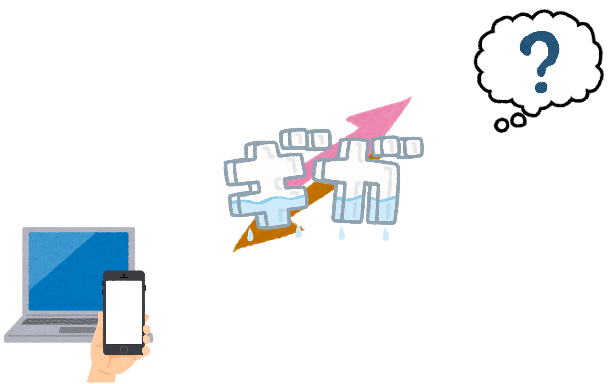

---

# 登場人物1　フロントエンド

- 別名：クライアント、Web UIなど
- 私達 (= エンドユーザー) が直接見て操作する部分
- 情報の表示や操作の受付を担当

---

# 登場人物2　ネットワーク

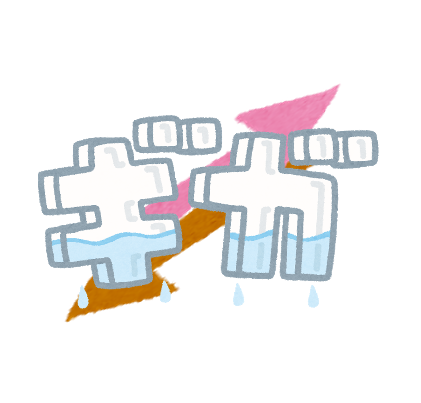

- いわゆるインターネット (通信)
- 様々なデータを決められたやり方でやり取りするパイプ
- 今日は詳しく説明しませんが、第3回で取り扱います

---

# traQ概念図（再掲）

---

# 疑問1

## いろんなクライアントから同じデータが見られるのはなぜ？

ログインさえすればPCでもスマホでもクライアントを問わず、同じユーザーとして自分向けの表示を見ることができます。

それが可能なのはなぜでしょうか？

---

# 登場人物3　サーバーアプリケーション

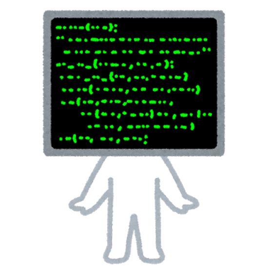

- サーバー（鯖）、バックエンドなどとも
- 接続してきたクライアントや**リクエストの内容に応じて**色々処理する
  - データを受け取ったり・返したりする
  - 許可したり・拒否したり（ログインなど）
  - その他にもいろいろ

---

# 登場人物4　物理サーバー

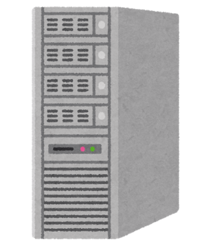

- サーバー（鯖）、インスタンス、サーバーマシンなどとも
- サーバーアプリケーションのプログラムが実際に動くマシン
- 世界中のどこかにある
  - 「クラウド」上に存在
  - 基本仮想化されている
  - その他にもいろいろ

---

# 注意

  
  

- 物理サーバーとサーバーアプリケーションは紛らわしい！
- どちらもサーバー、バックエンドなどと呼ばれる
- 気を付けますが、混乱したときは聞いてください

---

# traQ概念図

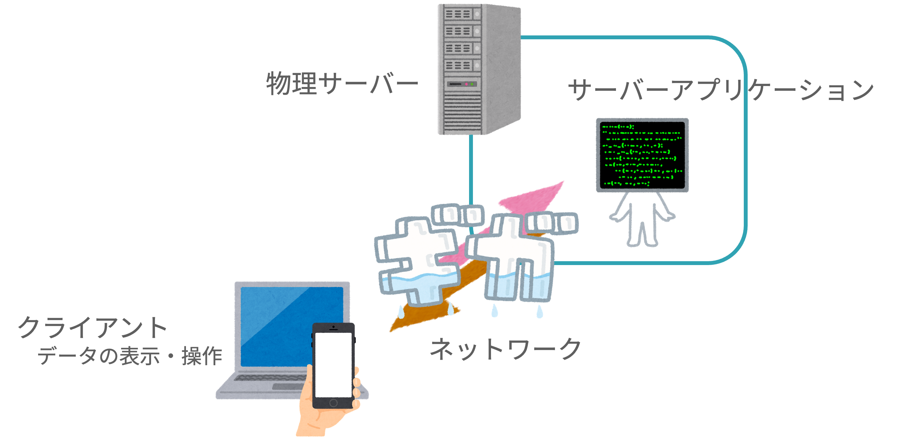

---

# 用語解説: リクエスト

## リクエスト

- こういうデータがほしい・こういう操作をしてほしいという要求
- クライアント **→** サーバー
- 例: 「#randomのメッセージがほしい」「『〇〇』というメッセージを送信したい」

---

# 用語解説: レスポンス

## レスポンス

- リクエストに対する返答
- クライアント **←** サーバー
- 例: 「#randomのメッセージは『〇〇』です」「メッセージが正常に送信されました」

---

# 疑問2

## メッセージをどこに保管する？

traQには多くのメッセージなどの情報が保管されていますが、サーバーアプリケーションは実行が終了すると、メモリに保存されているデータは消えてしまいます。

では、メッセージなどをどのように保存し、取り出しているのでしょうか？

---

# 登場人物5　データベース

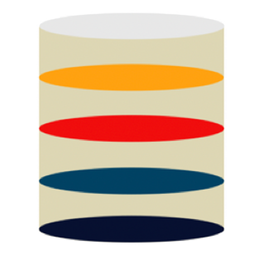

- DB（**D**ata**B**ase）と略されることも
- データの保存に特化したアプリケーション
- 様々なデータ管理方式、アプリケーションがある
  - traPではMariaDB(MySQL)を使用しています。
  - MongoDB, PostgreSQL, DynamoDB, Redis, etc...

---

# データの永続化

- 情報は主に**メモリ**か**ストレージ**に保持される
- メモリ → 変数の値やキャッシュなど
  - プログラムの実行中のみ保持するデータが置かれる
- ストレージ (HDD, SSD) → ファイルなど
  - プログラムが終了したり、PCの電源を切っても永続的にデータを保持し続けられる
- プレイ中のゲームの状態とセーブデータのような関係
  - ゲームをやめるとゲームの状態は消えるけど、 セーブデータは参照できる

---

# traQ概念図

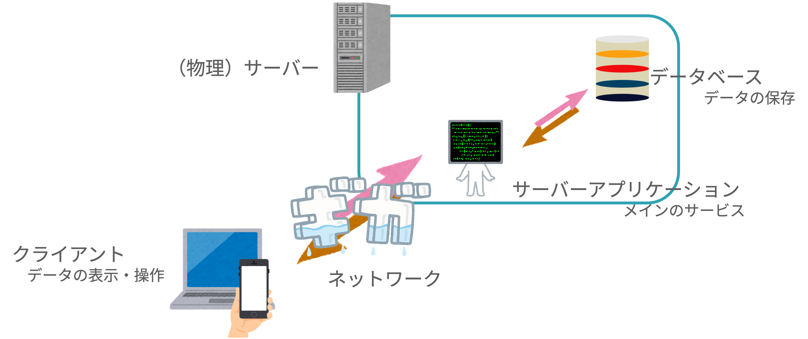

---

# traQ概念図

基本的な**構成**はこんな感じ
Webサービスを考えるにあたっての**主役**になる5要素

---

# マスタリングTCP/IP

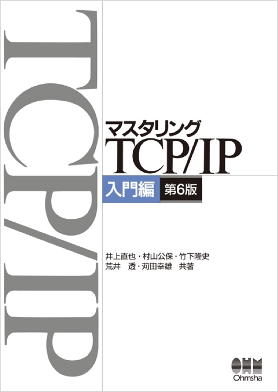

- 今日話さなかったデータのやり取りについてよくまとまった本
- これを覚えておけば困らない
- 事前知識を要求しない
- JK/JCのネットワーク科目の教科書

---

# 目次

- 座学
  - きれいなコードを書こう
  - **きれいなコードを保つために ⬅️**
  - JavaScriptの歴史
  - フロントエンド開発
- 実習
  - Chrome Devtools 入門
  - Vue入門

---

<!--
_class: section-head
-->

# ちょっと休憩

---

<!--
_class: section-head
-->

# フロントエンド開発

---

# traQ概念図

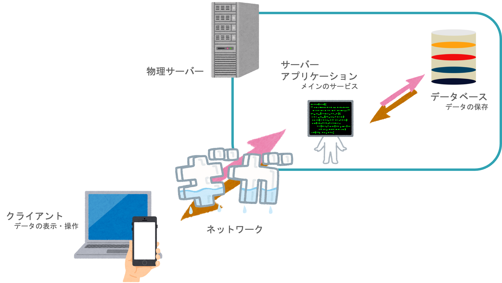

---

# 今日の実習の範囲

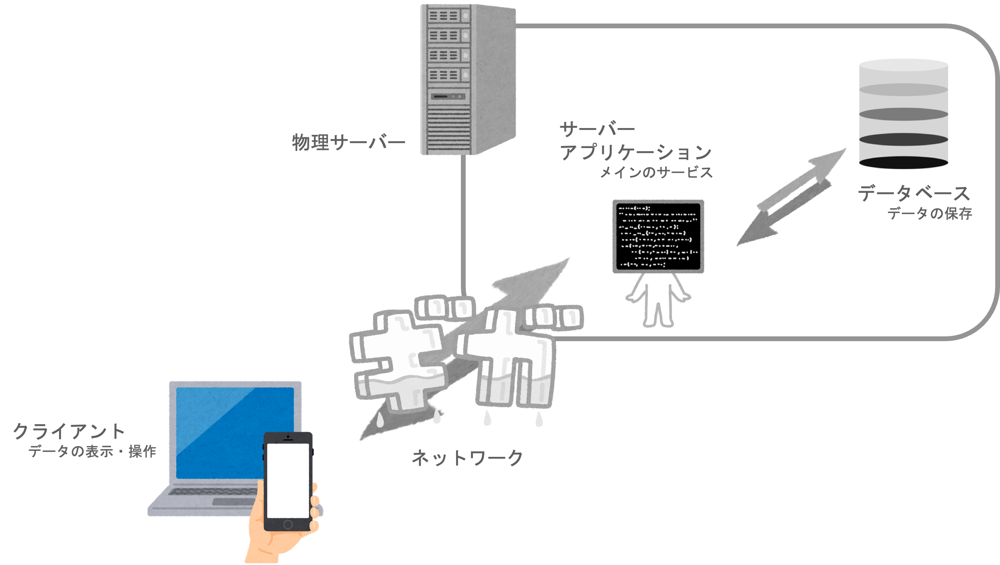

---

# HTML / CSS / JavaScript

- HTML
    - ページの 構造 を書く
- CSS
    - ページの スタイル を書く
- JavaScript
    - ページの ロジック を書く

...ための言語

---

# HTML

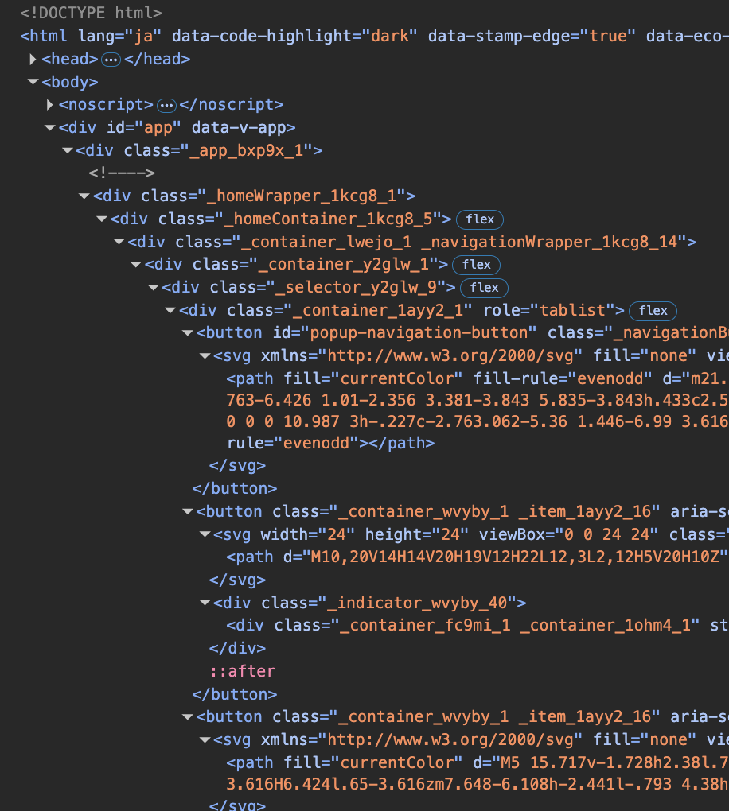

- ページの 構造 を書く
- `<hoge>` 〜 `</hoge>` を
セットで使う

---

# CSS

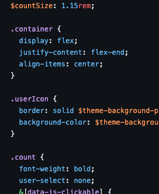

- ページの スタイル を書く
- 色からフォント、
アニメーションまでなんでも
- `hoge { fuga: piyo; ... }`
みたいな構造

---

# JavaScript

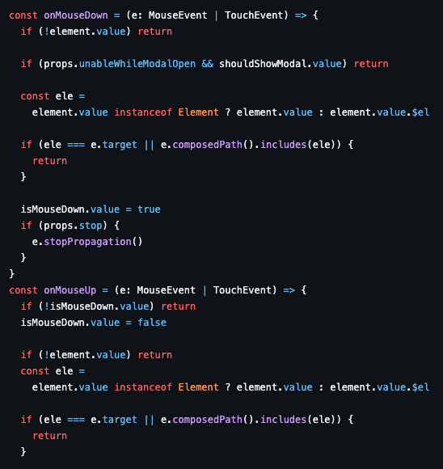

- ページの ロジック を書く
- バックエンドとの通信、並べ替え、マウス操作の取得も
- プログラムっぽい見た目

---

# フロントエンドの要素

- HTML
    - ページの **構造** を書く
- CSS
    - ページの **スタイル** を書く
- JavaScript
    - ページの **ロジック** を書く

---

<!--
_class: section-head
-->

# Alt(ernative) 〇〇

---

# Alt 〇〇

- 素のHTML / CSS / JavaScriptを書くのは嫌だ！
- もっと簡潔な・もっと楽な・もっと開発体験の良い言語で書きたい
  - 型のついた
  - 関数型の
  - 自分が慣れた
- ちょっとだけ例を紹介します

---

# Markdown

Alt **HTML**

---

# TypeScript

Alt **JavaScript**

---

# 現代のWebフロントエンド

- 様々な要素技術がひしめき合っている
- いろんなカオスをどうにかしようと日々新たなカオスが生み出されてる
- 流行の流れが早い
  - 数年前まで主流だったものが今では見ないこともザラ
- ここでは必要かつ現在主流のものに絞って話す

---

# Webフロント開発

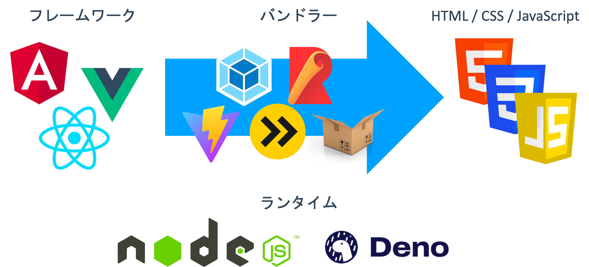

---

# 解説

- **フレームワーク**: Web サイトの開発方法を提供してくれるもの
- **モジュールバンドラー**: 最後に HTML + CSS + JS に変換するシステム
- **ランタイム**: JavaScript の実行環境

---

<!--
_class: section-head
-->

# Vue 入門（座学）

---

TODO 基本的な機能の説明をここに詰める

---

<!--
_class: section-head
-->

# まとめ

---

TODO

---