<style>
.columns {
  display: flex;
  align-items: center;
}
.columns img {
  width: 500px;
  margin-right: 1em;
}
.columns .text {
  flex: 1;
}
</style>

<!--
_class: title
-->

# プログラミング心得＆<br>フロントエンド基礎

Webエンジニアになろう講習会 第2回

---

<!--
_class: section-head
-->

# 前回のおさらい

---

# traQ概念図

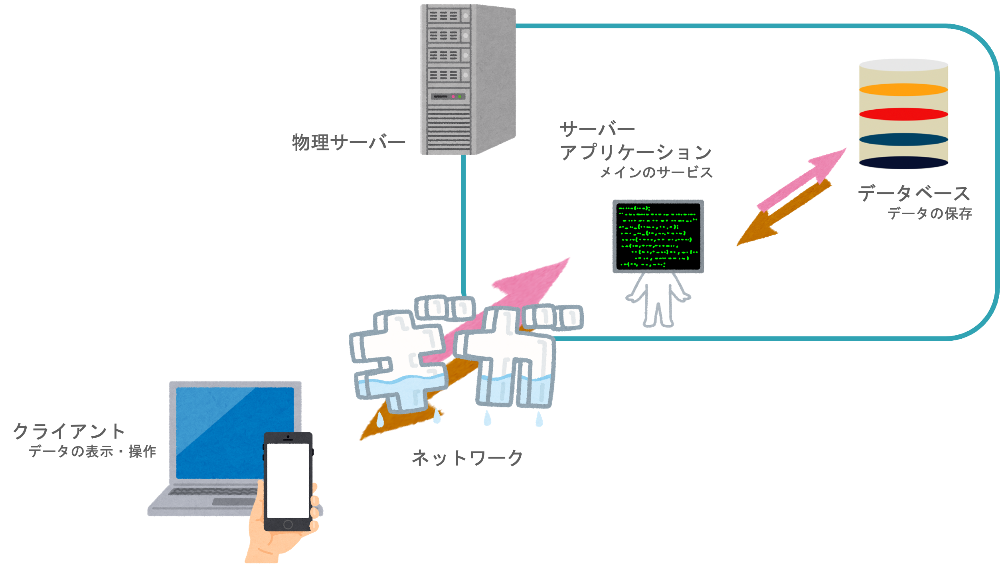

---

# 今日の範囲

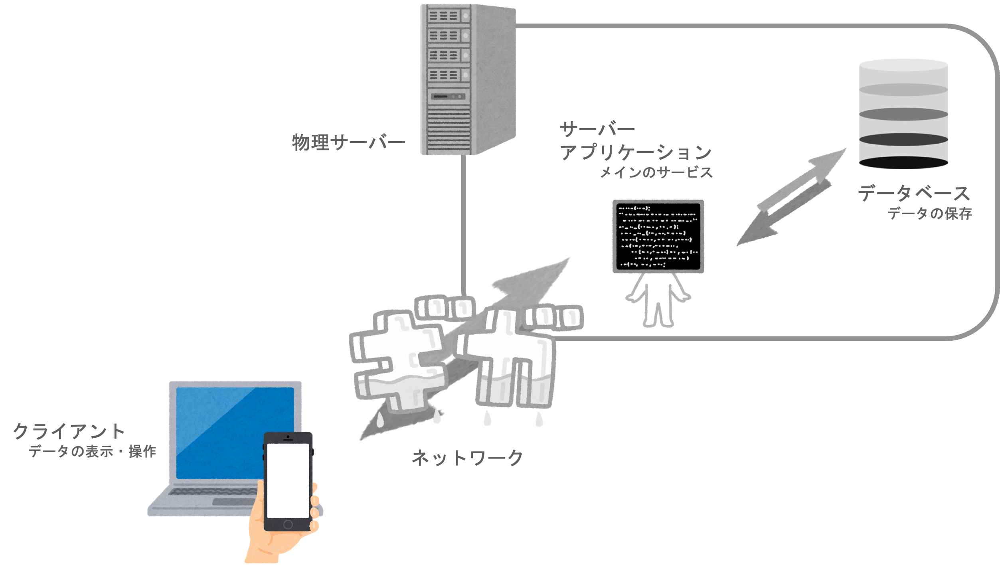

---

# 目次

- 座学
  - きれいなコードを書こう
  - きれいなコードを保つために
  - JavaScriptの歴史
  - フロントエンド開発
- 実習
  - Chrome Devtools 入門
  - Vue入門

---

# 目次

- 座学
  - **きれいなコードを書こう ⬅️**
  - きれいなコードを保つために
  - JavaScriptの歴史
  - フロントエンド開発
- 実習
  - Chrome Devtools 入門
  - Vue入門

---

<!--
_class: section-head
-->

# きれいな<br>コードを書こう

---

# 汚いコード

```go
var (
  a = 4 // X1-X3
  b = 7
  c = 2
  d = 5 // Y1-Y3
  e = 1
  f = 9
) 
func main() {
  tmp_var := 252521.0
  if tmp_var < math.Sqrt(float64((0-a)*(0-a)+(0-d)*(0-d))) {
    tmp_var = math.Sqrt(float64((a-0)*(a-0) + (d-0)*(d-0)))
  }
  if tmp_var > math.Sqrt(float64((0-b)*(0-b)+(0-e)*(0-e))) {
  } else {
  tmp_var = math.Sqrt(float64((-b)*(-b) + (-e)*(-e)))
  }
  if tmp_var < math.Sqrt(float64((0-c)*(0-c)+(0-f)*(0-f))) { 
  fmt.Println(math.Sqrt(float64((c)*(c) + (f)*(f))))} else { 
  fmt.Println(tmp_var) }} 
```

---

# きれいなコード

```go
type Point struct {
  x int
  y int
} 
var points = []Point{{4, 5}, {7, 1}, {2, 9}} 
func distance(a, b Point) float64 {
  dx := float64(a.x - b.x)
  dy := float64(a.y - b.y)
  return math.Sqrt(dx*dx + dy*dy) 
} 
func main() {
  origin := Point{0, 0}
  ans := math.MaxFloat64
  for _, point := range points { 
    dist := distance(origin, point) 
    if dist < ans { 
      ans = dist 
    } 
  } 
  fmt.Println(ans)
} 
```

---

# どちらも同じ処理が書かれているが……

<style>
.clean-code {
  width: 600px
}
</style>

<div class="columns">

<div class="clean-code">

```go
type Point struct {
  x int
  y int
} 
var points = []Point{{4, 5}, {7, 1}, {2, 9}} 
func distance(a, b Point) float64 {
  dx := float64(a.x - b.x)
  dy := float64(a.y - b.y)
  return math.Sqrt(dx*dx + dy*dy) 
} 
func main() {
  origin := Point{0, 0}
  ans := math.MaxFloat64
  for _, point := range points { 
    dist := distance(origin, point) 
    if dist < ans { 
      ans = dist 
    } 
  } 
  fmt.Println(ans)
} 
```

</div>

<div>

きれいなコードは
- 処理がわかりやすい
- 処理の変更がしやすい
  - 距離の定義の変更
  - ポイントの追加

</div>
</div>

---

# きれいなコードとは

- 他人 (将来の自分) が見てもわかりやすいコード
- 追加・変更・修正が容易にできるコード

---

# きれいなコードを書くために

1. インデントを使おう
2. コーディング規約を守ろう
3. 適切に分割しよう

もちろんこれらが全てではない

<span class="gray">検索すると色々出てくるので調べてみよう！</span>

---

# その1: インデントを使おう

<div class="columns">

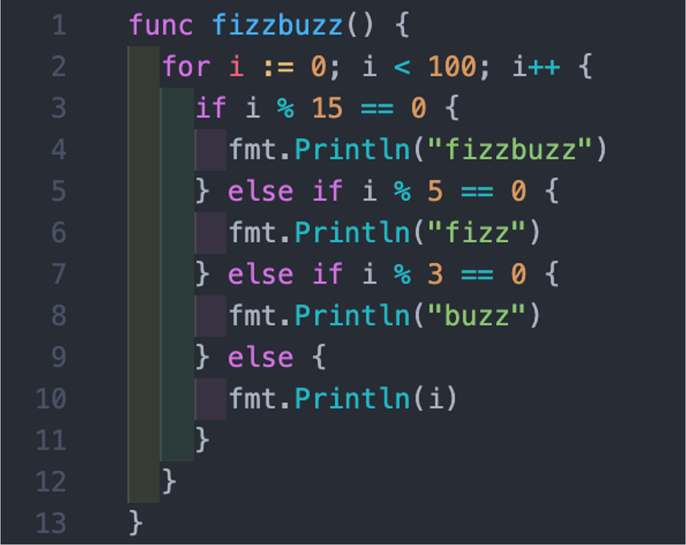

- プログラムの構造がわかりやすくなる
- 基本的には括弧の中を一段ネスト (深く) する
  - 括弧のペアが同じ深さになるように

</div>

---

# その2: コーディング規約を守ろう

変数・関数の命名方法には主に4種類

- getCurrentTime ... キャメルケース（lowerCamelCase）
- GetCurrentTime ... パスカルケース（UpperCamelCase）
- get_current_time ... スネークケース
- get-current-time ... ケバブケース

言語ごとに大まかな使い方の約束がある（＝ **命名規則**）
- 例：Python「変数にはスネークケースを使おう！」

---

# その3: 適切に分割しよう

- 分割単位はプロジェクトによってさまざま
- 繰り返し同じコードを書くのは避ける（＝DRY原則）
  - 関数など処理のまとまりを使って繰り返す
- デザインパターンとして研究対象にもなっている
  - SOLID原則, Clean Architecture, DDD
- 経験がものをいうのでたくさん見て、書いて、直そう

---


# リーダブルコード

<div class="columns">


<div>

「読みやすいコード」について詳しくまとまっている本
- 変数名やコメントのつけ方など
- 前半だけでも借りて読んでみよう
  - 部室に一冊おいてあります

</div>

</div>

---

# 目次

- 座学
  - きれいなコードを書こう
  - **きれいなコードを保つために ⬅️**
  - JavaScriptの歴史
  - フロントエンド開発
- 実習
  - Chrome Devtools 入門
  - Vue入門

---

<!--
_class: section-head
-->

# きれいなコードを<br>保つために

---

# きれいなコードに保つために

1. Linter / Formatter を使おう
2. コードレビューをしよう
3. ペアプロ・モブプロをしよう

自分一人で維持するのは難しい
どんどん道具や人の力を借りていこう

---

# その1: Linter / Formatter を使おう

<style>
.small {
  font-size: 30px
}
</style>

<div class="columns">

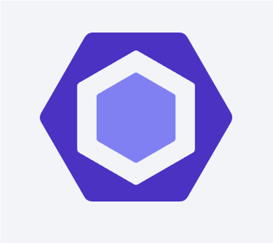<span class="small">ESLint</span><br>
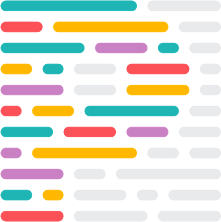<span class="small">Prettier</span>

- コードを自動でチェック・フォーマット
  - インデントや括弧、命名などを指摘・修正してくれる
- 設定ファイルでルールを変更・共有できます
  - チーム・プロジェクト内で管理して統一されたフォーマットになるようにしよう

</div>

---

# その2: コードレビューをしよう

<!--TODO: 図の挿入-->

- チームメイトがプルリクエストを確認する作業
  - 「これだとバグが出るからこう？」
  - 「この部分はこう書いたほうが分かりやすいかも」
- 実装をどうすべきかといった相談が行われることもある
- リポジトリの実例を見てみよう

---

# その3: ペアプロ・モブプロをしよう

<div class="columns">

- 一つのコードを複数人で見ながらコーディングすること
- リアルタイムコードレビューみたいな感じ
- スキルや知識の共有、集中力の向上などの利点がある
- **QSoC に参加しよう！ (講師もTAも)**


</div>

---

<!--
_class: section-head
-->

# ちょっと休憩

---

# 目次

- 座学
  - きれいなコードを書こう
  - きれいなコードを保つために
  - **JavaScriptの歴史 ⬅️**
  - フロントエンド開発
- 実習
  - Chrome Devtools 入門
  - Vue入門

---

<!--
_class: section-head
-->

# JavaScriptの歴史

---

# JavaScriptの歴史

- ブラウザ黎明期、沢山の人が思い思いに、より良いWeb体験を実現しようと努力していた
  - 今もそうだけど
- Webページに動きをもたせるいくつかの技術が開発された
  - Java Applet / Flash / JavaScript / Sliverlight ...

---

# Java Applet

<div class="columns">

- 1996年発表
- ブラウザでJavaが動く
- 遅かった（数十秒から数分）ため、大手のブラウザに採用されなくなった
- Java11〜 セキュリティ上の理由で廃止

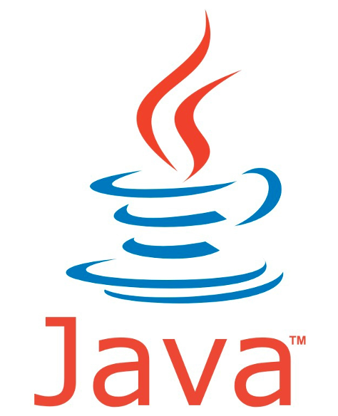

</div>

---

# Flash

<div class="columns">

- Flashゲームのフラッシュ
- YouTubeやニコニコでも使われていた
- 2020年末に配布・ブラウザのサポートが終了
  - セキュリティ上の理由
  - [Ruffle](https://ruffle.rs/)というエミュレータが有志でつくられている
  - https://trap.jp/post/1124/

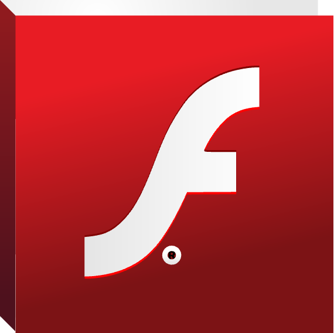

</div>

---

# JavaScript

<div class="columns">

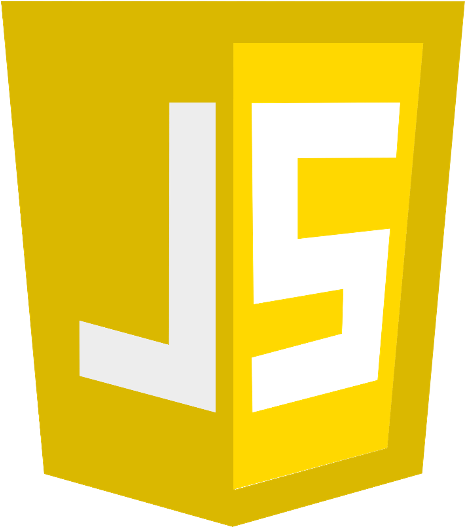

- 1995年登場
- Web関係ならどこにでもいる（クライアント ＆ サーバー）
- Webに無関係なアプリの開発にも使われる大人気言語
- Ajax (非同期通信)の登場とともに広がりを見せる

</div>

---

# JavaScript

- Ecma Internationalという機関によって仕様が策定される
  - 実装は各ブラウザベンダーによって独自に行われる
- 2008年 GoogleがChromeを発表：V8エンジン搭載
  - それ以前のJavaScriptはFlashよりも遅かった
  - JITコンパイルという技術がJavaScriptを爆速に

---

# 目次

- 座学
  - きれいなコードを書こう
  - きれいなコードを保つために
  - JavaScriptの歴史
  - **フロントエンド開発 ⬅️**
- 実習
  - Chrome Devtools 入門
  - Vue入門

---

<!--
_class: section-head
-->

# フロントエンド開発

---

# 現代のWebフロントエンド
- 様々な要素技術がひしめき合っている
- いろんなカオスをどうにかしようと日々新たなカオスが生み出されてる
- 流行の流れが早い
  - 数年前まで主流だったものが今では見ないこともザラ
- ここでは必要かつ現在主流のものに絞って話す

---

# Webフロント開発

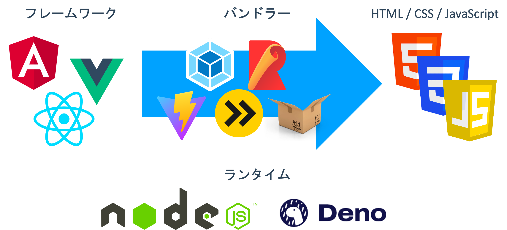

---

# フレームワーク

<div class="columns">

<span>　</span>


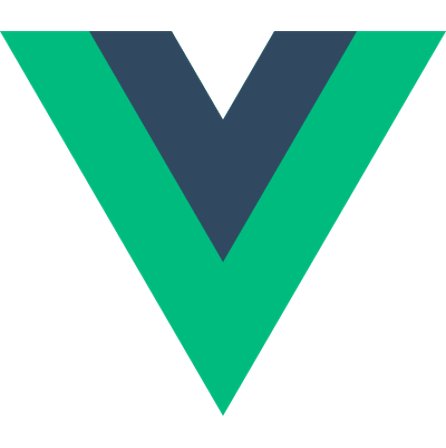

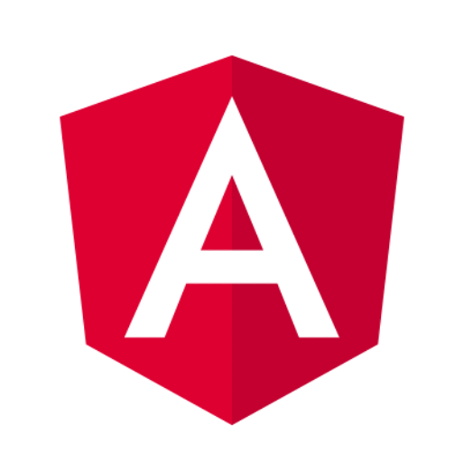


</div>

- Webサイトを開発する方法を提供してくれるもの
  - フレームワークごとに実装の方法が異なる
- 複雑な処理を簡潔に書ける
- コンポーネントという単位でコードを再利用できる
- 状態管理や描画の最適化を担うこともある

---

# モジュールバンドラー

<div class="columns">


</div>

- Webサイトは HTML + CSS + JavaScript で出来ている
  - しかし、フレームワークを活用して書くソースコードはその組み合わせではない
- 最後に HTML + CSS + JavaScript に変換するシステム\
  ＝ **モジュールバンドラー**

---

# ランタイム

<div class="columns">

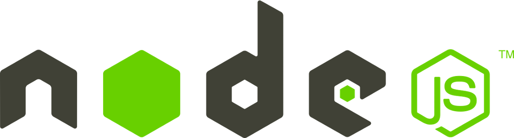


</div>

- JavaScriptの実行環境 = JavaScriptを解釈して実行する
- もちろんブラウザもランタイム
  > 2008年 GoogleがChromeを発表：V8エンジン搭載
- Node.jsやDenoにもV8エンジンは採用されている
- V8以外で動くランタイムもある (JavaScriptCore, SpiderMonkey, etc.)

---

# Webフロント開発雑多

- フレームワークもバンドラーもたくさんある
- 作るものの規模や特徴に合ったツールを選ぶことが大事
  - 大は小を兼ねない
  - traPの中でまず触ってみるなら Vue.js + Vite？
- それぞれに「設計思想」がある
- パラダイムの移り変わりも速い
- セキュリティにも意識を向ける必要がある

---

<!--
_class: section-head
-->

# Alt(ernative) 〇〇

---

# Alt 〇〇

- フレームワークを使ってちょっとは良くなったとしても素のHTML / CSS / JavaScriptを書くのは嫌だ！
- もっと簡潔な・もっと楽な・もっと開発体験の良い言語で書きたい
  - 型のついた
  - 関数型の
  - 自分が慣れた

---

# Alt HTML

- Markdown, Haml, Slim, Pug, EJS など
  - Markdownの内部にHTMLを書くと動く（こともある）
  - ↑HackMDとかで試せる
- HTMLテンプレートエンジンとも
- ループや条件なども記述できる（ものもある）

---

# Alt CSS

- Sass, Less, Stylus など
- 変数が使えたり、ネストができたり、コメントが楽だったり、条件式が使えたりする
- 今はCSSで変数もネストも条件式もサポートされている
  - <span class="gray">ただし色々と制約はある</span>

---

# Alt JS

- めっちゃ多い
- みんなそれぞれ自分の好きな言語っぽく書きたい
- TypeScript, PureScript, CoffeeScript ...
- 今はTypeScriptが一番人気
  - 静的な型がついている
  - JavaScriptのスーパーセットとして開発された

---

# Alt 〇〇

- どれもそのままではブラウザ上で動かない
- 処理自体に呼び方は色々あるが、どれも素のHTML / CSS / JSに変換しなければならない
- バンドラーがいい感じにしてくれる

---

<!--
_class: section-head
-->

# まとめ

---

# きれいなコードを書くために

1. インデントを使おう
2. コーディング規約を守ろう
3. 適切に分割しよう

---

# きれいなコードに保つために

1. Linter / Formatter を使おう
2. コードレビューをしよう
3. ペアプロ・モブプロをしよう

自分一人で維持するのは難しい
どんどん道具や人の力を借りていこう

---

# JavaScriptの歴史

- ブラウザ黎明期、沢山の人が思い思いに、より良いWeb体験を実現しようと努力していた
  - 今もそうだけど
- Webページに動きをもたせるいくつかの技術が開発された
  - Java Applet / Flash / JavaScript / Sliverlight ...

---

# 現代のWebフロントエンド
- 様々な要素技術がひしめき合っている
- いろんなカオスをどうにかしようと日々新たなカオスが生み出されてる
- 流行の流れが早い
  - 数年前まで主流だったものが今では見ないこともザラ

---

# Alt 〇〇

- フレームワークを使ってちょっとは良くなったとしても素のHTML / CSS / JavaScriptを書くのは嫌だ！
- もっと簡潔な・もっと楽な・もっと開発体験の良い言語で書きたい
  - 型のついた
  - 関数型の
  - 自分が慣れた

---

# 目次

- 座学
  - きれいなコードを書こう
  - きれいなコードを保つために
  - JavaScriptの歴史
  - フロントエンド開発
- **実習 ⬅️**
  - Chrome Devtools 入門
  - Vue入門
