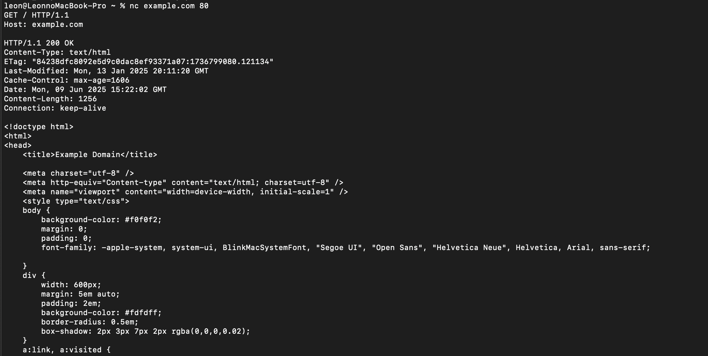
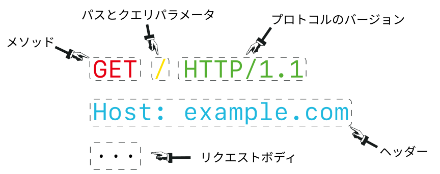
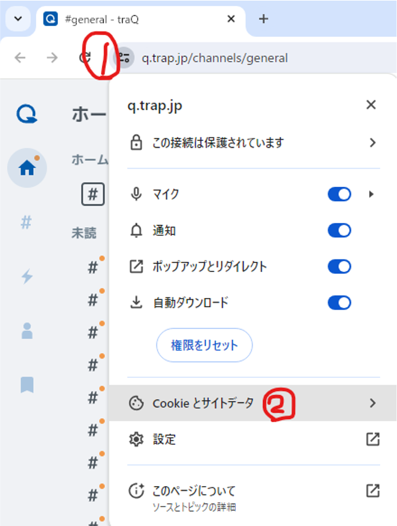
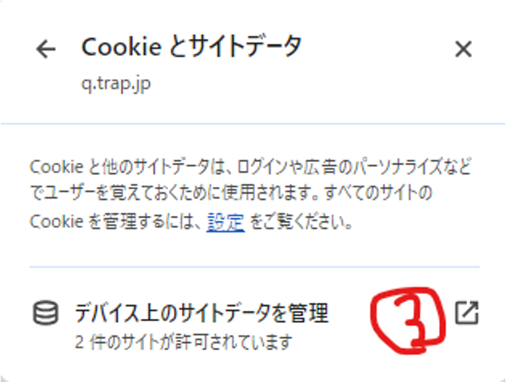
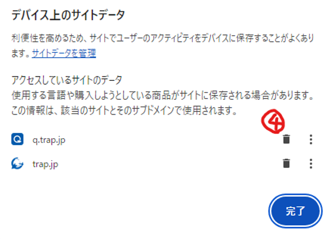

<style>
img:not(.emoji) {
  display: block;
  margin: 0 auto;
}

.http-message {
  font-family: 'Noto Sans Mono', 'Noto Sans JP', monospace;
  background: #ffffff;
  border: 2px solid #d6e7e6;
  border-radius: 16px;
  padding: 24px;
  line-height: 1.5;
}

.tag {
  display: inline-block;
  background: rgba(20, 163, 158, 0.12);
  border: 2px solid var(--primary);
  border-radius: 999px;
  padding: 4px 16px;
  font-weight: 800;
  color: var(--primary);
}
</style>

<!--
_class: title
-->

# HTTP 基礎 &<br>フロントエンド実習

Webエンジニアになろう講習会 第3回

---

# 本日のゴール

- Web ブラウザとサーバーが **HTTP** でやり取りしていることを理解する
- **URL / URI / パス** が何を表しているか説明できる
- **リクエスト・レスポンス・ステータスコード** を読めるようになる
- **Cookie** が「ログイン状態」などに使われることを知る
- 前回のフロントエンドを、複数ページっぽい構成と CSS で広げる

---

# 目次

- 座学
  - HTTP とは
  - URL / URI / パス
  - リクエストとレスポンス
  - ステータスコード
  - Cookie
- 実習
  - ページ分けをしてみる
  - CSS で軽く整える
  - Cookie を少し触ってみる

---

<!--
_class: section-head
-->

# 前回のおさらい

---

# Webサービスの主な登場人物


---

# 今日見るところ

## <span class="underlined">フロントエンドとサーバーの間の通信</span>

- ブラウザでページを開く
- ボタンを押して投稿する
- ログイン状態を保ったまま画面を移動する

これらの裏側では、フロントエンドとサーバーが何度も通信しています。

---

<!--
_class: section-head
-->

# HTTP とは

---

# HTTP とは

## <span class="underlined">Webで使われる通信の約束事</span>

- **H**yper**t**ext **T**ransfer **P**rotocol の略
- ブラウザとサーバーが、決まった形式でデータをやり取りするためのルール
- 基本は <span class="underlined">お願い（リクエスト）</span> と <span class="underlined">返事（レスポンス）</span>

---

# HTTP のイメージ

<div class="columns align-center">
<div>

## ブラウザ

「このページをください」<br>
「この投稿を保存してください」

</div>
<div>

## サーバー

「はい、この HTML です」<br>
「保存できました」<br>
「見つかりませんでした」

</div>
</div>

---

# 例: ページを開くとき

1. ブラウザがサーバーにリクエストを送る
   - 「`/` のページがほしいです」
2. サーバーがレスポンスを返す
   - 「成功しました。中身はこの HTML です」
3. ブラウザが HTML を解釈して画面に表示する

---

# 実際に見てみよう

ブラウザを使わずに、ターミナルから HTTP リクエストを送ってみます。

```sh
nc example.com 80
```

入力できる状態になったら、次の 3 行を入力して Enter を 2 回押します。

```http
GET / HTTP/1.1
Host: example.com

```

---

# 実際のリクエスト

<div class="http-message">
GET / HTTP/1.1<br>
Host: example.com<br>
<br>
</div>

- `GET / HTTP/1.1` は「`/` のデータをください」という意味
- `Host: example.com` は「`example.com` 宛てです」という追加情報
- 空行でリクエストの終わりを表す

---

# 返ってくるもの



---

# 今日の目標

## <span class="underlined">さっきのやり取りの中身を読む</span>

- どこにアクセスしている？
- 何をお願いしている？
- 結果は成功？　失敗？
- なぜログイン状態を覚えていられる？

---

<!--
_class: section-head
-->

# URL / URI / パス

---

# URL とは

## <span class="underlined">インターネット上の場所を表す文字列</span>

例です。

```text
https://q.trap.jp/channels/1f35cbd2-7f1d-4e5a-9c45-000000000000
```

- どの仕組みで通信する？
- どのサーバーに行く？
- そのサーバーの中のどこを見る？

などを表します。

---

# URL の構造

```text
https://example.com:443/path/to/page?keyword=traP#heading
```

<div class="columns">
<div>

- `https://`
  - スキーム
- `example.com`
  - ホスト名 / ドメイン名
- `:443`
  - ポート番号

</div>
<div>

- `/path/to/page`
  - パス
- `?keyword=traP`
  - クエリ
- `#heading`
  - フラグメント

</div>
</div>

---

# URI と URL

- **URI**: リソースを識別するための書き方全体
- **URL**: 場所を使ってリソースを示す URI

<div class="center">

<span class="tag">最初は「URL は URI の一種」くらいで OK</span>

</div>

細かい分類よりも、URL を見て「どのサーバーの何を指しているか」を読めることが大事です。

---

# パス

```text
https://example.com/users/123/profile
                   └────────────┘
                         パス
```

- サーバーの中の「どのリソースか」を表す
- フロントエンドでは、ページの切り替えにも使われる
- バックエンドでは、処理を分ける目印にもなる

---

# パスの例

```text
/
/login
/users
/users/123
/users/123/profile
/channels/1f35cbd2/messages
```

- どれも「サーバー内のどこを見たいか」を表している
- 人間にも読みやすい名前にしておくと、開発しやすい

---

# クエリとフラグメント

```text
https://example.com/search?q=traP&page=2#result
```

- `?q=traP&page=2`
  - サーバーへ渡す追加条件
  - 検索キーワード、ページ番号、絞り込み条件など
- `#result`
  - ブラウザ内で使われる目印
  - サーバーへのリクエストには基本的に含まれない

---

# 今日はここまで

URL のうち、今日は特に <span class="underlined">パス</span> を意識します。

- 実習でページを分けるときに使う
- リクエストの最初の行にも出てくる

クエリ・ホスト名・ドメイン名・HTTP メソッドの細かい話は次回以降で深掘りします。

---

<!--
_class: section-head
-->

# リクエストとレスポンス

---

# リクエスト

## <span class="underlined">ブラウザからサーバーへのお願い</span>

例です。

- 「トップページをください」
- 「このチャンネルのメッセージ一覧をください」
- 「この内容で新しい投稿を作ってください」

---

# リクエストの構造



---

# リクエストライン

```http
GET /search?q=traP HTTP/1.1
```

<div class="columns">
<div>

## `GET`

何をしたいかを表します。

</div>
<div>

## `/search?q=traP`

どのリソースかを表します。

</div>
</div>

`HTTP/1.1` は HTTP のバージョンです。

---

# まず覚えるメソッド: GET

## <span class="underlined">GET = データを取得する</span>

- ページを開く
- 画像を読み込む
- 一覧を取得する

など、「何かをください」というリクエストで使われます。

---

# ヘッダーとボディ

<div class="columns">
<div>

## ヘッダー

```http
Host: example.com
Cookie: session=...
```

リクエストに付ける追加情報です。

</div>
<div>

## ボディ

```json
{"message":"hello"}
```

送信するデータ本体です。

</div>
</div>

詳しい話は次回扱います。

---

# レスポンス

## <span class="underlined">サーバーからブラウザへの返事</span>

例です。

- 「成功しました。HTML はこれです」
- 「ログインが必要です」
- 「そのページは見つかりません」
- 「サーバー側でエラーが起きました」

---

# レスポンスの構造


---

<!--
_class: section-head
-->

# ステータスコード

---

# ステータスコード

## <span class="underlined">リクエストの結果を3桁の数字で表す</span>

```http
HTTP/1.1 200 OK
```

- ブラウザや開発者は、この数字を見て結果を判断する
- DevTools の Network タブでもよく見る

---

# よく見るステータスコード

<div class="columns">
<div>

## 2xx: 成功

- `200 OK`
  - 成功
- `204 No Content`
  - 成功、返す中身なし

</div>
<div>

## 3xx: 移動

- `301 Moved Permanently`
  - 恒久的に移動
- `302 Found`
  - 一時的に移動

</div>
</div>

---

# よく見るステータスコード

<div class="columns">
<div>

## 4xx: クライアント側の問題

- `400 Bad Request`
  - リクエストが変
- `401 Unauthorized`
  - 認証が必要
- `403 Forbidden`
  - 権限がない
- `404 Not Found`
  - 見つからない

</div>
<div>

## 5xx: サーバー側の問題

- `500 Internal Server Error`
  - サーバーでエラー
- `503 Service Unavailable`
  - 一時的に利用できない

</div>
</div>

---

# ステータスコードはデバッグの入口

- 画面が真っ白になった
- データが表示されない
- ボタンを押しても保存されない

そんなときは、まず DevTools の Network タブで確認します。

<div class="center">

<span class="tag">どのリクエストが、何番で返っているか？</span>

</div>

---

# ミニ演習

存在しない URL をブラウザで開いてみよう。

```text
https://example.com/not-found-page
```

- 画面には何が出る？
- DevTools の Network タブでは何番が見える？

---

<!--
_class: section-head
-->

# Cookie

---

# 疑問

## なぜログイン状態を覚えていられる？

HTTP は基本的に、リクエストとレスポンスが 1 往復したら終わりです。

では、サーバーはどうやって「さっきログインした人だ」と判断しているのでしょうか？

---

# Cookie

## <span class="underlined">ブラウザに保存される小さな情報</span>

- サーバーが「これを次回から持ってきてね」とブラウザに渡す
- ブラウザは同じサイトへのリクエストに Cookie を付けて送る
- ログイン状態、表示設定、トラッキングなどに使われる

---

# Cookie のイメージ

1. ログインする
2. サーバーが「会員証」をブラウザに渡す
3. ブラウザは次回以降のリクエストで会員証を見せる
4. サーバーは会員証を見て「ログイン済み」と判断する

<div class="center">

<span class="tag">Cookie はブラウザ側にある「会員証」っぽいもの</span>

</div>

---

# Cookie を消すと？

- ブラウザが会員証を失う
- 次のリクエストでログイン済みだと示せない
- その結果、ログアウトしたように見えることがある

※ 実際のサービスでは、Cookie の中身そのものがユーザー情報とは限りません。

---

# やってみよう: Cookie を確認する

1. traQ などログイン済みのサービスを開く
2. DevTools を開く
3. Application タブを開く
4. Cookies からサイトを選ぶ
5. どんな名前の Cookie があるか眺める

<span class="red">値を人に見せたり、共有したりしないこと！</span>

---

# やってみよう: Cookie を削除する

ブラウザの設定で `q.trap.jp` 以下の Cookie を削除してみよう。

<div class="columns-3">
  
  
  
</div>

---

# Cookie の注意

- Cookie はリクエストに自動で付く
- 盗まれると、ログイン状態を悪用されることがある
- そのため、Cookie やトークンは <span class="underlined">秘密情報</span> として扱う

セキュリティの詳しい話は第二部で扱います。

---

<!--
_class: section-head
-->

# ちょっと休憩

---

<!--
_class: section-head
-->

# 実習

---

# 今日の実習

前回作ったフロントエンドを広げます。

- ページを分ける
- CSS で軽く見た目を整える
- Cookie を使って、ブラウザに小さな状態を保存する

<span class="gray">※ 実際の演習リポジトリの構成に合わせて、コード例や手順は調整してください</span>

---

# 実習1: ページ分け

## 目標

- `/` と `/about` のように、URL のパスで表示を変える
- 「パスが変わると表示するものが変わる」感覚をつかむ

## 例

- `/` → トップページ
- `/profile` → 自己紹介ページ
- `/settings` → 設定ページ

---

# 実習1: Vue でページを分ける案

```ts
const path = window.location.pathname

const page = computed(() => {
  if (path === '/profile') return 'profile'
  if (path === '/settings') return 'settings'
  return 'home'
})
```

最初はルーターライブラリを使わず、パスと表示の対応を手で書いても OK です。

---

# 実習2: CSS で整える

## 目標

- 余白を付ける
- 色を付ける
- 横並びにする
- ボタンやカードっぽい見た目にする

「動くけど見づらい」から「使えそう」に近づけます。

---

# 実習2: CSS の例

```css
.card {
  padding: 16px;
  border: 1px solid #ddd;
  border-radius: 12px;
  background: white;
}

.nav {
  display: flex;
  gap: 12px;
}
```

CSS は一気に完璧を目指さず、少しずつ足して確認します。

---

# 実習3: Cookie を使ってみる

## 目標

ブラウザに小さな状態を保存して、リロード後も値が残ることを確認します。

例です。

- 表示名
- テーマカラー
- 説明を閉じた状態

---

# 実習3: Cookie の読み書き

```ts
document.cookie = 'displayName=trap; path=/; max-age=3600'

const cookies = document.cookie
console.log(cookies)
```

まずは DevTools の Console で試してみましょう。

余裕があれば、Cookie に保存した表示名を画面に出してみます。

---

# Cookie 実習の注意

- Cookie にパスワードを書かない
- Cookie の値を人に見せない
- 本格的なログイン処理は、今日は作らない

今日は「ブラウザが値を保存して、次回以降のリクエストに使える」という雰囲気をつかむのが目的です。

---

<!--
_class: section-head
-->

# まとめ

---

# 今日のまとめ

- HTTP は、ブラウザとサーバーがやり取りするための約束事
- URL は、どこにある何へアクセスするかを表す
- パスは、サーバー内のリソースやフロントエンドの画面を表す目印になる
- レスポンスのステータスコードを見ると、成功・失敗の種類がわかる
- Cookie は、ブラウザに保存される小さな情報で、ログイン状態などに使われる

---

# 次回予告

次回は HTTP をもう少し深掘りします。

- ヘッダー
- JSON
- クエリ
- IP とドメイン
- GET 以外のメソッド
- バックエンドのデバッグ

---

<!--
_class: end
-->

# おわり
