<!--
_class: title
-->

# インターネット概論<br>&サーバー入門

Webエンジニアになろう講習会 第3回

---
# 自己紹介

<div class="columns"> 
    <div>
        
    </div>
    <div>
    <h2>matsun</h2>
    数理計算科学系に所属しているB2です．Rustにハマってます🦀 
    </div>
</div>


---
<!--
_class: section-head
-->
# 前回のおさらい

---

# きれいなコードを書くために

- インデントを適切に使おう
- 命名規則を守ろう
- コードを適切に分割しよう

---

# きれいなコードを保つために

- Linter/Formatterを使おう
- コードレビューをしよう
- ペアプロ・モブプロをしよう

> 自分一人で維持するのは難しい．<br>どんどん他人や道具の力を使っていこう！

---

# JavaScriptの歴史

- ブラウザ黎明期から現在にかけて、沢山の人が思い思いに、より良いWeb体験を実現しようと努力していた
- その中でwebページに動きを持たせる技術がいくつか開発されてきた
    - Java Applet
    - Flash
    - JavaScript
    - Silverlight

---

# 現在のwebフロントエンド

- 皆が思い思いにより良いWeb体験・開発体験を探求している
- 流行の流れが早い
- **フレームワーク** - コンポーネントや状態管理などの概念の導入や，描画の最適化などを通じて開発者を助けるツール
- **モジュールバンドラー** - バラバラのコードを一つにまとめたり，サイズを小さくしたりするツール

---

# Alt ○○
- 素のHTML, CSS, JavaScriptを書くのは嫌！
- もっと良い言語を作りたい
    - 静的型付け
    - 関数型
    - etc...

👉ならば改善しよう

---

# 目次 - 座学
- HTTP
    - HTTPとは
    - リクエストの構造
    - レスポンスの構造
- データ伝送の仕組み
    - TCP
    - IP

---
# 目次 - 実習
- Golang/Echoでサーバーを立てよう！
- エンドポイントを生やそう！

---

<!--
_class: section-head
-->
# HTTPとは

---

# HTTPって何だったっけ
（Web基礎講習会の復習）
- 「お願い（リクエスト）」と「お返事（レスポンス）」でやりとりをする仕組み
- リソースを取得・編集・削除するやりとりができる
    - 「この動画投稿したいです」「200（投稿しました）」
    - 「このページのデータをください」「404（そんな人はいません）」

---
# 早速やってみよう！！
Webブラウザを使わずに http://example.com にリクエストを投げてみよう


---
# 早速やってみよう！！

- `nc example.com 80`をシェルで実行し、次のように入力してみよう

    ```
    GET / HTTP/1.1
    Host: example.com
    

    ```
- HTTPのリクエストは改行2つで終わります
- めっちゃ長い文字列がずらずらと出てきたら成功
- 成功したらCtrl+Cを押してコマンドを中断しよう

---
# やってみた
サーバーからレスポンス(返事)が帰ってくる

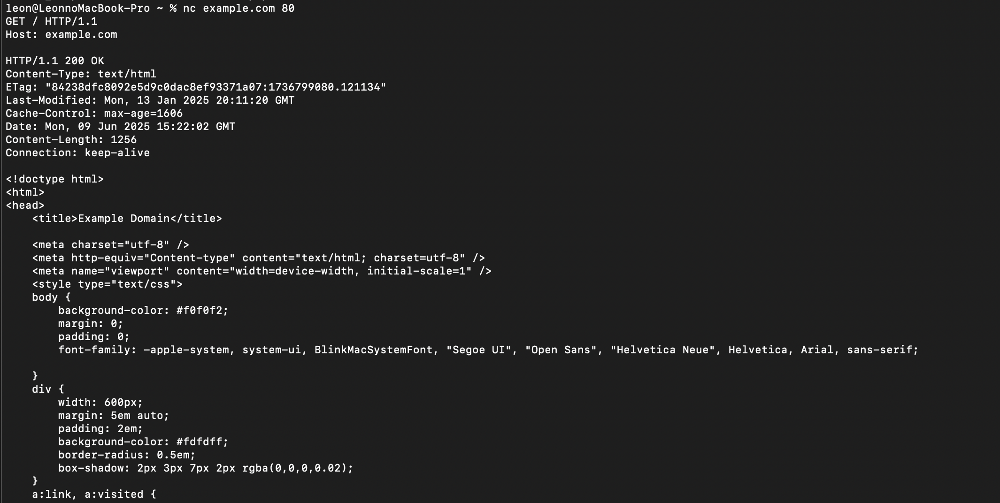

---
# HTTPによる通信
- 今日のブラウザによる通信も、基本的には全部さっきのような「これをください」「あげます」のやりとり
    - ページ本体以外にも画像とかを取得するので、何往復も通信するかもしれない
    - データが圧縮されていたり、暗号化されていたりするかもしれない
    - でも基本的には全部一緒

**今日の目標: さっきの一連のやりとりの中身を理解すること**

---
<!--
_class: section-head
-->
# リクエスト
これください！

---
# リクエストの構造
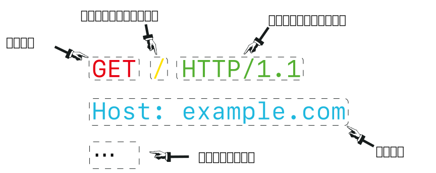

---
# メソッド
「どういう種類のリクエストか？」を明示する
- `GET` - このデータください
    - 例 - `https://google.com`のhtmlをください
    - 例 - オンラインゲームで、自分が持っているアイテムの一覧を取得したい
- `POST` - 新たにデータを作ってください
    - 例 - SNSで新規投稿をする
    - 例 - アンケートの回答内容を送信する

---
# メソッド
- `PUT` - ここにデータを作ってください/ここのデータを上書きしてください
    - 例 - traQで，チャンネルトピックを書き換える
- `PATCH` - このデータのこの場所だけ書き換えてください
    - 例 - traQで、あるチャンネルの特定ユーザーだけの通知状態を書き換える
- `DELETE` - このデータを消してください
    - 例 - 昨日投稿したXのポストを見たら恥ずかしくなったため，削除

---
# メソッド
- 他にも色々あります
- https://developer.mozilla.org/ja/docs/Web/HTTP/Reference/Methods で色々なメソッドの説明が見れます！

---
# パスとクエリパラメータ
- 読み書きしたいデータの所在地を表す
- https://google.com/search?q=traP のパスとクエリパラメータはどれか？

---
# URLの構造
https://example.com:8080/path/to/dir?q=somequery#hoge
- `https://` - プロトコル<cite>※1</cite>
- `example.com` - ドメイン名
    - アクセスするサーバーを表す
- `:8080` - ポート番号
    - あとでやります．

<div class="cite">
※1 HTTPを暗号化したプロトコルであるHTTPSを利用していることを示します．暗号化せずにサイトにアクセスする場合はURLは`http://`から始まります．
</div>

---
# URLの構造
https://example.com:8080/path/to/dir?q=somequery#hoge

- `/path/to/dir` - パス　
    - サーバー内のリソースの位置を指し示します．
- `?q=somequery` - クエリパラメータ
    - `?`で始まる
    - `key=value`の形式でパラメータを指定できる
    - `&`を使い複数のパラメータを指定できる
        - 例 - `?min=0&max=100`

---
# URLの構造
https://example.com:8080/path/to/dir?q=somequery#hoge
- `#hoge` - フラグメント部
    - ブラウザが処理するデータ
    - (主に)文書のどの部分を指しているかを示す
    - リクエストには含まれない

---
# プロトコルのバージョン
- HTTPにはいくつかのバージョンがある
    - 例 - `HTTP/0.9`<cite>※1</cite>, `HTTP/1.0`, `HTTP/1.1`, `HTTP/2`, `HTTP/3`
- バージョンが違うとプロトコル(通信形式)が変わるため，バージョンを区別する必要がある

<div class="cite">
※1 HTTP/0.9の時代はバージョンを区別する必要が無かったので、空欄だった
</div>

---
# ヘッダー
通信につけることのできる追加情報
- `ヘッダー名: 値`の形で構成される
- 様々な種類のヘッダーがある<cite>※1</cite>
    - `Host`
    - `Cookie`
    - `Content-Type`
    - etc...


<div class="cite">
※1 <a href="https://www.iana.org/assignments/http-fields/http-fields.xhtml">https://www.iana.org/assignments/http-fields/http-fields.xhtml</a> にヘッダーの種類が収録されています．独自のヘッダーを利用することも可能です．
</div>

--- 
# ヘッダー：Host
サーバーのホスト名を明示する．
- これにより同じサーバーでも異なるホスト名のサーバーを運用することができる．

---
# ヘッダー：Cookie
- HTTPはステートレス．<cite>※</cite>
    - サーバーは前のリクエストの内容を覚えていない
- ブラウザに状態を記録し，リクエスト毎に送ることによって他のリクエストと関連付けることができる
    1. 「あなたのユーザーIDは○○なので、これを覚えておいてくださいね」と伝えておく
    2. 次回以降のリクエストで、ブラウザに毎回ユーザーIDを名乗ってもらう

<div class="cite">
※ 例：麺屋こころにポイントカード忘れていったら特典受けられないよね
</div>

---
# やってみよう：Cookieを削除してみよう
ブラウザの設定でq.trap.jp以下のCookieを全部消してみよう
<div class="columns-3">
    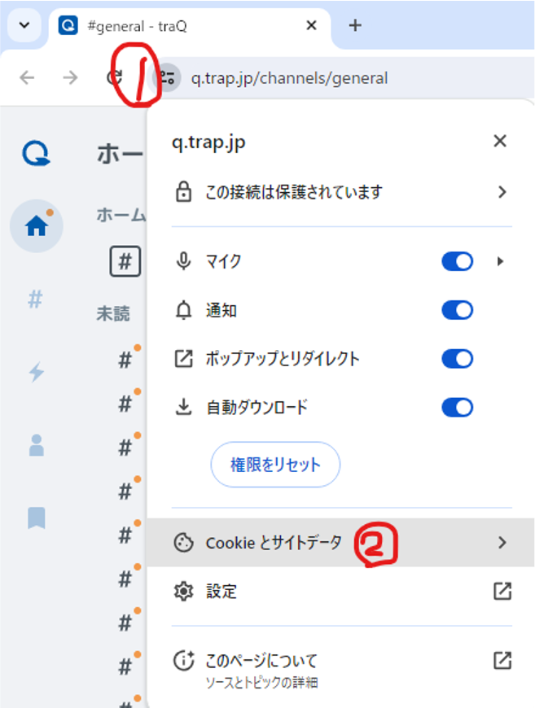
    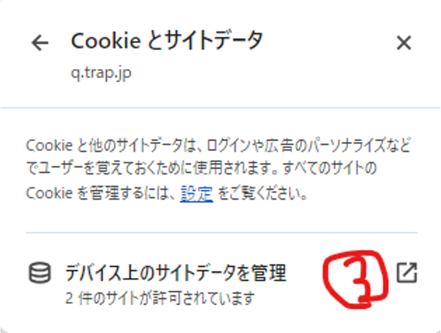
    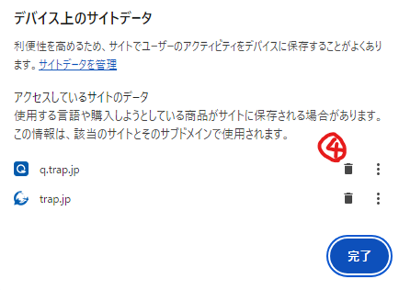
</div>

---
# リクエストボディ
送信するデータの本体
- `POST`, `PUT`, `PATCH`などのメソッドを使用する場合，リクエストにデータの本体を含めることができる．
- リクエストヘッダーの直後に入れることができる．

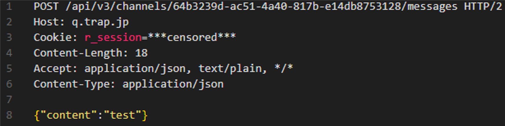

---
<!--
_class: section-head
-->
# レスポンス
リクエストに対する返事

---
# レスポンスの構造
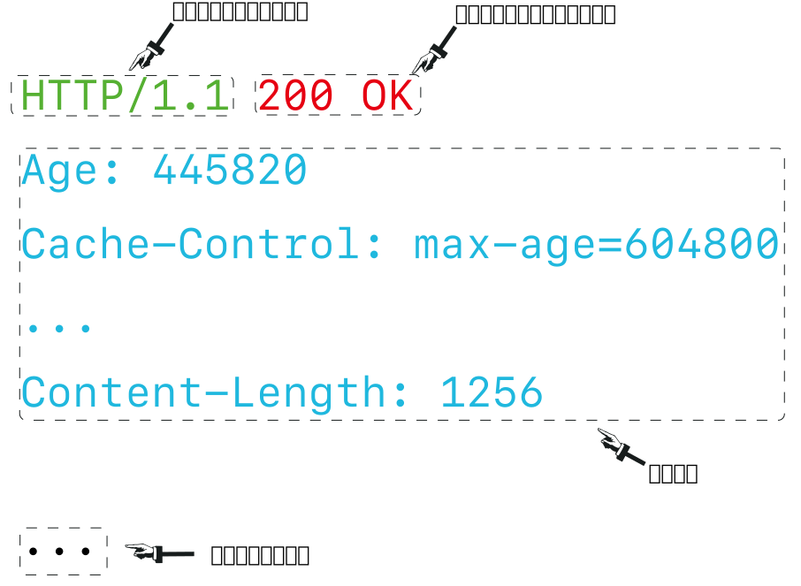

---
# レスポンスステータスコード
リクエストが正常に完了したかどうかを返す
- 200番台は成功を表す
    - `200 OK` - リクエストが成功したことを示す．
    - `204 No Content` - リクエストが成功したが，返すべきものがないことを示す．
    - etc...

---
# レスポンスステータスコード
- 300番台はリダイレクトを表す
    - `302 Found` - 一時的な移動
    - `308 Permanent Redirect` - 永久的な移動

---
# レスポンスステータスコード
- 400番台はリクエストに不備があることを表す
    - `403 Forbidden` - 権限がない
    - `404 Not Found` - リソースを発見できない
    - `429 Too Many Requests` - リクエストが多すぎる

---
# レスポンスステータスコード
- 500番台はサーバー側で不具合が生じたことを表す
    - `500 Internal Server Error` - サーバー側でエラーが生じた
    - `503 Service Unavailable` - サーバーがリクエストを処理する準備ができていない

--- 
<!--
_class: section-head
-->
# データの伝送
HTTPが依存するプロトコル

---
# TCP
HTTPが依存する通信プロトコル．
- 通信が確実に/正しい順序で届くことを保証する．
- あらゆるデジタルなデータの伝送をすることができる．
    - HTTPのリクエストやメールの送信，コンピュータの遠隔操作(ssh)まで
- 通信をパケット(小包)に分けて送信する

👉TCPの重要な機能について紹介します

---
# TCP: パケットの構造
- パケットは，ヘッダとデータ部分から構成される
- TCPヘッダの構造
    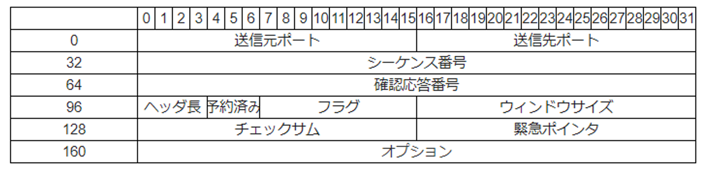

---
# TCP: アプリケーション間通信
アプリケーションごとにポート番号を振ることによりアプリケーション間の通信を実現する．コンピューター内アドレス．
- `0`-`1023`はWell Known Portsと呼ばれ，基本的なシステムサービスなどに利用される
- ポート番号の例
    - `53` - DNS
    - `80` - HTTP
    - `443` - HTTPS

---
# TCP: 順序制御
- IP(TCPより下位のプロトコル)の制限を超えたサイズの巨大なデータを複数パケットに分割して送信することができる．
- 「シーケンス番号」を振ることによってデータの順番が混ざらないようにしている．

---
# TCP: 到達保証
TCPには、パケットが確実に届くことを保証する仕組みがある
- 受信側がパケットを受け取ったら「受け取りましたよ」という返事(ACKパケット)を返す
- 返事が届かなかったらパケットを送り返す

---
# TCPが向かない用途
- データが届いた場合にいちいち返事を送る必要がある．
    - 常に必要なわけではない
        - 例 - 音声通話で，音声が届かない場合送り直してもしょうがない
- そのため、TCPはリアルタイム性が求められる用途には向かない
- そのような用途ではUDPなどの別のプロトコルを使う
    - UDPはTCPのような到達保証や順序制御がない
    - その代わり、パケットの送信が速い

---
# IPv4
インターネットの基礎となるプロトコル(Internet Protocol)．改良版のIPv6がある．
- 様々な機械を経由して別のコンピューターにデータを届ける仕組み
- ネットワークに接続されているコンピューターは、IPアドレスと呼ばれる番号を持つ(インターネット上の住所のようなもの)
    - 例 - `203.0.113.1`, `198.51.100.1`

---
# IPv4のヘッダー
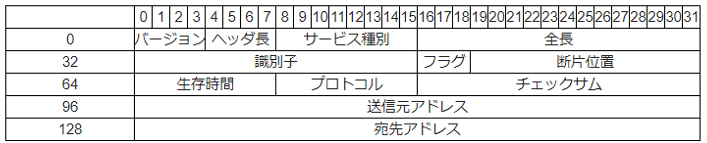

---
# IPの概要
- 世界中に何億台も機械があるが、そのうち届いてほしい機械にデータを届けたい
- 機械に番号を振る
- ものすごく良い感じに機械に番号を振ることで、機械同士が直接つながっていなくてもデータが届くようになっている

---
# IP
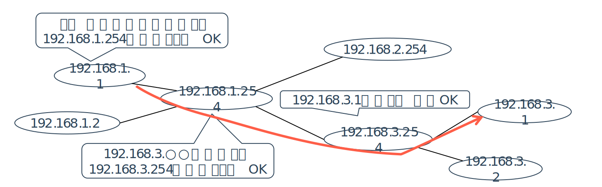

---
# IP
- IPは、物理的に隣接している相手と通信できることを前提にしている
- 通信手段は何でも良い
    - PPPoEかもしれないし、Wi-Fiかもしれない
    - その下のプロトコルがなんでも使える

---
# パケット構造
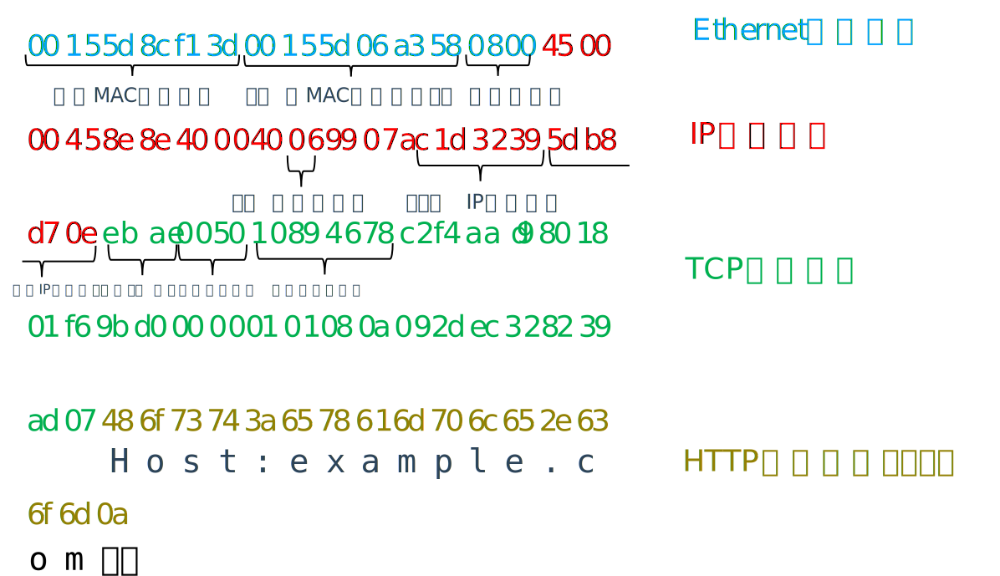

---
# まとめ
- <small>HTTPリクエストは、メソッド、パス、クエリパラメータ、ヘッダー、ボディから構成される</small>
- <small>HTTPレスポンスは、ステータスコード、ヘッダー、ボディから構成される</small>
- <small>HTTPはTCP/IPの上で動作する</small>
- <small>TCPはデータの順序制御と到達保証を提供するプロトコル</small>
- <small>IPアドレスはインターネット上の機械の住所のようなもの</small>


---
# 参考文献
<div class="columns"> 
    
    <div>
    <small>オーム社</small>
    <h2>マスタリングTCP/IP　入門編</h2>
    <p>TCP/IPの基礎を学ぶための入門書です．</p>
    </div>
</div>

---
<!--
_class: section-head
-->
# 演習タイム