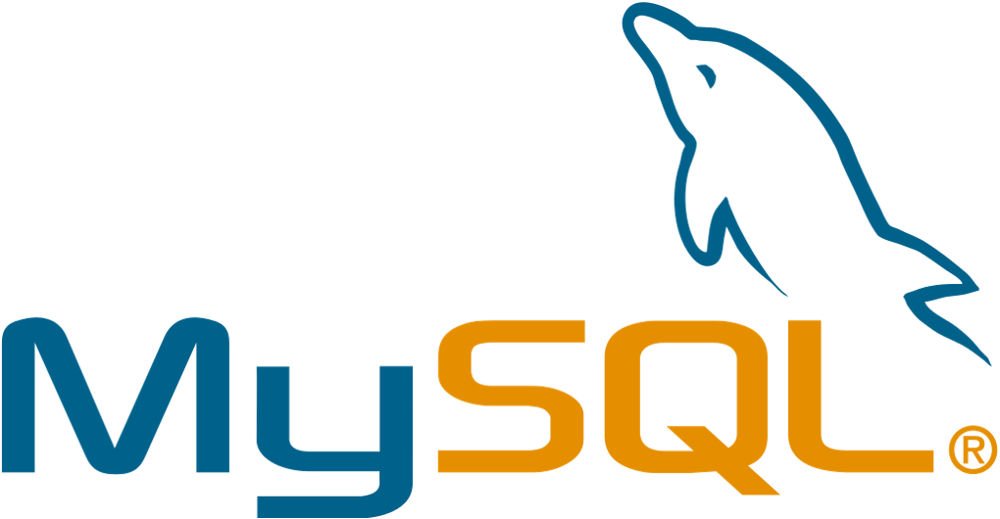
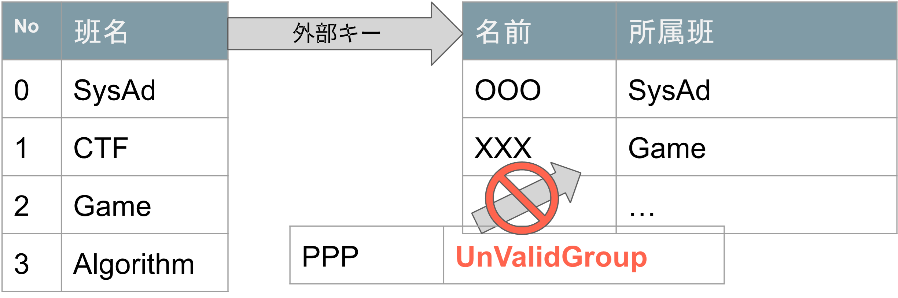
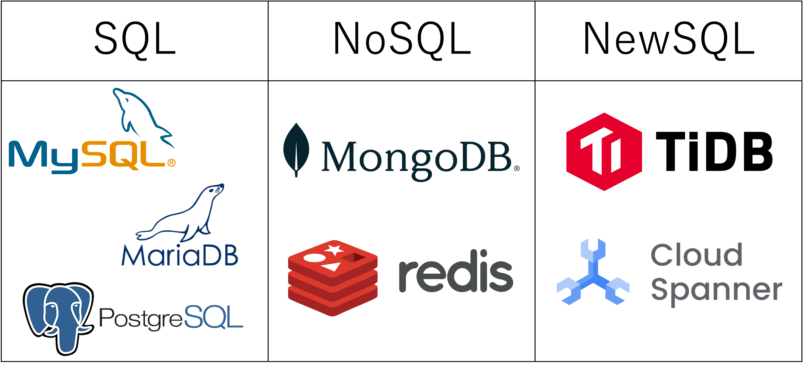
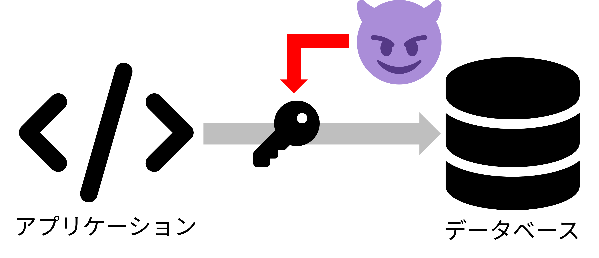

<!--
_class: title
-->

# データベース入門

Webエンジニアになろう講習会 第4回

---

# 自己紹介

<div class="columns"> 
  <div>
    
  </div>
  <div>
    <h2>Kentaro1043</h2>
    <div>数理・計算科学系</div>
    <div>インフラやってます</div>
    <div>Kubernetesが好きです</div>
  </div>
</div>

---

<!--
_class: section-head
-->
# 前回のおさらい

---

# HTTPって何だったっけ？

- <span class="underlined">お願い (リクエスト)</span> と <span class="underlined">お返事 (レスポンス)</span> で<br>やりとりをする仕組み  
- リソースを、読み取る、作る、書き換える、消す、などのやりとりができる  

---

# HTTPのやり取り例

- 「この動画投稿したいです」
  - ➡️ `200 (投稿しました)`  
- 「このユーザーのデータください」
  - ➡️ `404 (そんな人はいません)`  
- 「このメッセージ消したいです」
  - ➡️ `403 (権限がありません)`

---

# リクエスト  

## 「これください」をもっと詳しく

---

# リクエストの構造  

```http
GET / HTTP/1.1
Host: example.com
```

- メソッド  
- パスとクエリパラメータ  
- プロトコルのバージョン  
- ヘッダー

---

# レスポンス  

## 「これあげます」をもっと詳しく

---

# レスポンスの構造  

```http
HTTP/1.1 200 OK
Content-Length: 1256

<!doctype html>
<html>
...
```

- バージョン番号 ステータス
- レスポンスヘッダー
- ボディ

---

# データの伝送  

HTTPが依存するレイヤー

---

# TCP (Transmission Control Protocol)
  
- 伝送 (トランスミッション)をコントロールするプロトコル  
- どんなデータの伝送でも使える  
- メールの伝送や遠隔制御にも利用  
- TCPを扱うプログラムは、送ったデータの扱いを知らない  
- HTTPを扱うプログラムは、データの送られ方を知らない

---

# IP (Internet Protocol)

- TCPはデータが届くことを前提としている  
- 物理的に直接つながっていなくても中継を経由して届ける  
- ほかの機械の80番ポート宛に届かないよう管理  
- リクエストヘッダーに宛先情報を付けて伝送を管理

---

<!--
_class: section-head
-->
# データベース

---

# Webサービス概観


---

# Webサービス概観


---

# DB  (DataBase) とは

- DataBase → データ基地 → データを蓄積し、管理する場所
- 例: Excelファイル
  - 大量のデータをまとめられる
  - 効率よく検索、追加、削除ができる
- <span class="underlined">SQL</span>と呼ばれる言語がよく使われる

---

# SQL

**S**tructured **Q**uery **L**anguage

例: `member` テーブルから `Name`, `Team` の3カラムを選択する

```sql
SELECT Id, Name, Team FROM member;
```

---

# DBMS  (**D**ata**B**ase **M**anagement **S**ystem)

- データベースの情報管理を行うアプリ
- <span class="underlined">データの整合性</span>を保つ役割

<div class="columns-3">
  
  
  
</div>
<div>

---

# RDBMS（Relational DBMS）（1/2）

- 表形式でデータを格納 （テーブル）
- 管理する情報の種類を列（カラム）にする  
- 1つのデータを1行（レコード）で管理
- 整合性を保つ: **ACID特性**
  - 関係が壊れたりデータが勝手に無くなったりしない
  - 気になった方は調べてみてください

---

# RDBMS（2/2）

- テーブル同士に**関係**（**Relation**）を作れる
- 例: 特定のカラムにあるテーブルから制限をかける
  - 部員テーブルの“所属班”は“班”テーブルの”班名”しか挿入できない

<div class="center">
  
</div>

---

# NoSQL

- Not Only SQLの略
  - RDBMS以外のDBMS
- 高パフォーマンス、サーバー分散
- SQLを<span class="underlined">使えない</span>
- 整合性を<span class="underlined">保たない</span>場合も

---

# NewSQL

- NoSQLの利点を取り入れたRDBMS
- 高パフォーマンス、サーバー分散
- SQLを使える、整合性を保つ
- まだ新しく情報が少ない

---

# 様々なDBMS



---

# 環境変数の話（1/2）

- データベースを使うには？
  - ユーザー名、パスワードが必要
  - 漏洩するとデータが盗まれる

<div class="center">
  
</div>


---

# 環境変数の話（2/2）

- どこに書く？
  - ❌️ ソースコード
    - Gitでコミットしたら漏洩
    - 手元のパソコンとサーバーで設定が異なる
  - ⭕️ 環境変数（よく`.env`ファイルに記述）
    - `.gitignore`で、認証情報のみGitから除外
    - 環境ごとに設定を切り替えられる

---

<!--
_class: section-head
-->
# なろう講習会 第一部 完！

お疲れ様でした！

本日の実習範囲:
データベースを扱う準備～サーバーからデータベースを扱う
