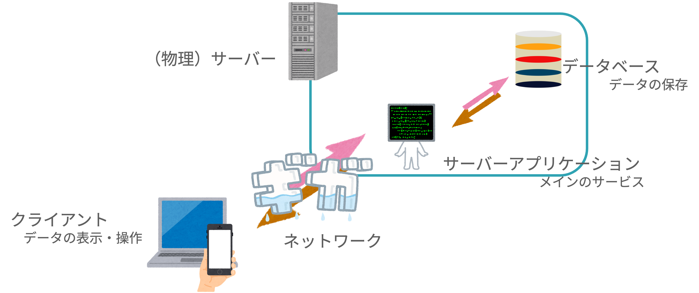

<!--
_class: title
-->

# データベース入門

Webエンジニアになろう講習会 第4回

---

<!--
_class: section-head
-->
# 前回のおさらい

---

# HTTPって何だったっけ？

- <span class="underlined">お願い (リクエスト)</span> と <span class="underlined">お返事 (レスポンス)</span> で<br>やりとりをする仕組み  
- リソースを、読み取る、作る、書き換える、消す、などのやりとりができる  

---

# HTTPのやり取り例

- 「この動画投稿したいです」
  - ➡️ `200 (投稿しました)`  
- 「このユーザーのデータください」
  - ➡️ `404 (そんな人はいません)`  
- 「このメッセージ消したいです」
  - ➡️ `403 (権限がありません)`

---

# リクエスト  

## 「これください」をもっと詳しく

---

# リクエストの構造  

```http
GET / HTTP/1.1
Host: example.com
```

- メソッド  
- パスとクエリパラメータ  
- プロトコルのバージョン  
- ヘッダー

---

# レスポンス  

## 「これあげます」をもっと詳しく

---

# レスポンスの構造  

```http
HTTP/1.1 200 OK
Content-Length: 1256

<!doctype html>
<html>
...
```

- バージョン番号 ステータス
- レスポンスヘッダー
- ボディ

---

# データの伝送  

HTTPが依存するレイヤー

---

# TCP (Transmission Control Protocol)
  
- 伝送 (トランスミッション)をコントロールするプロトコル  
- どんなデータの伝送でも使える  
- メールの伝送や遠隔制御にも利用  
- TCPを扱うプログラムは、送ったデータの扱いを知らない  
- HTTPを扱うプログラムは、データの送られ方を知らない

---

# IP (Internet Protocol)

- TCPはデータが届くことを前提としている  
- 物理的に直接つながっていなくても中継を経由して届ける  
- ほかの機械の80番ポート宛に届かないよう管理  
- リクエストヘッダーに宛先情報を付けて伝送を管理

---

<!--
_class: section-head
-->
# データベース

---

# Webサービス概観



---

# Webサービス概観


---

# DB  (DataBase) とは

- DataBase → データ基地 → データを蓄積し、管理する場所
- 図書館もDBの一種
  - カテゴリや著者名に基づいて本を探せる
  - 効率よく検索、追加、削除ができる 
- <span class="underlined">SQL</span>と呼ばれる言語がよく使われる

---

# SQL

**S**tructured **Q**uery **L**anguageの略

例: `city` テーブルから `Name`, `Population` の2カラムを選択する

```sql
SELECT Name, Population FROM city;
```

---

# DBMS  (DataBase Management System)

- データベースの情報管理を行う  
- “データの整合性”を保つ役割  
- 図書館でいう司書のような存在

---

# データの整合性 (1/2)

- データが失われない  
- システム障害が起こっても障害前に復帰可能 → **永続性**

---

# データの整合性 (2/2)

- 入力できるデータにルールを決められる → **一貫性**  
- 他に **不可分性  (Atomicity)**、**独立性  (Isolation)** がある  
- これら4つの整合性要素を **ACID特性** と呼ぶ

---

# RDBMS  (Relational DBMS)

- 表形式でデータを格納  (テーブル)  
- 管理する情報の種類を列  (カラム) にする  
- 1つのデータを1行  (レコード) で管理  
- テーブル同士の関連付けが容易  
- 外部キーで他テーブルの値のみ入力可能にする例:  
  - 部員テーブルの “所属班” は “班” テーブルの値しか挿入できない

---

# NoSQL

- Not Only SQL の略  
- RDBMS 以外のDBMS全般  
- 各DBMSごとに異なるデータ格納方法で高パフォーマンスを実現  
- データ取り扱いに制限があったり、取り出しに工夫が必要

---

# 様々なDBMS

* (MongoDB, Redis, Cassandra, etc.)*

---

# 環境変数の話 (1/2)

- 別サーバ (アプリケーション)へのログイン情報を保存  
- ユーザ名やパスワードなど機密情報も含む  
- プログラムでのログイン情報管理に利用 → `.env`

---

# 環境変数の話 (2/2)

- パスワードなどをプログラムにベタ書きしない  
- Gitで誤ってコミットしないよう `.gitignore` に追加  
- 開発環境に応じたテンプレートファイルも用意可能

---

# Webエンジニアになるにあたって
* (まとめ・次回予告)*

---

<!-- スライド24・25 空白／補足スライドなど -->
