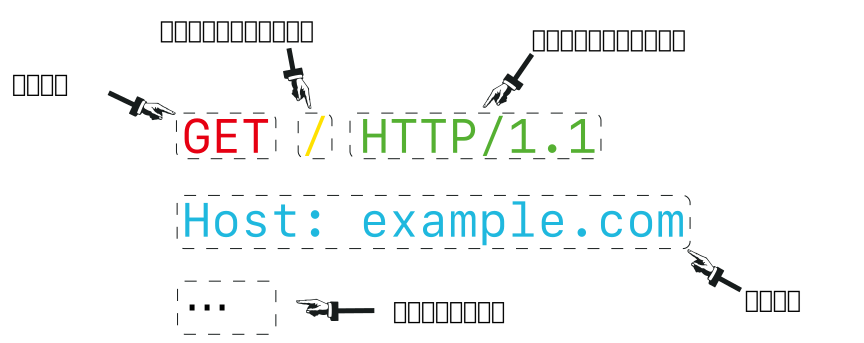
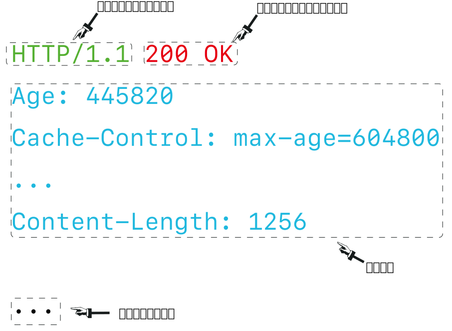
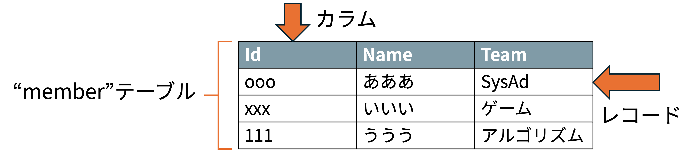

<!--
_class: title
-->

# データベース入門

Webエンジニアになろう講習会 第4回

---

# 自己紹介

<div class="columns"> 
  <div>
    
  </div>
  <div>
    <h2>Kentaro1043</h2>
    <div>数理・計算科学系</div>
    <div>インフラやってます</div>
    <div>Kubernetesが好きです</div>
  </div>
</div>

---

<!--
_class: section-head
-->
# 前回のおさらい

---

# HTTPって何だったっけ？

- <span class="underlined">お願い (リクエスト)</span> と <span class="underlined">お返事 (レスポンス)</span> で<br>やりとりをする仕組み  
- リソースを取得・編集・削除するやりとりができる  

---

<!--
_class: section-head
-->
# リクエスト

これください！

---

# リクエストの構造

<div class="center">
  
</div>

---

<!--
_class: section-head
-->
# レスポンス

リクエストに対する返事

---

# レスポンスの構造  

<div class="center">
  
</div>

---

<!--
_class: section-head
-->
# データの伝送
HTTPが依存するプロトコル

---

# TCP
  
HTTPが依存する通信プロトコル．
  - 通信が確実に/正しい順序で届くことを保証する．
  - あらゆるデジタルなデータの伝送をすることができる．
    - HTTPのリクエストやメールの送信，コンピュータの遠隔操作(ssh)まで
- 通信をパケット(小包)に分けて送信する

---

# IP (Internet Protocol)

- 世界中に何億台も機械があるが、そのうち届いてほしい機械にデータを届けたい
- 機械に番号を振る
- ものすごく良い感じに機械に番号を振ることで、機械同士が直接つながっていなくてもデータが届くようになっている

---

<!--
_class: section-head
-->
# データベース

---

# Webサービス概観

<div class="center">
  
</div>

---

# Webサービス概観

<div class="center">
  
</div>

---

# DB  (DataBase) とは

- DataBase → データ基地 → データを蓄積し、管理する場所
- 例: Excelファイル
  - 大量のデータをまとめられる
  - 効率よく検索、追加、削除ができる
- <span class="underlined">SQL</span>と呼ばれる言語がよく使われる

---

# SQL

**S**tructured **Q**uery **L**anguage

例: `member` テーブルから<br>`Id`, `Name`, `Team` の3カラムを選択する

```sql
SELECT Id, Name, Team FROM member;
```

---

# DBMS  (**D**ata**B**ase **M**anagement **S**ystem)

- データベースの情報管理を行うアプリ
- <span class="underlined">データの整合性</span>を保つ役割
- 整合性を保つ: **ACID特性**
  - 関係が壊れたりデータが勝手に無くなったりしない
  - 気になった方は調べてみてください

<div class="columns-3">
  
  
  
</div>
<div>

---

# RDBMS（Relational DBMS）（1/2）

- 表形式でデータを格納 （テーブル）
- 管理する情報の種類を列（カラム）にする  
- 1つのデータを1行（レコード）で管理

<div class="center">
  
</div>

---

# RDBMS（2/2）

- テーブル同士に**関係**（**Relation**）を作れる
- 例: 特定のカラムにあるテーブルから制限をかける
  - 部員テーブルの“所属班”は“班”テーブルの”班名”しか挿入できない

<div class="center">
  
</div>

---

# NoSQL

- Not Only SQLの略
  - RDBMS以外のDBMS
- 高パフォーマンス、サーバー分散
- SQLを<span class="underlined">使えない</span>
- 整合性を<span class="underlined">保たない</span>場合も

---

# NewSQL

- NoSQLの利点を取り入れたRDBMS
- 高パフォーマンス、サーバー分散
- SQLを使える、整合性を保つ
- まだ新しく情報が少ない

---

# 様々なDBMS


---

# 環境変数の話（1/2）

- データベースを使うには？
  - ユーザー名、パスワードが必要
  - 漏洩するとデータが盗まれる

<div class="center">
  
</div>


---

# 環境変数の話（2/2）

- どこに書く？
  - ❌️ ソースコード
    - Gitでコミットしたら漏洩
    - 手元のパソコンとサーバーで設定が異なる
  - ⭕️ 環境変数（よく`.env`ファイルに記述）
    - `.gitignore`で、認証情報のみGitから除外
    - 環境ごとに設定を切り替えられる

---

<!--
_class: section-head
-->
# なろう講習会 第一部 完！

お疲れ様でした！

本日の実習範囲:
データベースを扱う準備～サーバーからデータベースを扱う
