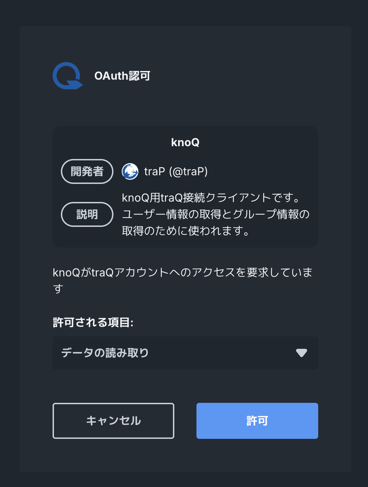
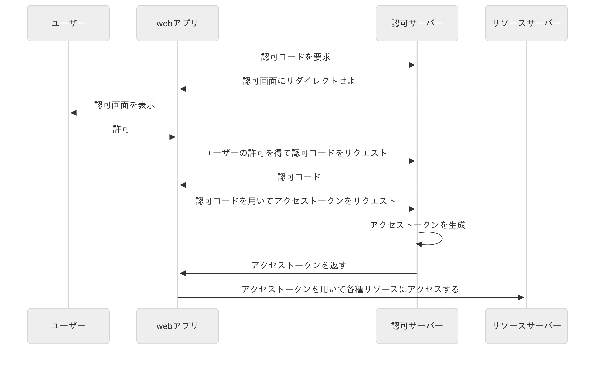
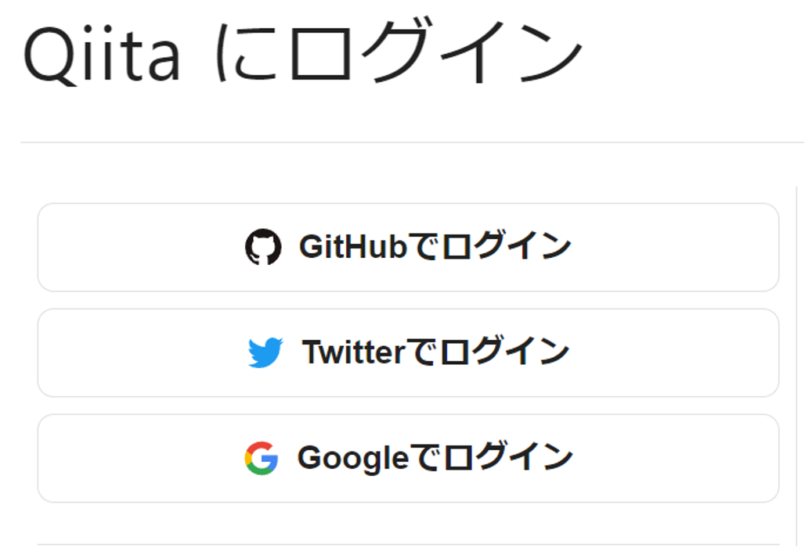

<!--
_class: title
-->

# 認証・認可

Webエンジニアになろう講習会 第5回

---
# 自己紹介

<div class="columns align-center"> 
    <div class="center">
        
    </div>
    <div>
    <h2>matsun</h2>
    数理計算科学系B2です．SysAd．JIZI(ネットワーク局)で色々やってます．好きな言語はRust🦀
    </div>
</div>

---

# 目次

1. 認証と認可とは？
2. パスワードをどう守る？
3. ID/PW認証とセッション認証
4. JWT
5. OAuth 2.0
6. OpenID Connect

---
<!--
_class: section-head
-->

# 1. 認証・認可とは？

---

# 認証・認可とは

<div class="columns"> 
    <div>
        <h3>認証(Authentication)</h3>
        あなたが<span class="red">誰であるか</span>
        <ul>
            <li>ユーザーが本人であることを確認すること</li>
            <li>例: ユーザーIDとパスワードの組み合わせ</li>
        </ul>
    </div>
    <div>
        <h3>認可(Authorization)</h3>
        あなたが<span class="red">何をできるか(権限)</span>
        <ul>
            <li>ユーザーが特定の操作を行う権限があるか確認すること</li>
            <li>例: 管理者権限を持つユーザーのみがアクセスできるページ</li>
        </ul>
    </div>
</div>

---

# 認証 or 認可クイズ

- お酒を買うときに「20歳以上ですか？」
- スマホのロックを解除する
- サービスにログインする
- 役員権限でtraPortalの個人情報を閲覧

---

# 認証 or 認可クイズ

- お酒を買うときに「20歳以上ですか？」→ <span class="red">認可</span>
- スマホのロックを解除する → <span class="red">認証</span>
- サービスにログインする → <span class="red">認証</span>
- 役員権限でtraPortalの個人情報を閲覧 → <span class="red">認可</span>

---
<!--
_class: section-head
-->

# 2. パスワードをどう守る？

---

# パスワードをどう守る？
- パスワードはサービスのセキュリティの要
- パスワードが漏洩すると、アカウントの乗っ取りや不正アクセスのリスクが高まる

---

# ハッシュ関数
ハッシュ関数は、どんな長さのデータでも一定の長さの「要約（ハッシュ値）」に変換する関数です。
同じ入力なら必ず同じ値が出て、わずかな違いでも全く別の値になるのが特徴です。
例(SHA-256): 
- "password" → `5e884898da28047151d0e56f8dc6292773603d0d6aabbdd62a11ef721d1542d8`

---

# ハッシュ関数の特徴
- **一方向性**: ハッシュ値から元のデータを復元することは非常に困難
- **衝突耐性**: 異なる入力が同じハッシュ値になる可能性が極めて低い
- **微小な変化に対する大きな変化**: 入力のわずかな変更がハッシュ値に大きな影響を与える

👉  パスワードの保存やデータの改竄防止に使われる

---
<!--
_class: section-head
-->

# 3. ID/PW認証・セッション認証

---

# パスワードログインの仕組み

1. Sign Up (登録)
2. Sign In (ログイン)
3. Session (ログイン状態の維持)

---

# 1. Sign Up (登録)
i. IDとパスワードをサーバーに送信(POST)
ii. サーバー側でIDとパスワードのハッシュ値の組を保存 <cite>*</cite>

<div class="cite">
* 実際にはソルトといった秘密の文字列を使ったり、bcryptやArgon2などの計算コストの高いハッシュ関数を使うことでパスワードを予測しにくいようにしています．
</div>

---

# 2. Sign In (ログイン)
1. IDとパスワードをサーバーに送信(POST)
2. サーバー側でIDに対応するパスワードのハッシュ値を取得
3. 受け取ったパスワードをハッシュ化し、保存されているハッシュ値と比較
4. 一致すればログイン成功

---
# 3. Session
HTTPはステートレス(状態を持たない)
- サーバーは前のリクエストの内容を覚えていない
- つまり、ログインしたことを覚えていない

👉 ログイン状態を維持する仕組み(Session認証)が必要

---

# 3. Session (ログイン状態の維持)
Cookieを使ってログイン状態を維持する
1. ログイン成功時にサーバーがセッションIDを発行し、`Set-Cookie`ヘッダーでブラウザに送信
2. ブラウザは以降のリクエストで毎回セッションIDをCookieに含めて送信
3. サーバーはセッションIDを元にユーザー情報を特定し、ログイン状態を維持

---
<!--
_class: section-head
-->

# 4. JWT

---

# デジタル署名とは？

身近な例で考えてみましょう：
- **手紙の封筒** → 開けたら跡が残る（改竄の検出）
- **印鑑** → 本人しか持っていない（本人確認）

デジタル署名は、この2つの機能をデジタルで実現したものです！

---

# デジタル署名の仕組み

1. 送信者が秘密鍵でデータを署名
2. 受信者が公開鍵で署名を検証
3. データが改竄されていないことを確認

👉 これによって「誰が送ったか」と「内容が変更されていないか」が分かる！

---

# JWT (JSON Web Token) って何？
- Webで使う「デジタル身分証明書」のようなもの
- デジタル署名で守られているので改竄できない

---

# JWTの構造（3つのパーツ）
JWT*は「.」で区切られた3つの部分でできています：

```
ヘッダー.ペイロード.署名
```

実際のJWT（文字の羅列に見えますが、ちゃんと意味があります！）：
```
eyJhbGciOiJIUzI1NiIsInR5cCI6IkpXVCJ9.
eyJzdWIiOiIxMjM0NTY3ODkwIiwibmFtZSI6IkpvaG4gRG9lIiwiaWF0IjoxNTE2MjM5MDIyfQ.
SflKxwRJSMeKKF2QT4fwpMeJf36POk6yJV_adQssw5c
```

<div class="cite">
*ここで説明しているものは正確にはJWS(JSON Web Signature)と呼ばれるものの構造ですが，理解を簡単にするためにJWTとして説明しています．
JWTはJWSのペイロードにJSON形式のクレームを含むものです．
</div>

---

# Base64エンコードって何？

JWTの文字の羅列の正体は **Base64エンコード** されたJSON！

### 元のJSON
```json
{
  "alg": "HS256",
  "typ": "JWT"
}
```

### Base64エンコード後
```
eyJhbGciOiJIUzI1NiIsInR5cCI6IkpXVCJ9
```

---

# JWTの3つのパーツを詳しく見てみよう！

1. **ヘッダー (Header) = どんなトークンか**
   - 「これはJWTです」という情報
   - どんな方法で署名されているかの情報
   - JSONをBase64エンコードしたもの

---

# JWTの3つのパーツを詳しく見てみよう！

2. **ペイロード (Payload) = 中身の情報**
   - ユーザーの名前やIDなど
   - いつまで有効か（有効期限）
   - どんな権限を持っているか
   - これもJSONをBase64エンコードしたもの

⚠️ **重要**: Base64は暗号化ではない！ペイロードの中身は誰でも見れるので、パスワードなどの秘密情報は入れない！

---

# JWTの3つのパーツを詳しく見てみよう！

3. **署名 (Signature) = 改竄防止の印鑑**
   - ヘッダー + ペイロード + 秘密鍵 から生成
   - これがあるから偽造できない！


---

# JWTの使い方（3ステップ）

**ログインしたとき**：
- ユーザー：「IDとパスワードを送ります」
- サーバー：「確認できました！このJWTトークンを渡します」
   
**その後のやり取り**：
- ユーザー：「このJWTトークンを持ってます（リクエストに添付）」
- サーバー：「トークンを確認します」

---

# JWTの使い方（3ステップ）

3. **サーバーの確認作業**：
   - 署名は本物か？（偽造されていないか）
   - まだ有効期限内か？（期限切れじゃないか）

---

# JWTの良いところ・気をつけるところ

<div class="columns">
    <div>
        <h3>😊 良いところ</h3>
        <ul>
            <li>サーバーが楽（誰がログイン中か覚えなくていい）</li>
            <li>複数のサービスで簡単に使い回せる</li>
            <li>たくさんのユーザーに対応しやすい</li>
        </ul>
    </div>
    <div>
        <h3>🤔 気をつけるところ</h3>
        <ul>
            <li>トークンのサイズが大きい</li>
            <li>一度発行したら取り消しにくい</li>
            <li>秘密鍵が漏れたら大変</li>
            <li>特有のセキュリティ対策が必要</li>
        </ul>
    </div>
</div>

---

# JWKS (JSON Web Key Set)
- JWTの署名を検証するための公開鍵をまとめたもの
- 鍵をWeb上で共有するための標準的なフォーマット

---
<!--
_class: section-head
-->

# 5. OAuth 2.0

---

# OAuth 2.0 とは？
<div class="columns align-center">
    <div class="center">
        
    </div>
    <div>
    <ul>
        <li>認可の仕組みの一つ</li>
        <li>他のサービスに自分の情報へのアクセスを許可するための仕組み</li>
    </ul>
    </div>
</div>

---

# OAuth 2.0の(簡単な)仕組み


<div class="cite">
Authorization Code Flowの図です．
認可コードを挟むのは、PKCEという仕組みを使うためです．
</div>

---

# OAuth 2.0のいいところ・気をつけるところ

<div class="columns">
    <div>
        <h3>😊 いいところ</h3>
        <ul>
            <li>パスワードを教えなくていい</li>
            <li>他のサービスと連携しやすい</li>
            <li>ユーザーにとって便利</li>
        </ul>
    </div>
    <div>
        <h3>🤔 気をつけるところ</h3>
        <ul>
            <li>仕組みが複雑で，実装が面倒</li>
            <li>認可のためのプロトコルなので，認証には使わない→認証にはOpenID Connectを使う</li>
        </ul>
    </div>
</div>


---
<!--
_class: section-head
-->

# 6. OpenID Connect

---
# OpenID Connectとは？
<div class="columns align-center">
    <div class="center">
        これ→
        
    </div>
    <div>
    <ul>
        <li>OAuth 2.0をベースにした認証の仕組み</li>
        <li>ユーザーが誰であるかを確認するための標準的なプロトコル</li>
        <li>略してOIDC</li>
    </ul>
    </div>
</div>

---
# OpenID Connectの仕組み
- OpenID ConnectはOAuth 2.0の上に成り立っている
- アクセストークンと一緒にIDトークンが返ってくる
    - IDトークンはJWT形式で、ユーザーの情報が含まれている
    - IDトークンを検証することで、ユーザーが誰であるかを確認できる

---
# OIDCののいいところ・気をつけるところ

<small>
<div class="columns">
    <div>
        <h3>😊 メリット</h3>
        <ul>
            <li>OAuth 2.0の利点を引き継いでいる</li>
            <li>認証情報を安全にやり取りできる</li>
            <li>シングルサインオン(SSO)が可能</li>
            <li>多くのサービスでサポートされている</li>
        </ul>
    </div>
    <div>
        <h3>🤔 気をつけるところ</h3>
        <ul>
            <li>OAuth 2.0同様に仕組みが複雑</li>
            <li>実装には注意が必要</li>
        </ul>
    </div>
</div>
</small>

---
# おすすめYouTube動画紹介
- https://www.youtube.com/live/PKPj_MmLq5E
OAuth 2.0やOpenID Connectについてわかりやすく解説している動画です

---
# まとめ

<div class="columns"> 
    <div>
        <h3>認証(Authentication)</h3>
        あなたが<span class="red">誰であるか</span>
        <ul>
            <li>ユーザーが本人であることを確認すること</li>
            <li>例: ユーザーIDとパスワードの組み合わせ</li>
        </ul>
    </div>
    <div>
        <h3>認可(Authorization)</h3>
        あなたが<span class="red">何をできるか(権限)</span>
        <ul>
            <li>ユーザーが特定の操作を行う権限があるか確認すること</li>
            <li>例: 管理者権限を持つユーザーのみがアクセスできるページ</li>
        </ul>
    </div>
</div>


---
# まとめ
認証にはいくつか種類がある
- パスワード認証
    - IDとパスワードの組み合わせで認証を実現
    - パスワードはハッシュ化して保存する
- セッション認証
    - セッションストアを参照することによって認証を実現
- JWT認証
    - JWTを検証することで認証を実現

---
# まとめ
認証・認可には標準的な仕組みがある
- OAuth 2.0
    - 他のサービスに自分の情報へのアクセスを許可するための仕組み
- OpenID Connect
    - OAuth 2.0をベースにした認証の仕組み

👉 セキュリティに関わるのでプロトコルの意図をきちんと理解して実装しよう！

---
<!--
_class: section-head
-->

# 演習タイム
ID/PW認証やセッション認証の実装を行います！
