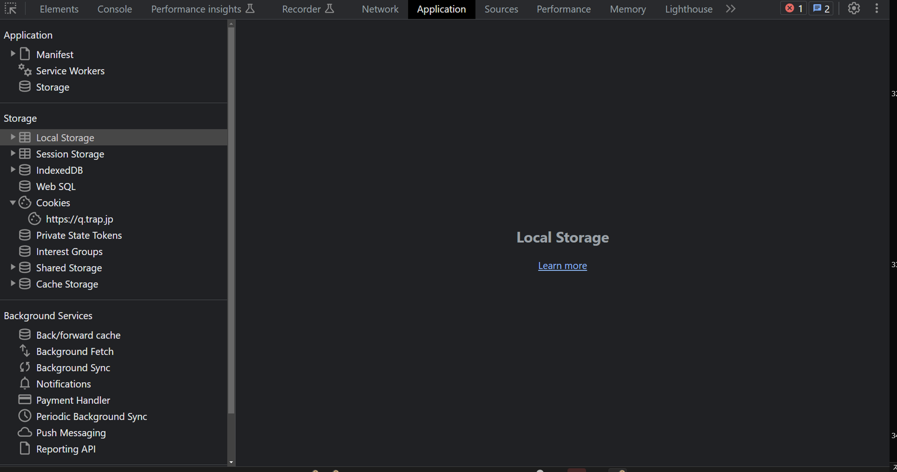

<!--
_class: title
-->

# セキュリティ入門

Webエンジニアになろう講習会 第6回

---

# 自己紹介

<div class="columns">
  <div>
 
  </div>
  <div>
 <h2>Kentaro1043</h2>
 <div>数理・計算科学系</div>
  </div>
</div>

---

# 前回のおさらい

// TODO

---

# 今日の内容は大事

外部にサービスを公開するときに、
絶対に気をつけて欲しいことです。
難しい内容ではないので、しっかり理解してください。

---

# 目次

- 座学
  - Webサービスセキュリティ入門
  - ブラウザセキュリティ入門
- 実習
  - vue-routerの設定
  - プロキシの設定
  - サーバーとの通信

---

<!--
_class: section-head
-->

# Webサービス<br />セキュリティ入門

---

# セキュリティ: 被害

- サービスを公開する→サーバーが外部に<span class="underlined">公開される</span>
- サーバーに侵入されると...
  - サービスの停止
  - データの破損、流出
    - <span class="underlined">個人情報保護法</span>→<span class="underlined">報告義務</span>が発生する場合あり
    - 損害賠償、裁判沙汰にも
  - 攻撃に利用される
    - DDoS攻撃、スパムメール

---

# セキュリティ: 対策

1. ログイン情報を漏らさない
2. 不要なポートは閉じる
3. ソフトウェアを最新に保つ
4. 流出しても影響が無いようにする

---

# ① ログイン情報を漏らさない

サーバーは常に攻撃されている

```log
Disconnected from authenticating user root 80.94.93.119 port 19976 [preauth]
Received disconnect from 80.94.93.119 port 19976:11:  [preauth]
Connection closed by authenticating user root 185.156.73.233 port 56948 [preauth]
Disconnected from authenticating user root 193.46.255.33 port 23924 [preauth]
Received disconnect from 193.46.255.33 port 23924:11:  [preauth]
Disconnected from authenticating user root 193.46.255.7 port 38508 [preauth]
Received disconnect from 193.46.255.7 port 38508:11:  [preauth]
Connection closed by invalid user git 194.0.234.18 port 47130 [preauth]
Invalid user git from 194.0.234.18 port 47130
Disconnected from authenticating user root 193.46.255.217 port 23786 [preauth]
Received disconnect from 193.46.255.217 port 23786:11:  [preauth]
Connection closed by invalid user a 80.94.95.115 port 59186 [preauth]
Invalid user a from 80.94.95.115 port 59186
```

---

# ① ログイン情報を漏らさない

## 対策

- パスワードを長く複雑なものにする
- パスワードよりも強力な認証方式を使う
  - SSH: 公開鍵認証方式
- ファイアウォールの導入
- fail2banの導入
  - 不正なログイン試行を検知してIPをブロック
- ログを記録・監視

---

# ① ログイン情報を漏らさない

DBの認証情報も同様

- パスワードを長く複雑なものにする
- GitHubに認証情報をpushしない
- 漏れても影響を最小限に
  - 適切な権限を設定
  - アプリからのログインに管理者ユーザーを使わない

---

# ① ログイン情報を漏らさない

巧妙なリクエストを送って、不正にデータを取得したり、権限昇格をしたりする攻撃

- <span class="underlined">SQL injection</span>
- <span class="underlined">OS Command Injection</span>

---

# ① ログイン情報を漏らさない

## SQL injection

脆弱なコード

```go
cities := []City{}
db.Select(&cities, fmt.Sprintf("SELECT * FROM city WHERE CountryCode='%s'", os.Args[1]))

fmt.Println("日本の都市一覧")
for _, city := range cities {
    fmt.Printf("都市名: %s, 人口: %d人\n", city.Name, city.Population)
}
```

---

# ① ログイン情報を漏らさない

## SQL injection

使い方

```bash
$ go run main.go JPN
Connected!
日本の都市一覧
都市名: Tokyo, 人口: 7980230人
都市名: Jokohama [Yokohama], 人口: 3339594人
都市名: Osaka, 人口: 2595674人
都市名: Nagoya, 人口: 2154376人
...
```

---

# ① ログイン情報を漏らさない

## SQL injection

正しい動作

```bash
$ go run main.go "' OR 1 OR ''='"
Connected!
日本の都市一覧
```

---

# ① ログイン情報を漏らさない

## SQL injection

実際には

```bash
$ go run main.go "' OR 1 OR ''='"
Connected!
日本の都市一覧
都市名: Kabul, 人口: 1780000人
都市名: Qandahar, 人口: 237500人
都市名: Herat, 人口: 186800人
都市名: Mazar-e-Sharif, 人口: 127800人
...
```

---

# ① ログイン情報を漏らさない

## SQL injection

安全なコード

```go
cities := []City{}
// ライブラリの機能のプレースホルダを使う
db.Select(&cities, "SELECT * FROM city WHERE CountryCode=?", os.Args[1])

fmt.Println("日本の都市一覧")
for _, city := range cities {
    fmt.Printf("都市名: %s, 人口: %d人\n", city.Name, city.Population)
}
```

---

# ② 不要なポートは閉じる

- ポートは必要最低限に
- デフォルトのポートは避ける
  - SSH: 22
  - MySQL: 3306
- ファイアウォールの導入
  - 外部ネットワークからのアクセスを制限

---

# ② 不要なポートは閉じる

デフォルトのポートは非常に攻撃されやすい

SSHポートを22から変更した例


---

# ③ ソフトウェアを最新に保つ

- どんなソフトウェアにも脆弱性がある
- 定期的にアップデートする
  - パッケージマネージャのアップデート機能
  - Dockerイメージのアップデート

---

# ④ 流出しても影響が無いようにする

- どんなに注意しても流出が起きてしまうことはある
  - どんなに大きな企業でもやらかすときはやらかす
- 流出しても機密データは漏らさないように
  - 機密データはサーバーに保存しない
- データベースに平文（そのままの状態）のパスワードを保存するのはNG
  - 漏洩すると大惨事になる

---

# ④ 流出しても影響が無いようにする

- パスワードを元に一定の手順に従って求めたハッシュ値を代わりに保存する
  - ハッシュ化アルゴリズム: bcrypt, PBKDF2, scrypt, Argon2など
- 単なるハッシュ化では、事前計算したハッシュの結果と比較することでパスワードが復元できてしまうことがある
  - ソルト（ランダムな値）をパスワードに付加してからハッシュ化することで事前計算を困難に出来る

---

# 目次

- 座学
  - Webサービスセキュリティ入門
  - <span class="red">ブラウザセキュリティ入門</span>
- 実習
  - クライアントからAPIを呼び出す

---

# ブラウザのセキュリティ

- さっきまではサーバーのセキュリティに関して
  - ブラウザ自体にも重要なデータが保存されている
- 加えてブラウザ自体も各端末で動くネイティブアプリケーション
  - 攻撃者と端末とのインターフェースとなりうる

---

# 保存場所の一例



---

# ブラウザの持つ情報

- 悪意のあるWebページが、Local Storageに保存した他のWebページに関する情報を無制限に読み取れるなら…
- 悪意のあるWebページAがiframeを用いて悪意のないWebページBを埋め込んでいる時、WebページAのJavaScriptが無制限にWebページBのDOMにアクセスできるなら…

---

# 境界の必要性

- Webページの間には「ほどよい」境界が必要
  - どのような境界が適切か？
- **Origin**: URI中の「スキーム、ホスト、ポート」の組
  - **Scheme**: HTTP, HTTPS
  - **Host**: a.example.com, b.example.com, a.sample.com
  - **Port**: 80, 443, 8080

---

# Same-Origin Policy

- SOP: Originに依拠した最も基本的なセキュリティ機構
- 次の2つのルールに従って、Webページ間の「やりとり」に制限を加える
  - 2つのページの Origin が一致していれば、無制限で「やりとり」を許す
  - 2つのページの Origin が異なっていれば、「やりとり」を原則禁止する

---

# Same-Origin Policy

- やりとり：書き込み、埋め込み、読み込み
  - Cross-Originでの書き込み：基本的に許可（条件付きで禁止される）…「単純な」リクエストに限る
  - Cross-Originでの埋め込み：許可
  - Cross-Originでの読み込み：基本的に禁止される

---

# Cross-Origin Resource Sharing

```
Access to XMLHttpRequest at 'https://play.google.com/log?...' from origin
'https://drive.google.com' has been blocked by CORS policy: No
'Access-Control-Allow-Origin' header is present on the requested resource.

Failed to load resource: net::ERR_FAILED
```

- CORS: SOPの緩和
- SOPは時に善良な開発者の障害となる
- HTTPヘッダのやり取りを通じて、リソースの読み出し・書き込みを行ってよいかすり合わせる

---

# CORSの仕組み (1/5)

1. ユーザーのブラウザが `http://a.example.com` のWebページにアクセスします。


---

# CORSの仕組み (2/5)

2. `a.example.com` のページで実行されたスクリプトが、別のオリジンである `http://b.example.com` にリクエストを送信しようとします。


---

# CORSの仕組み (3/5)

3. しかし、オリジンが異なるため、ブラウザはSame-Origin Policyに基づき、このリクエストをブロックします。


---

# CORSの仕組み (4/5)

4. これを解決するため、`http://b.example.com` サーバー側で、予め「`http://a.example.com` からのリクエストを許可する」と設定しておきます。（`Access-Control-Allow-Origin` ヘッダなど）


---

# CORSの仕組み (5/5)

5. ブラウザは `b.example.com` の許可設定を確認し、リクエストを許可します。これで異なるオリジン間での通信が安全に実現できます。


---

# Cross-Site Scripting (XSS)

- SOPは同一Origin内のリソースのやり取りに関して何ら制限を加えない
- 攻撃者が何らかの方法で他のユーザーの閲覧ページに任意のScriptを挿入することができれば？
  - 自身のサーバーに読み取った値を送信するような事ができる
- 対策
  - ユーザーが生成したコンテンツは必ずサニタイジングする
  - 危ない関数を迂闊に使わない
    - v-htmlディレクティブ
    - render関数のdomPropsやdomPropsInnerHTML

---

# Content Security Policy

- CSP: XSS脆弱性の水際対策
- 開発者は自身がブラウザ上で実行したいスクリプトを知っている
  - それだけ読み込めれば良い
- Inline Scriptを`.js`や`.css`にまとめて、信頼のできるOriginからのみ配信する
  - それ以外のScriptはContent-Injectionによるもの
- 信頼性担保にはSRI (SubResource Integrity)などが利用される

---

# Cookie

**HttpOnly属性**

- セッションの実現だけに用いられるCookieはブラウザの実行するJavaScriptから参照する必要がない
  - サーバーへの送信時以外参照できないように設定する

**Secure属性**

- HTTPSプロトコル上の暗号化されたリクエストでのみサーバーに送信できるようになる

---

# まとめ

---

# Webサービスセキュリティ入門

- サーバー内の情報が流出しないように気を付ける
  - 認証情報を守る
  - ポートを閉じる
  - ライブラリに頼る
- たとえ流出してもわからないようにする
  - ハッシュ化する
  - パスワードの痕跡を残さない
- 他の人の攻撃を手伝わないようにする
  - 不要なポートは閉じる
  - パッチを当てる

---

# 境界の必要性

- Webページの間には「ほどよい」境界が必要
  - どのような境界が適切か？
- **Origin**: URI中の「スキーム、ホスト、ポート」の組
  - **Scheme**: HTTP, HTTPS
  - **Host**: a.example.com, b.example.com, a.sample.com
  - **Port**: 80, 443, 8080

---

# Same-Origin Policy

- SOP: Originに依拠した最も基本的なセキュリティ機構
- 次の2つのルールに従って、Webページ間の「やりとり」に制限を加える
  - 2つのページの Origin が一致していれば、無制限で「やりとり」を許す
  - 2つのページの Origin が異なっていれば、「やりとり」を原則禁止する
- やりとり：書き込み、埋め込み、読み込み
  - Cross-Originでの書き込み：基本的に許可（条件付きで禁止される）…「単純な」リクエストに限る
  - Cross-Originでの埋め込み：許可
  - Cross-Originでの読み込み：基本的に禁止される

---

# Cross-Origin Resource Sharing

- CORS: SOPの緩和
- SOPは時に善良な開発者の障害となる
- HTTPヘッダのやり取りを通じて、リソースの読み出し・書き込みを行ってよいかすり合わせる

---

# Content Security Policy

- CSP: XSS脆弱性の水際対策
- 開発者は自身がブラウザ上で実行したいスクリプトを知っている
  - それだけ読み込めれば良い
- Inline Scriptを`.js`や`.css`にまとめて、信頼のできるOriginからのみ配信する
  - それ以外のScriptはContent-Injectionによるもの
- 信頼性担保にはSRI (SubResource Integrity)などが利用される

---

# Cookie

**HttpOnly属性**

- セッションの実現だけに用いられるCookieはブラウザの実行するJavaScriptから参照する必要がない
  - サーバーへの送信時以外参照できないように設定する

**Secure属性**

- HTTPSプロトコル上の暗号化されたリクエストでのみサーバーに送信できるようになる

---

# 参考資料

- [安全なウェブサイトの運用管理に向けての20ヶ条 - IPA](https://www.ipa.go.jp/security/vuln/20point-website-operation.html)
- [安全なウェブサイトの作り方 – IPA](https://www.ipa.go.jp/security/vuln/websecurity.html)
- [脆弱性対策 - IPA](https://www.ipa.go.jp/security/vuln/index.html)
