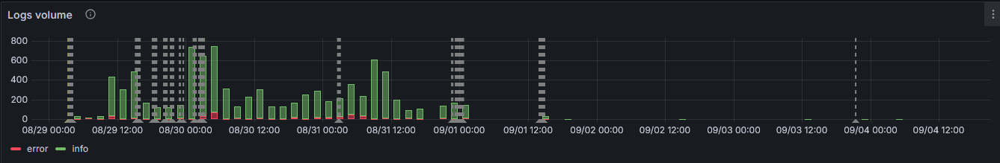
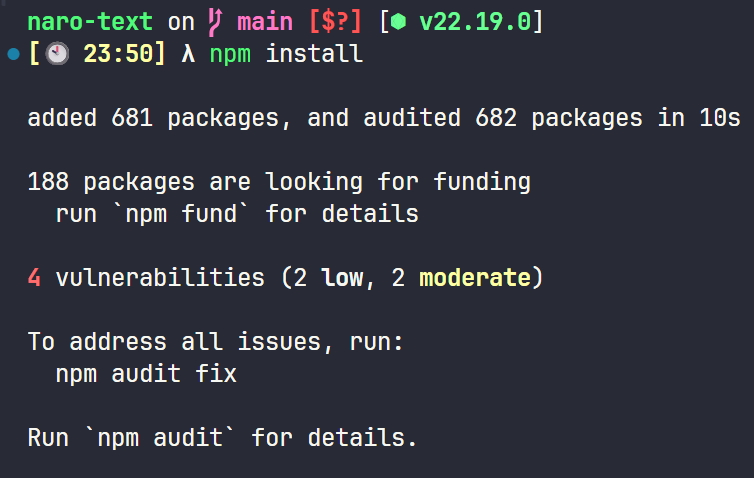
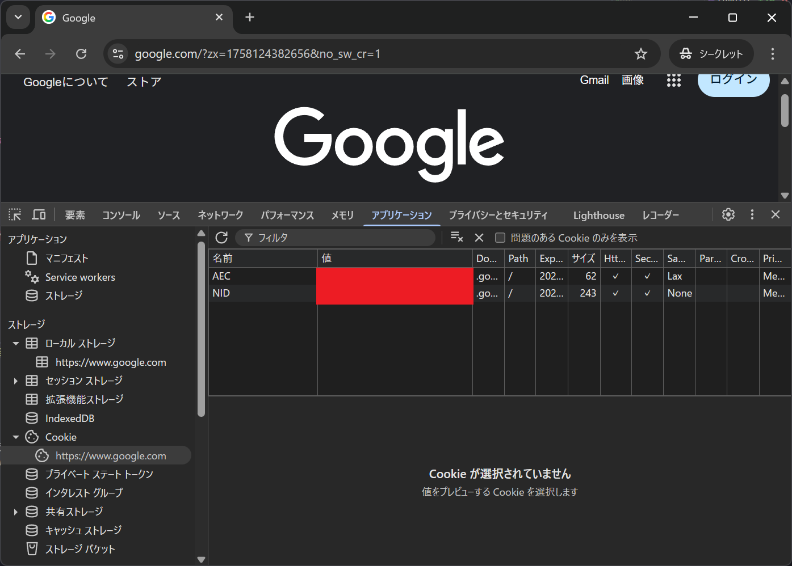
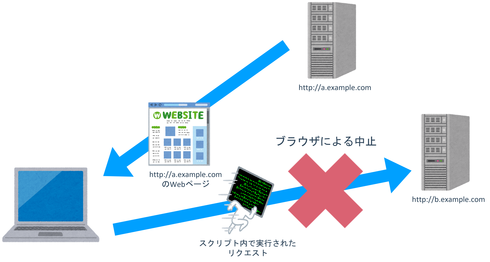
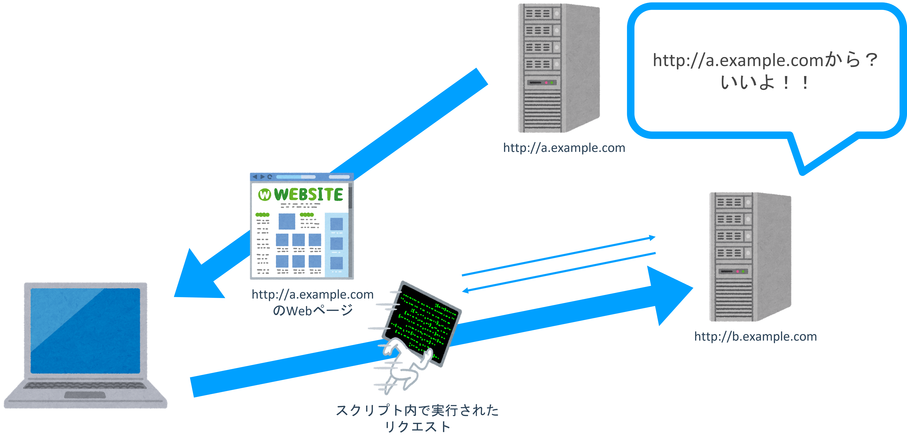

<!--
_class: title
-->

# セキュリティ入門

Webエンジニアになろう講習会 第6回

---

# 講師

<div class="columns">
  <div>
    
  </div>
  <div>
    <h2>Kentaro1043</h2>
    <div>数理・計算科学系</div>
    <div>k8sが好きです☸</div>
  </div>
</div>

---

<!--
_class: section-head
-->

# 前回のおさらい

## 認証・認可

---

# 前回のおさらい

<div class="columns">
  <div>
    <h3>認証(Authentication)</h3>
    あなたが<span class="red">誰であるか</span>
    <ul>
      <li>ユーザーが本人であることを確認すること</li>
      <li>例: ユーザーIDとパスワードの組み合わせ</li>
    </ul>
  </div>
  <div>
    <h3>認可(Authorization)</h3>
    あなたが<span class="red">何をできるか(権限)</span>
    <ul>
      <li>ユーザーが特定の操作を行う権限があるか確認すること</li>
      <li>例: 管理者権限を持つユーザーのみがアクセスできるページ</li>
    </ul>
  </div>
</div>

---

# 前回のおさらい

認証にはいくつか種類がある

- パスワード認証
  - IDとパスワードの組み合わせで認証を実現
  - パスワードはハッシュ化して保存する
- セッション認証
  - セッションストアを参照することによって認証を実現
- JWT認証
  - JWTを検証することで認証を実現

---

# 前回のおさらい

認証・認可には標準的な仕組みがある

- OAuth 2.0
  - 他のサービスに自分の情報へのアクセスを許可するための仕組み
- OpenID Connect
  - OAuth 2.0をベースにした認証の仕組み

---

# セキュリティ入門

## 目次

- サーバーセキュリティ入門
- ブラウザセキュリティ入門

---

<!--
_class: section-head
-->

# サーバーセキュリティ入門

---

# サーバーのセキュリティ: 被害

- サービスを公開する→サーバーが外部に公開される
- サーバーに侵入されると...
  - サービスの停止
  - データの破損、流出
    - <span class="underlined">個人情報保護法</span>→<span class="underlined">報告義務</span>が発生する場合あり
    - 損害賠償、裁判沙汰にも
  - 攻撃に利用される
    - 知らないうちにDDoS攻撃に加担

---

# サーバーのセキュリティ: 対策

1. 不正なログインを防ぐ
2. 不要なポートは閉じる
3. ソフトウェアを最新に保つ
4. 流出しても影響が無いようにする

---

# ① 不正なログインを防ぐ

サーバーは常に攻撃されている

例: traQが動いているサーバーのSSHログ（ログイン試行）

```log
Failed password for root from 36.212.31.122 port 41556 ssh2
Received disconnect from 36.212.31.122 port 41556:11: Bye Bye [preauth]
Disconnected from authenticating user root 36.212.31.122 port 41556 [preauth]
Connection closed by 36.212.31.122 port 55696 [preauth]
banner exchange: Connection from 143.198.30.148 port 51388: invalid format
Invalid user ubuntu from 44.220.185.104 port 45026
Connection closed by invalid user ubuntu 44.220.185.104 port 45026 [preauth]
Connection reset by 45.140.17.26 port 57180
Accepted publickey for kentaro1043 from 203.0.113.1 port 63036 ssh2: ED25519 SHA256:...
pam_unix(sshd:session): session opened for user kentaro1043(uid=60053) by (uid=0)
```

---

# ① 不正なログインを防ぐ

## 対策

- パスワードを長く複雑なものにする
- パスワードよりも強力な認証方式を使う
  - SSH: 公開鍵認証方式
- fail2banの導入
  - 不正なログイン試行を検知してIPをブロック
- ログを記録・監視

---

# ① 不正なログインを防ぐ

DBの認証情報も同様

- パスワードを長く複雑なものにする
- GitHubに認証情報をpushしない
- 漏れても影響を最小限に
  - 適切な権限を設定
  - アプリ用のユーザーとして管理者を使わない

---

# ① 不正なログインを防ぐ

巧妙なリクエストを送って、不正にデータを取得したり、権限昇格をしたりする攻撃

- <span class="underlined">SQL injection</span>
- <span class="underlined">OS Command Injection</span>

---

# ① 不正なログインを防ぐ

## SQL injection

脆弱なコード

```go
cities := []City{}
db.Select(&cities, fmt.Sprintf("SELECT * FROM city WHERE CountryCode='%s'", os.Args[1]))

fmt.Println("日本の都市一覧")
for _, city := range cities {
    fmt.Printf("都市名: %s, 人口: %d人\n", city.Name, city.Population)
}
```

---

# ① 不正なログインを防ぐ

## SQL injection

正しい使い方

```bash
$ go run main.go JPN
Connected!
日本の都市一覧
都市名: Tokyo, 人口: 7980230人
都市名: Jokohama [Yokohama], 人口: 3339594人
都市名: Osaka, 人口: 2595674人
都市名: Nagoya, 人口: 2154376人
...
```

---

# ① 不正なログインを防ぐ

## SQL injection

正しい動作

```bash
$ go run main.go "' OR 1 OR '"
Connected!
日本の都市一覧
```

---

# ① 不正なログインを防ぐ

## SQL injection

実際には

```bash
$ go run main.go "' OR 1 OR '"
Connected!
日本の都市一覧
都市名: Kabul, 人口: 1780000人
都市名: Qandahar, 人口: 237500人
都市名: Herat, 人口: 186800人
都市名: Mazar-e-Sharif, 人口: 127800人
...
```

---

# ① 不正なログインを防ぐ

## SQL injection

安全なコード

```go
cities := []City{}
// ライブラリの機能のプレースホルダを使う
db.Select(&cities, "SELECT * FROM city WHERE CountryCode=?", os.Args[1])

fmt.Println("日本の都市一覧")
for _, city := range cities {
    fmt.Printf("都市名: %s, 人口: %d人\n", city.Name, city.Population)
}
```

---

# ② 不要なポートは閉じる

- ポートは必要最低限に
- デフォルトのポートは避ける
  - SSH: 22
  - MySQL: 3306
- ファイアウォールの導入
  - 外部ネットワークからのアクセスを制限

---

# ② 不要なポートは閉じる

デフォルトのポートは非常に攻撃されやすい

例: SSHポートを22から変更



---

# ③ ソフトウェアを最新に保つ

- どんなソフトウェアにも脆弱性がある
  - 脆弱性: セキュリティ上の欠陥
- 定期的にアップデートする
  - 手動アップデート
  - パッケージマネージャのアップデート機能
  - Dockerイメージのアップデート
    - ベースイメージも忘れずに

---

# ③ ソフトウェアを最新に保つ

例: Node.js(npm)



---

# ④ 流出しても影響が無いようにする

- どんなに注意しても流出が起きてしまうことはある
- もし流出しても致命的なデータが漏れないようにする
  - 機密データは極力サーバーに保存しない
- データベースに平文のパスワードを保存するのはNG
  - 漏洩すると大惨事になる
  - どうする？→<span class="underlined">ハッシュ化</span>

---

# ④ 流出しても影響が無いようにする

## ハッシュ化

- あるルールに従って変換した値→<span class="underlined">ハッシュ値</span>を保存する
  - ハッシュアルゴリズム: bcrypt, PBKDF2, Argon2など
  - 適切に選択する
- <span class="underlined">レインボーテーブル攻撃</span>: 事前計算したハッシュの結果と比較することでパスワードを特定する攻撃
  - 対策: ソルトを付与する

---

<!--
_class: section-head
-->

# ブラウザセキュリティ入門

---

# ブラウザのセキュリティ

- データはサーバーだけでなく、ブラウザにも保存される
  → 攻撃者に狙われる

---

# 保存場所の一例



---

# ブラウザのセキュリティ: 被害

情報漏洩が起きるシチュエーション

- あるWebページのLocalStorageを、他のWebページが読み取れてしまう
- あるWebページを埋め込んている他のWebページが、埋め込まれたページをJavaScriptで操作できてしまう

---

# **Origin**: どこで区切る？

- ここまではOK、ここからはNGという区切りが必要
- <span class="underlined">Origin</span>: URI中の「スキーマ、ホスト、ポート」の組
  - **スキーマ**: http, https
  - **ホスト**: a.example.com, b.example.com
  - **ポート**: 80, 443, 8080

---

# **Same-Origin Policy**(**SOP**)

- <span class="underlined">SOP</span>: 最も基本的なセキュリティ機構
- リソースへのアクセスをOriginに基づいて制限する
  - Originが同じ(same)ならOK
  - Originが異なるならNG

---

# **Cross-Origin Resource Sharing**(**CORS**)

- <span class="underlined">CORS</span>: SOPの緩和
- HTTPヘッダのやり取りを通じて、<br />Origin間でのリソースへのアクセスを許可する
  - **Access-Control-Allow-Origin**: 許可するOrigin
    - 例: `*`, `https://b.example.com`
  - **Access-Control-Allow-Methods**: 許可するメソッド
    - 例: GET, POST, PUT, DELETE

---

# **Cross-Origin Resource Sharing**(**CORS**)

通常時（SOP）



---

# **Cross-Origin Resource Sharing**(**CORS**)

適切なヘッダーを付与した場合（CORS）



---

# **Cross-Site Scripting**(**XSS**)

- SOPはOriginで不正アクセスを防ぐ
- アクセスしたいOriginと同じOriginでスクリプトを実行できれば...？
  - 攻撃者は何でもやり放題
- <span class="underlined">XSS</span>: 悪意のあるスクリプトをWebページに注入する攻撃
- ↓のような文字列を入力される

```HTML
<script type="text/javascript">for(;;){alert("おいすー");}</script>
```

---

# **Cross-Site Scripting**(**XSS**)

対策

- サニタイジング
  - ユーザーの入力をコードとして解釈しないように変換
  - `<script>`→`&lt;script&gt;`
- 危険な機能の使用に注意する
  - Vue.js: `v-html`ディレクティブ

---

# **Content Security Policy**(**CSP**)

- <span class="underlined">CSP</span>: スクリプトの出所を制限するXSS対策
- Webサイトが動かしたいスクリプトの場所は決まっている
- **Content-Security-Policy**ヘッダーで許可するスクリプトの場所を指定する
- 例: `default-src 'self'; script-src 'self' example.com`
  - デフォルトはSOP
  - スクリプトはexample.comからも許可

---

# **Subresource Integrity**(**SRI**)

- <span class="underlined">SRI</span>: スクリプトが改ざんされていないことを確かめる
- ファイルのハッシュ値を事前に計算し、一致しない場合はブロック

```HTML
<script
  src="https://example.com/example-framework.js"
  integrity="sha384-oqVuAfXRKap7fdgcCY5uykM6+R9GqQ8K/uxy9rx7HNQlGYl1kPzQho1wx4JwY8wC"
  crossorigin="anonymous"></script>
```

---

# Cookieのセキュリティ

<span class="underlined">HttpOnly</span>属性

- JavaScriptからCookieにアクセスできなくする
- セッションIDやJWTなどに適用
- XSSを仕掛けられても認証情報が盗まれない

<span class="underlined">Secure</span>属性

- HTTPS通信でのみCookieを送信する
- 通信の盗聴を防ぐ

---

# まとめ

サーバーのセキュリティ

1. 不正なログインを防ぐ
2. 不要なポートは閉じる
3. ソフトウェアを最新に保つ
4. 流出しても影響が無いようにする

---

# まとめ

ブラウザのセキュリティ

- SOPとCORSでOriginを制限
- XSS対策: サニタイジング、CSP、SRI
- Cookieのセキュリティ: HttpOnly、Secure属性

---
<!--
_class: section-head
-->

# 演習タイム
