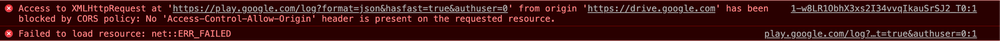
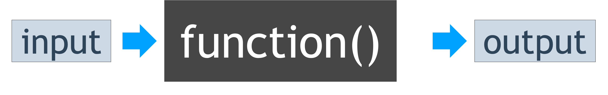
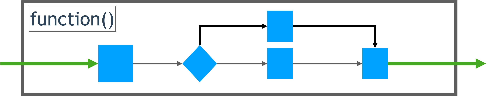
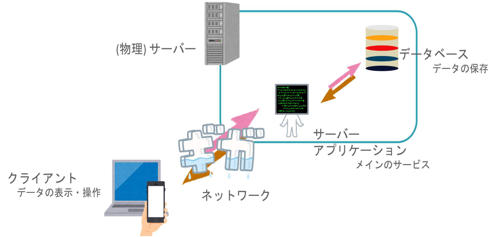
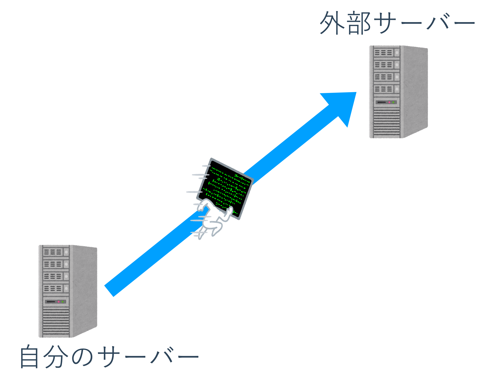
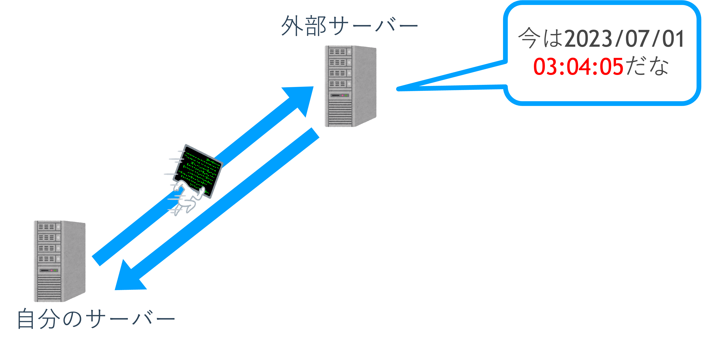
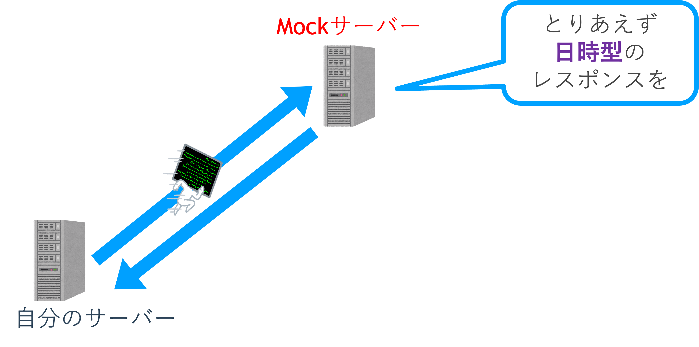
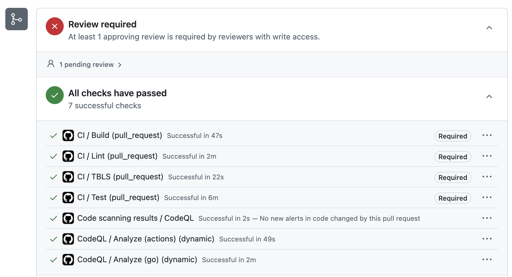

<!--
_class: title
-->

# テスト・CI/CD
Webエンジニアになろう講習会

---

# 自己紹介

## あきも

24B 数理・計算科学系
rucQ開発がんばった
traQチームにもいるよ


---

<!--
_class: section-head
-->

# 前回のおさらい

---

# Webサービスセキュリティ入門

- サーバー内の情報が流出しないように気を付ける
  - 認証情報を守る
  - ポートを閉じる
  - ライブラリに頼る
- たとえ流出してもわからないようにする
  - ハッシュ化する
  - パスワードの痕跡を残さない
- 他の人の攻撃を手伝わないようにする
  - 不要なポートは閉じる
  - パッチを当てる

---

# 境界の必要性

- Webページの間には「ほどよい」境界が必要
  - では、どのような境界が適切か？
- Origin: URI中の「スキーム、ホスト、ポート」の組
  - Scheme: HTTP, HTTPS
  - Host: a.example.com, b.example.com, a.sample.com
  - Port: 80, 443, 8080

---

# Same-Origin Policy

- SOP: Originに依拠した最も基本的なセキュリティ機構
- 次の2つのルールに従って、Webページ間の「やりとり」に制限を加える
  - 2つのページの Origin が一致していれば、無制限で「やりとり」を許す
  - 2つのページの Origin が異なっていれば、「やりとり」を原則禁止する
- やりとり: 書き込み, 埋め込み, 読み込み
  - Cross-Originでの書き込み: 基本的に許可 (条件付きで禁止される…「単純な」リクエストに限る
  - Cross-Originでの埋め込み: 許可
  - Cross-Originでの読み込み: 基本的に禁止される

---

# Cross-Origin Resource Sharing



- CORS: SOPの緩和
- SOPは時に善良な開発者の障害となる
- HTTPヘッダのやり取りを通じて、リソースの読み出し・書き込みを行ってよいかすり合わせる

---

# Content Security Policy

- CSP: XSS脆弱性の水際対策
- 開発者は自身がブラウザ上で実行したいスクリプトを知っている
  - それだけ読み込めれば良い
- Inline Scriptを `.js` や `.css` にまとめて、信頼のできるOriginからのみ配信する
  - それ以外のScriptはContent-Injectionによるもの
- 信頼性担保にはSRI (**S**ub**R**esource **I**ntegrity)などが利用される

---

# Cookie

## HttpOnly属性

- セッション実現だけに用いられるCookieはブラウザの実行するJavaScriptから参照する必要がない
  - サーバーへの送信時以外参照できないように設定する

## Secure属性

- HTTPSプロトコル上の暗号化されたリクエストでのみサーバーに送信できるようになる

---

# 目次

- 座学
  - テスト
  - CI/CD
- 実習
  - テストを書いてみよう
  - 自動でテストを走らせてみよう

---

# 目次

- 座学
  - **テスト**
  - CI/CD
- 実習
  - テストを書いてみよう
  - 自動でテストを走らせてみよう

---

# テスト

- ”web開発”におけるテストについて話します
- コードが期待した動きをするか調べる
  - 期待した動き: 仕様書等に残す

---

# 仕様書

- 実装すべきプログラムとその想定挙動についてのまとめ
  - 開発メンバー全員が実装を把握できるわけではない
  - 構造体定義やAPIリクエスト/レスポンス形式など
- OpenAPIなど体系化された記法もある
  - コード生成等を用いるときには整備が必要

---

# テストの役割

- コード品質、仕様書を保証する
  - 大規模プロジェクト、公開プロジェクトでは必須
  - 内部実装を知らない人にコードを信用してもらう
  - **よりよいサービス利用体験へ**
- テストに合わせてコードを書く開発手法もある (テスト駆動開発など)

---

# ブラックボックス / ホワイトボックス テスト

- ”関数の利用者”の視点か”関数の開発者”の視点か
  - 利用者視点: ブラックボックステスト
  - 開発者視点: ホワイトボックステスト

---

# ブラックボックステスト

- 関数の”引数”と”返り値”だけをみる
- 内部処理は知らなくても良い
- 返り値に現れない潜在的なバグを見逃す恐れ



---

# ホワイトボックステスト

- 関数の内部の処理（条件分岐等）もみる
- 潜在的なバグを発見できる確率が上がる
  - それでもすべてのバグを見つける保証はない
- 内部処理の丁寧な理解が前提となる



---

# テストの種類（規模別）

- Unit test （単体テスト）
- Integration test（統合テスト）
- End-to-End test（E2Eテスト）

---

# Unit test

- 単一の処理（主として関数・メソッド）に対して行う
  - ロジックをテストする
    - 数値計算, DBへの保存, DBからの情報取得など
  - ホワイトボックス/ブラックボックス両方の手法をとる
- 失敗したときの原因特定も容易
  - 関数の中を探せば良い
- 「意図された挙動」のドキュメントにもなる


---

# Unittestの例(実習でも扱う)

```go
// 加算する関数
func Add(a int, b int) int {
	return a + b
}
```

---

# Unittestの例(実習でも扱う)

```go
// 加算する関数
func Add(a int, b int) int {
	return a + b
}
```

```go
// テスト関数
func Test_Add(t *testing.T) {
	result := Add(1, 2)
	// 期待値と結果が一致するか
	assert.Equal(t, 3, result)
}
```

---

# Integration test

- 複数の機能を連携して行うテスト
  - **相互作用**をテストする
    - 情報保存のタイミング, リクエスト内容の反映など
  - 実際の動作の流れをテストする、ブラックボックステスト
- 機能間の連携をする必要がある
- 相互作用することで発生するバグを見つけられる


---

# End-to-End test

- ユーザーの動きを模倣して行われるテスト
- **実際の挙動**をテストする
  - アカウント作成〜チャンネル作成〜メッセージ投稿
- 実環境とほぼ同じ環境を用意して行う



---

<!--
_class: section-head
-->

# でも実際の環境を用意するのは大変

---

# Mocking

- 実際のサーバアプリケーション等の代わりをしてくれる
- テスト形式に応じて必要な要素のみ実装する
  - 決まったレスポンスを返すだけのものもある
  - 必ずしも実際の処理が実装されているわけではない
    - e.g.) フロントエンドのテストのためにバックエンドの処理を全て書く必要はない

---

# 本番環境

現在時刻を返す
GET http://a.example.com/now



---

# 本番環境

現在時刻を返す
GET http://a.example.com/now

|アクセス時刻|レスポンス|レスポンスの型|
|-|-|-|
|2023/07/01 00:01:02|2023/07/01 00:01:02|日時型|


---

# 本番環境

現在時刻を返す
GET http://a.example.com/now

|アクセス時刻|レスポンス|レスポンスの型|
|-|-|-|
|2023/07/01 **03:04:05**|2023/07/01 **03:04:05**|日時型|



---

# Mock環境

現在時刻を返す
GET http://**m**.example.com/now

|アクセス時刻|レスポンス|レスポンスの型|
|-|-|-|
|2023/07/01 00:01:02|2023/07/01 00:01:02|**日時型**|



---

# Mock環境

現在時刻を返す
GET http://m.example.com/now

|アクセス時刻|レスポンス|レスポンスの型|
|-|-|-|
|2023/07/01 **03:04:05**|2023/07/01 **00:01:02**|**日時型**|


---

# Mockingの注意

- 開発者間で仕様についての共通認識が必要
- 実際の挙動を保証するわけではない
  - 仕様書はあくまで人間が書くもの
  - Mockサーバは仕様書に依存する
  - 更新により、仕様書との差分が起こり得る
  - **継続的な仕様書更新**も必要

---

# 目次

- 座学
  - テスト
  - **CI/CD**
- 実習
  - テストを書いてみよう
  - 自動でテストを走らせてみよう

---

# CI / CD

- 開発を効率化するための自動化手法
  - できることは自動化する
- GitHubなどのホストサービスで提供される (GitHubの場合GitHubActions)

---

# CI / CD

## Continuous Integration(CI)

- 継続的インテグレーション
- PRを出した時に自動で整合性や挙動をチェックする
  - テストが通るか (テスト関数の実行)
  - Linter/Formatter がかかっているか
- CIをパスしないとマージできない設定もできる

## Continuous Deployment (CD)

- 継続的デプロイ
  - デプロイ:外部サーバー上でアプリを起動させること(webサービスを公開する)
- 継続的に最新のソフトウェアを提供する
- Continuous Delivery(継続的デリバリー)を指すこともある

---



---

# GitHub Actions

- GitHubが提供してるCI/CDのための環境
- 多様なOS、CPU Archが利用可能
- 公式のActionのほかにマーケットで公開されているActionが使える

---

<!--
_class: section-head
-->

# まとめ

---

# テストの役割

- コード品質, 仕様書を保証する
  - 大規模プロジェクト、公開プロジェクトでは必須
  - 内部実装を知らない人にコードを信用してもらう
  - **よりよいサービス利用体験へ**
- テストに合わせてコードを書く開発手法もある

---

# Mocking

- 実際のサーバアプリケーション等の代わりをしてくれる
- テスト形式に応じて必要な要素のみ実装する
  - 決まったレスポンスを返すだけのものもある
  - 必ずしも実際の処理が実装されているわけではない
  - 例) フロントエンドのテストのためにバックエンドの処理を全て書く必要はない

---

# CI / CD

- 開発を効率化するための自動化手法
  - できることは自動化する
- GitHubなどのホストサービスで提供される
  (GitHubの場合GitHub Actions)

---

# 目次

- 座学
  - テスト
  - CI/CD
- **実習**
  - テストを書いてみよう
  - 自動でテストを走らせてみよう
