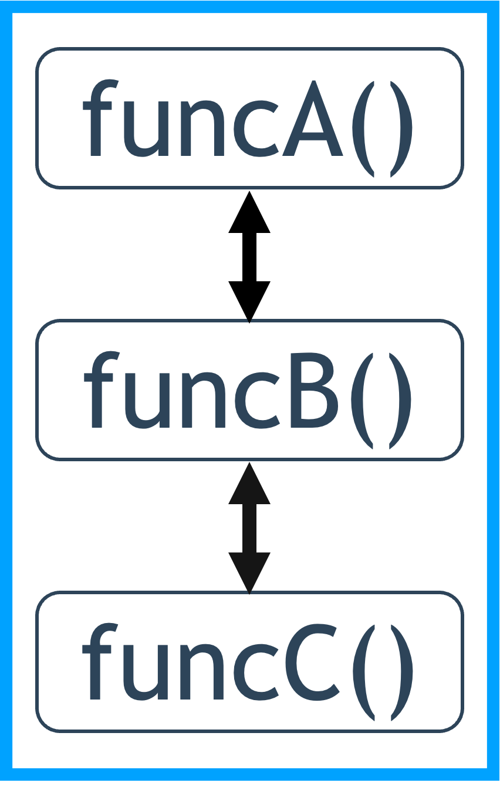

<style>
* {
  tab-size: 4;
}
</style>

<!--
_class: title
-->

# テスト・CI/CD
Webエンジニアになろう講習会

---

# 自己紹介

## あきも

24B 数理・計算科学系
rucQ開発がんばった
traQチームにもいるよ


---

<!--
_class: section-head
-->

# 前回のおさらい

---

# Webサービスセキュリティ入門

- サーバー内の情報が流出しないように気を付ける
  - 認証情報を守る
  - ユーザーによる入力は信用しない
  - たとえ流出してもわからないようにする
- 他人の攻撃を手伝わないようにする

---

# 目次

- 座学
  - テスト
  - CI/CD
- 実習
  - テストを書いてみよう
  - 自動でテストを走らせてみよう

---

<!--
_class: section-head
-->

# テスト

**Web開発**におけるテストについて話します

---

# テストとは

- コードが期待した動きをするか調べること
- 期待する動きは**仕様書**等に残す

---

# 仕様書

- 実装すべきプログラムとその想定挙動についてのまとめ
  - 開発メンバー全員が実装を把握できるわけではない
  - 構造体定義やAPIリクエスト/レスポンス形式など
- OpenAPIなど体系化された記法もある
  - コードの自動生成などにも使える

---

# テストの役割

- コード品質、仕様書を保証する
  - 大規模プロジェクト、公開プロジェクトでは必須
  - 内部実装を知らない人にコードを信用してもらう
  - **よりよいサービス利用体験へ**
- テストに合わせてコードを書く開発手法もある
  - テスト駆動開発など

---

# テストの種類（視点別）

**利用者**の視点か**開発者**の視点か

- 利用者視点：ブラックボックステスト
- 開発者視点：ホワイトボックステスト

---

# ブラックボックステスト

- **入力**と**出力**だけをみる
  - 関数の引数と返り値など
- 内部処理は知らなくて良い
- 返り値に現れない潜在的なバグを見逃す恐れ


---

# ホワイトボックステスト

- 関数の内部の処理（条件分岐等）もみる
- 潜在的なバグを発見できる確率が上がる
  - それでもすべてのバグを見つける保証はない
- 内部処理の丁寧な理解が前提となる


---

# テストの種類（規模別）

- Unit test（単体テスト）
- Integration test（統合テスト）
- End-to-End test（E2Eテスト）

---

# Unit test（単体テスト）

- 単一の処理（関数など）に対して行う
- ロジックをテストする
  - 数値計算、DBへの保存・情報取得など
- ホワイトボックス／ブラックボックス両方の手法をとる
- 失敗したときの原因特定も容易
  - 関数の中を探せば良い
- 「意図された挙動」のドキュメントにもなる


---

# Unit testの例

```go
// 加算する関数
func Add(a int, b int) int {
	return a + b
}
```

---

# Unit testの例

```go
// 加算する関数
func Add(a int, b int) int {
	return a + b
}
```

```go
// テスト関数
func Test_Add(t *testing.T) {
	result := Add(1, 2)
	// 期待値と結果が一致するか
	assert.Equal(t, 3, result)
}
```

---

# Integration test（結合テスト）

- 複数の機能を連携して行うテスト
- **相互作用**をテストする
  - 情報保存のタイミング、リクエスト内容の反映など
- 実際の動作の流れをテストする、ブラックボックステスト
- 相互作用することで発生するバグを見つけられる



---

# End-to-End test（E2Eテスト）

- ユーザーの動きを模倣して行われるテスト
- **実際の挙動**をテストする
  - アカウント作成→チャンネル作成→メッセージ投稿
    など
- 実環境とほぼ同じ環境を用意して行う

---

## でも実際の環境を用意するのは大変……

---

# Mocking

- 実際のサーバアプリケーション等の代わりをしてくれる
- テスト形式に応じて**必要な要素のみ**実装する
  - 決まったレスポンスを返すだけ、など
  - フロントエンドのテストのためにサーバー側の処理を全て書く必要はない

---

## 例：現在時刻を返すAPI

---

# 本番環境

`GET http://a.example.com/now`

現在時刻を返す

|アクセス時刻|レスポンス|型|
|:-:|:-:|:-:|
|2025/09/14 15:16:17|2025/09/14 15:16:17|日時型|

---

# 本番環境

`GET http://a.example.com/now`

現在時刻を返す

|アクセス時刻|レスポンス|型|
|:-:|:-:|:-:|
|**2025/09/21 21:23:45**|**2025/09/21 21:23:45**|日時型|

---

# Mock環境

`GET http://m.example.com/now`

**日時型**のそれっぽいレスポンスを返す

|アクセス時刻|レスポンス|型|
|:-:|:-:|:-:|
|2025/09/14 15:16:17|**2006/01/02 15:04:05**|**日時型**|

---

# Mock環境

`GET http://m.example.com/now`

**日時型**のそれっぽいレスポンスを返す

|アクセス時刻|レスポンス|型|
|:-:|:-:|:-:|
|2025/09/21 21:23:45|**2006/01/02 15:04:05**|**日時型**|

---

# Mockingの注意点

- 開発者間で仕様についての共通認識が必要
- 実際の挙動を保証するわけではない
  - Mockサーバは仕様書に依存する
  - 仕様書はあくまで人間が書くもの
  - 実装の更新により、仕様書との差分が起こり得る
  - **継続的な仕様書更新**も必要

---

<!--
_class: section-head
-->

# CI / CD

---

# CI / CD

- 開発を効率化するための**自動化手法**
  - できることは自動化する
- GitHubなどのホストサービスで提供される
  - GitHubの場合はGitHub Actions

---

# Continuous Integration (CI)

- 継続的インテグレーション
- PRを出した時に自動で整合性や挙動をチェックする
  - テストが通るか
  - Linter / Formatterがかかっているか
- CIをパスしないとマージできないようにすることも可能

---

# Continuous Deployment (CD)

- 継続的デプロイ
  - デプロイ：外部サーバー上でアプリを起動させること（Webサービスを公開すること）
- 継続的に最新のソフトウェアを提供する
- Continuous Delivery（継続的デリバリー）を指すこともある

---


---

# GitHub Actions

- GitHubが提供しているCI/CDのための環境
- 多様なOS、CPUアーキテクチャが利用可能
- マーケットプレイスで様々なActionが公開されている

---

<!--
_class: section-head
-->

# まとめ

---

# テストの役割

- コード品質、仕様書を保証する
  - 大規模プロジェクト、公開プロジェクトでは必須
  - 内部実装を知らない人にコードを信用してもらう
  - **よりよいサービス利用体験へ**
- テストに合わせてコードを書く開発手法もある

---

# Mocking

- 実際のサーバアプリケーション等の代わりをしてくれる
- テスト形式に応じて**必要な要素のみ**実装する
  - 決まったレスポンスを返すだけ、など
  - フロントエンドのテストのためにサーバー側の処理を全て書く必要はない

---

# CI / CD

- 開発を効率化するための**自動化手法**
  - できることは自動化する
- GitHubなどのホストサービスで提供される
  - GitHubの場合はGitHub Actions

---

<!--
_class: section-head
-->

# 実習

- テストを書いてみよう
- 自動でテストを走らせてみよう
