<!--
_class: title
-->

# Docker

Webエンジニアになろう講習会 第8回

---

<!--
_class: section-head
-->

# 前回のおさらい

---

# テスト

## テスト

- コードの品質・仕様書どおりの動作を保証
- 正常系 と 異常系 / ブラックボックステスト と ホワイトボックステスト

## テストの規模（一例）

- Unit test（単体テスト）
- Integration test（統合テスト）
- End-to-End test（E2Eテスト）

---

# Mocking

- 実際のサーバーアプリケーションの代わり
- テストに必要なもののみ実装
  - 決まったレスポンスだけするものも
  - サーバーサイドの再現は必要ない

---

# CI / CD

## CI
- Continuous Integration
  > 継続的インテグレーション
- 自動で整合性や挙動をチェック
  - テスト
  - Linter / formatter

## CD
- Continuous Deployment
  > 継続的デプロイ
- 継続的に最新のソフトを提供
- Continuous Delivery（継続的デリバリー）を指すことも

---

# GitHub Actions

- GitHub 公式の CI / CD 環境
- 多様な OS・CPU Arch が利用可能
  - Ubuntu / macOS など
- 公式の Action のほかにマーケットで公開されている Action も使用可能
- 類似製品
  - GitLab CI/CD
  - Jenkins
  - CircleCI

---

# 目次

## 座学
- Docker とはなにか
- コンテナ概論
- Docker Image について
- Docker Volume について
- Docker Network について

## 実習
- Dockerfile の書き方
- compose.yml の書き方

---

# 目次

## 座学
- Docker とはなにか
- コンテナ概論
- Docker Image について
- Docker Volume について
- Docker Network について

## 実習
- Dockerfile の書き方
- compose.yml の書き方

---

# Docker とは

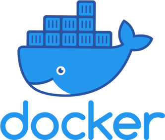</img>

- コンテナ型の仮想環境を作成・配布・実行するためのプラットフォーム
- 言語やフレームワーク、アーキテクチャ、そして様々なツール間の連携といった複雑化する開発環境を簡略化し、開発体験を向上するために開発
- 標準化された規格やソフトウェア群、それらを支えるためのサービス、ドキュメントやコミュニティを総称して Docker という

---

# Docker とは

</img>

- コンテナ型の仮想環境を作成・配布・実行するためのプラットフォーム
- 言語やフレームワーク、アーキテクチャ、そして様々なツール間の連携といった複雑化する開発環境を簡略化し、開発体験を向上するために開発
- 標準化された規格やソフトウェア群、それらを支えるためのサービス、ドキュメントやコミュニティを総称して Docker という

---

# 環境とは

- 開発物を動かすときの背景となるものの総称
  - 言語のコンパイラ・ランタイム
  - 環境変数
  - OS
  - ハードウェア
  - 依存関係

---

# 仮想環境とは

- 仮想マシン、VM(Virtual Machine)とも
- それぞれのコンピューターから独立した仮想的な環境
- 実現方法
  - ホスト型 ... VMware Player, VirtualBox など
  - ハイパーバイザー型 ... Hyper-V, Virtualization.framework など
  - コンテナ型 ... LXC/LXD, Docker, podman など

---

# Dockerを使う理由

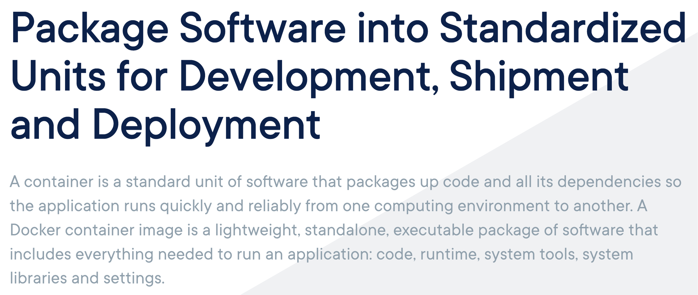</img>

---

<!--
_class: section-head
-->

# 全ての依存関係をパッケージ化し、コンテナとして動かす

パッケージの作成、配布、実行がDockerの役割

---

# 目次

## 座学
- Docker とはなにか
- コンテナ概論
- Docker Image について
- Docker Volume について
- Docker Network について

## 実習
- Dockerfile の書き方
- compose.yml の書き方

---

# Docker とは

</img>

- コンテナ型の仮想環境を作成・配布・実行するためのプラットフォーム
- 言語やフレームワーク、アーキテクチャ、そして様々なツール間の連携といった複雑化する開発環境を簡略化し、開発体験を向上するために開発
- 標準化された規格やソフトウェア群、それらを支えるためのサービス、ドキュメントやコミュニティを総称して Docker という

---

# 仮想化技術

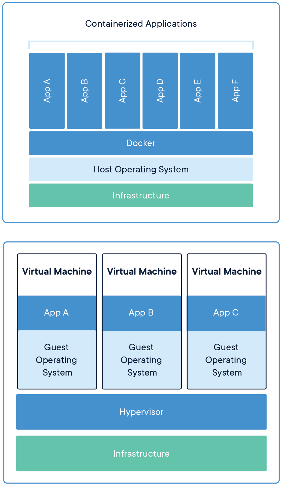</img>

## コンテナ型
- OS をエミュレートしない分軽量 (MB 単位)
- ボトルネックも小さい

## ハイパーバイザー型
- OS のフルコピーを一つのハードウェア上で動かす
- 容量が大きい (GB 単位)

---

# プロセス

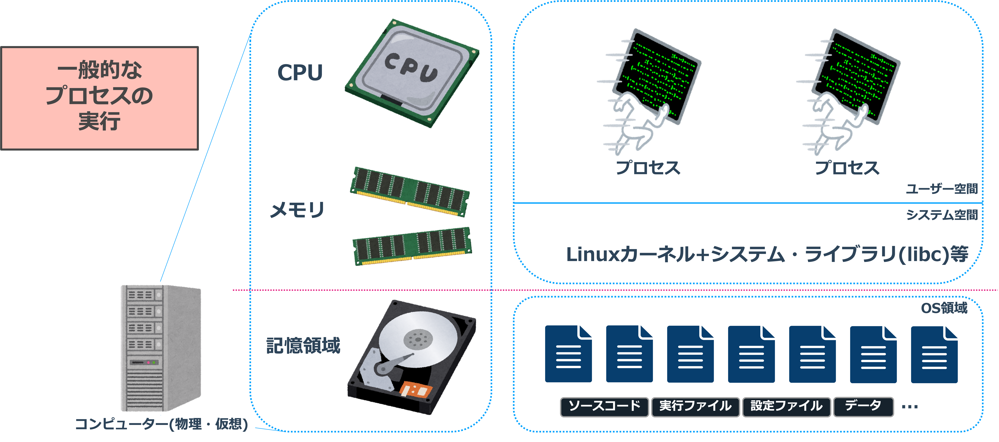</img>

---

# プロセス

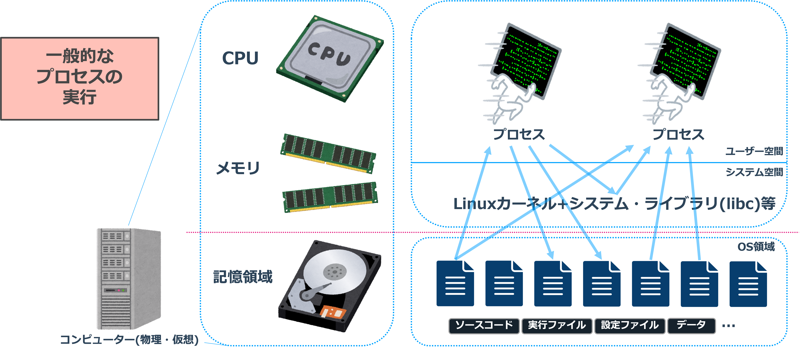</img>

---

# プロセス

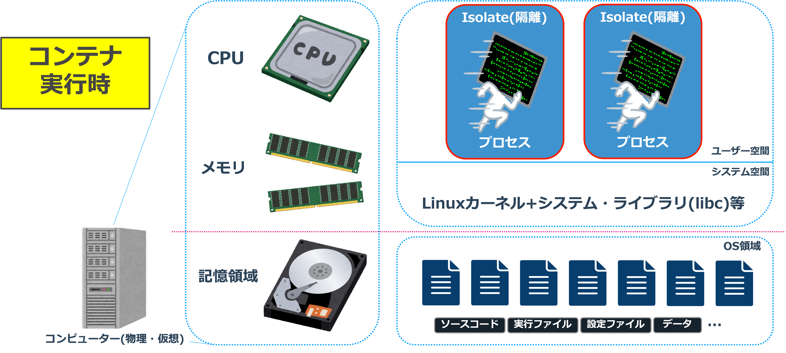</img>

---

# プロセス

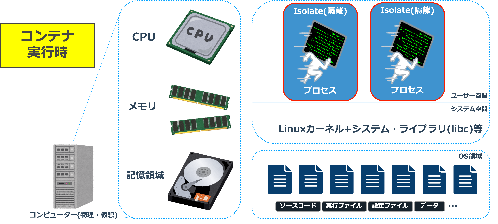</img>

</img>

---

# コンテナとは

- 特別な状態で実行されるプロセス群
- Linuxカーネルの一部であるnamespaceやcgroupなどを用いて実現される
- namespace
  - PID・ファイルシステム・ネットワーク・ホスト名・UID/GIDなどの分離
- cgroup
  - CPU・メモリ・I/O・ディスク容量などの制限

---

# コンテナとは

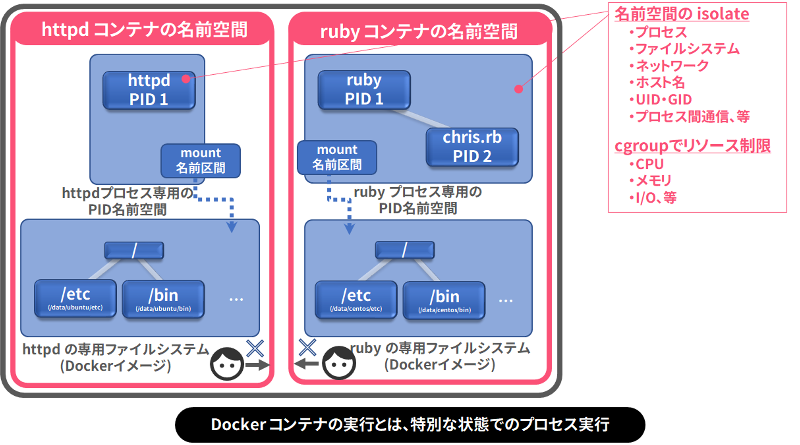</img>

---

# Dockerでは？

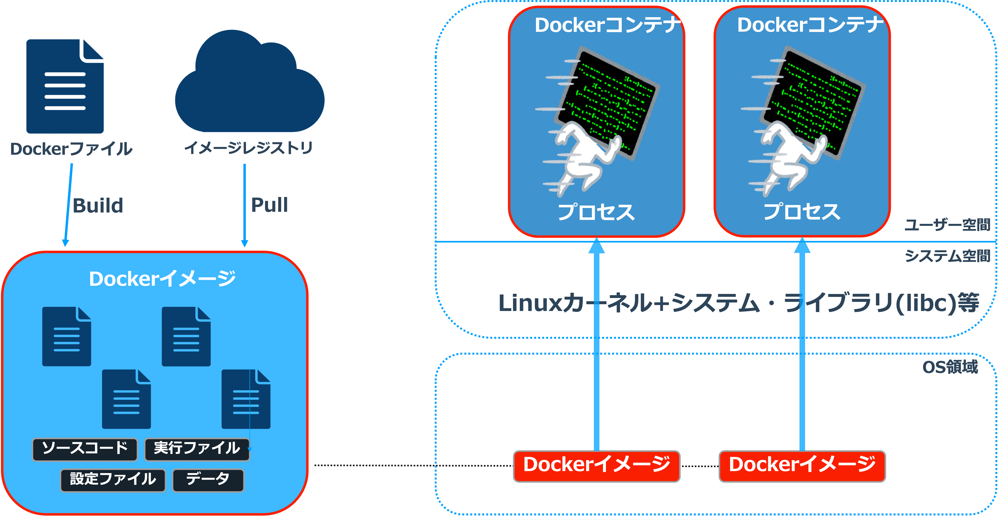</img>

---

# Docker について

- Linux の機能をベースにしている
  - Mac や Windows のネイティブでは動かない
  - 仮想マシンを立てて動かしている
- Docker (dockerd) が仲介
  - コンテナの起動や操作

---

# パッケージ化した利点

- ホストの環境が異なっても簡単にアプリケーションを動かせる
- 「ある環境をちょっと変更したもの」を簡単に作れる
  - ある Dockerfile を参考に Dockerfile が書ける
- 必要な環境をコードとして残せる
  - Dockerfile というファイルに手順を記述する
- 環境を手軽に共有できる
  - Docker Hub のようなイメージレジストリが利用できる

---

# 目次

## 座学
- Docker とはなにか
- コンテナ概論
- Docker Image について
- Docker Volume について
- Docker Network について

## 実習
- Dockerfile の書き方
- compose.yml の書き方

---

# Docker Image とは

- コンテナの雛形 (動かす前の初期状態を規定するもの)
- 複数の イメージ / レイヤー の積み重ね
- layers
  - マウントする root filesystem に加えられた変更のまとまり
- metadata
  - ビルド手順・環境変数・タイムスタンプ…

---

# Docker Image とは

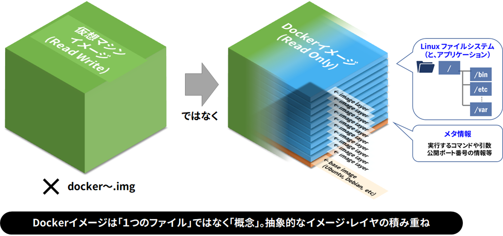</img>

---

# Docker Image とは

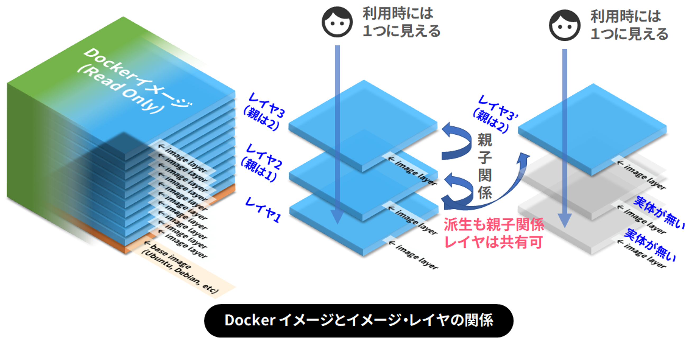</img>

---

# Docker における コンテナ とは

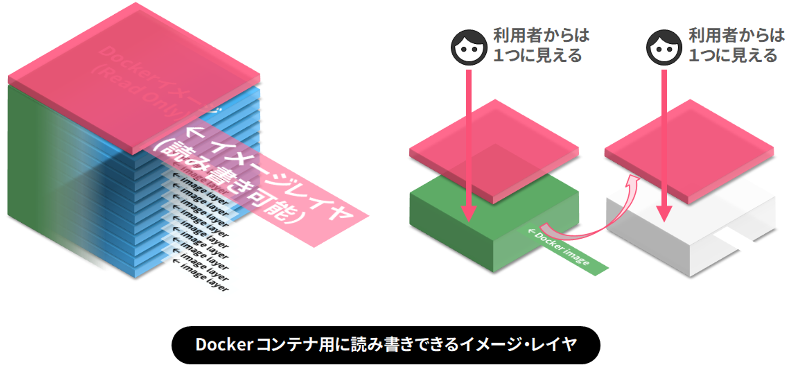</img>

---

# Docker の流れ

1. イメージ を用意
2. 読み込む環境変数・設定ファイル等を準備
3. イメージ から コンテナ を起動

イメージとコンテナの関係はクラスとインスタンスみたいなもの
更にわかりやすく言うとテンプレと実際のスライド的な感じ

---

# 目次

## 座学
- Docker とはなにか
- コンテナ概論
- Docker Image について
- Docker Volume について
- Docker Network について

## 実習
- Dockerfile の書き方
- compose.yml の書き方

---

# Volume とは

## Docker コンテナ内のデータを永続化する手段
- 仮想環境は一度消すとデータも全部消える
- サーバーアプリケーションに対する DB と似た関係性
## ホストマシンのディレクトリとコンテナをつなぐ
- ホストのファイルシステムの一部をコンテナに対して露出
- コンテナ側のファイルシステムにマウントする

---

# Volume とは

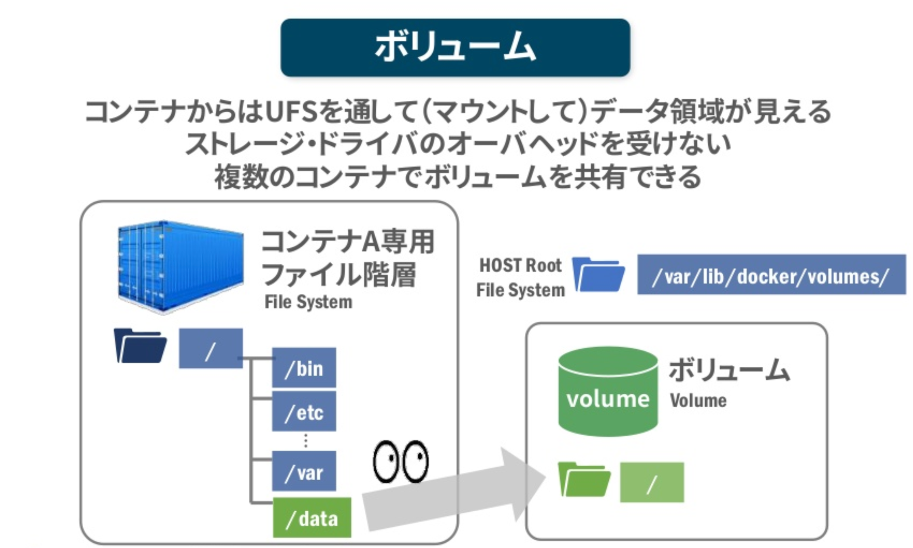</img>

---

# Volume とは

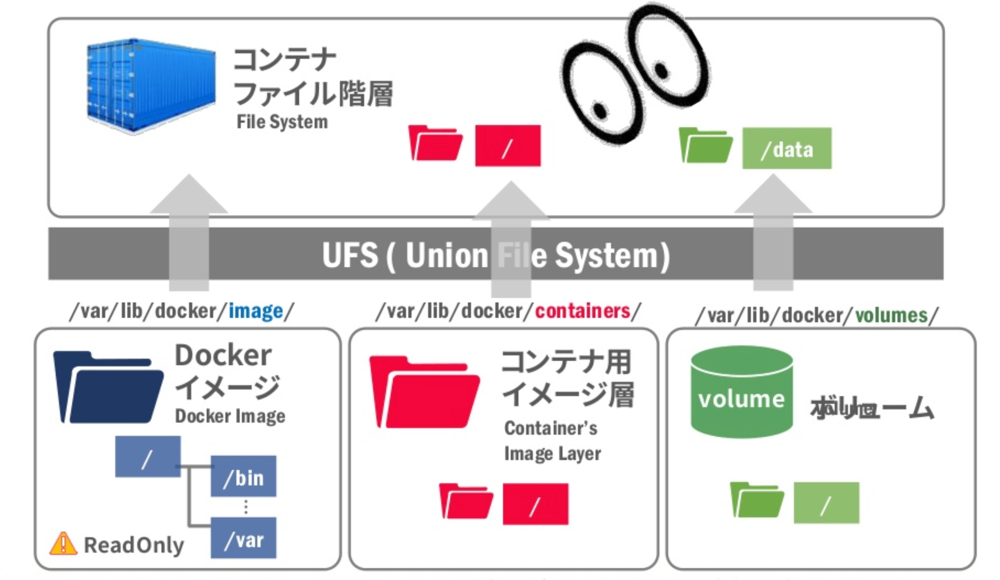</img>

---

# 目次

## 座学
- Docker とはなにか
- コンテナ概論
- Docker Image について
- Docker Volume について
- Docker Network について

## 実習
- Dockerfile の書き方
- compose.yml の書き方

---

# Network とは

- コンテナ内のアプリをインターネットとつなぐ手段
- 標準ネットワークモデルは以下の 3 つ
  - **bridge**
    - ブリッジでコンテナ側のポートとホストのポートをマッピング
  - **host**
    - コンテナでポートを開くと直接ホストの公開ポートを利用
  - **none**
    - 疎通しない

---

# Network とは

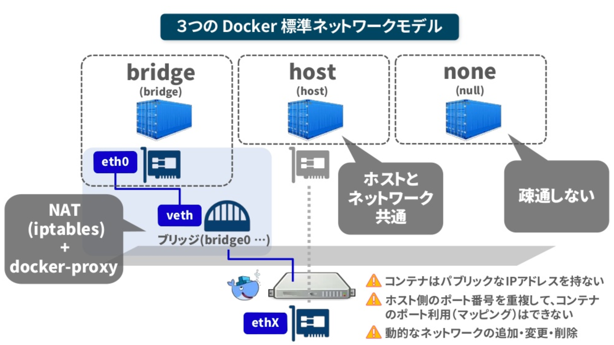</img>

---

# 参考資料

- [コンテナの作り方](https://www.slideshare.net/slideshow/what-isdockerdoing/205136068)
- [https://www.docker.com/why-docker](https://www.docker.com/why-docker/)
- [Dockerの概要、仕組み、および実装について](https://yuuki0xff.jp/articles/docker.html)
- [Dockerイメージの理解を目指すチュートリアル - Qiita](https://qiita.com/zembutsu/items/24558f9d0d254e33088f)

---

<!--
_class: section-head
-->

# まとめ

---

# Docker とは

</img>

- コンテナ型の仮想環境を作成・配布・実行するためのプラットフォーム
- 言語やフレームワーク、アーキテクチャ、そして様々なツール間の連携といった複雑化する開発環境を簡略化し、開発体験を向上するために開発
- 標準化された規格やソフトウェア群、それらを支えるためのサービス、ドキュメントやコミュニティを総称して Docker という

---

# 仮想化技術

</img>

## コンテナ型
- OS をエミュレートしない分軽量 (MB 単位)
- ボトルネックも小さい

## ハイパーバイザー型
- OS のフルコピーを一つのハードウェア上で動かす
- 容量が大きい (GB 単位)

---

# コンテナ

</img>

---

# Docker Image とは

</img>

---

# Docker における コンテナ とは

</img>

---

# Volume とは

</img>

---

# Network とは

</img>

---

# 目次

## 座学
- Docker とはなにか
- コンテナ概論
- Docker Image について
- Docker Volume について
- Docker Network について

## 実習
- Dockerfile の書き方
- compose.yml の書き方

